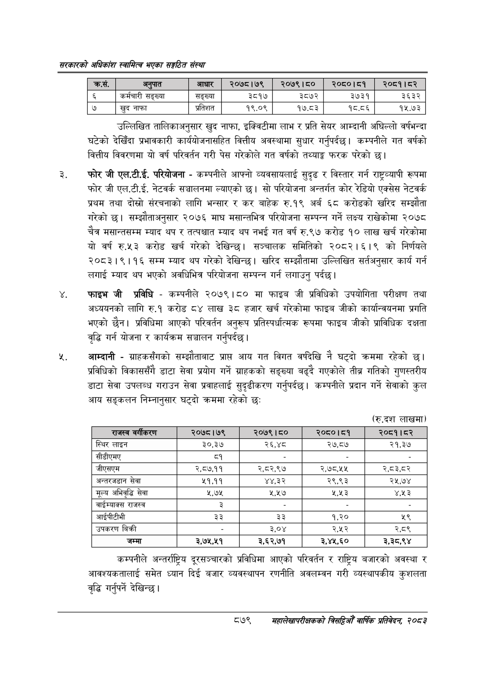

# Page 925 QA

## Rendered page


## Extracted text

```text
सरकारको अधिकांश स्वामित्व भएका सङ्गठित संस्था
उल्लिखित तालिकाअनुसार खुद नाफा, इक्विटीमा लाभ र प्रति सेयर आम्दानी अघिल्लो वर्षभन्दा घटेको देखिँदा प्रभावकारी कार्ययोजनासहित वित्तीय अवस्थामा सुधार गर्नुपर्दछ। कम्पनीले गत वर्षको वित्तीय विवरणमा यो वर्ष परिवर्तन गरी पेस गरेकोले गत वर्षको तथ्याङ्क फरक परेको छ।
फोर जी एल.टी.ई. परियोजना -कम्पनीले आफ्नो व्यवसायलाई सुदृढ र विस्तार गर्न राष्ट्रव्यापी रूपमा फोर जी एल.टी.ई. नेटवर्क सञ्चालनमा ल्याएको छ। सो परियोजना अन्तर्गत कोर रेडियो एक्सेस नेटवर्क प्रथम तथा दोस्रो संरचनाको लागि भन्सार र कर बाहेक रु.१९ अर्ब ६८ करोडको खरिद सम्झौता गरेको छ। सम्झौताअनुसार २०७६ माघ मसान्तभित्र परियोजना सम्पन्न गर्ने लक्ष्य राखेकोमा २०७८ चैत्र मसान्तसम्म म्याद थप र तत्पश्चात म्याद थप नभई गत वर्ष रु.९७ करोड १० लाख खर्च गरेकोमा यो वर्ष रु.५३ करोड खर्च गरेको देखिन्छ। सञ्चालक समितिको २०८२।६।९ को निर्णयले २०८३।९।१६ सम्म म्याद थप गरेको देखिन्छ। खरिद सम्झौतामा उल्लिखित सर्तअनुसार कार्य गर्न लगाई म्याद थप भएको अवधिभित्र परियोजना सम्पन्न गर्न लगाउनु पर्दछ।
फाइभ जी प्रविधि -कम्पनीले २०७९।८० मा फाइब जी प्रविधिको उपयोगिता परीक्षण तथा अध्ययनको लागि रु.१ करोड ८४ लाख ३८ हजार खर्च गरेकोमा फाइब जीको कार्यान्वयनमा प्रगति भएको छैन। प्रविधिमा आएको परिवर्तन अनुरूप प्रतिस्पर्धात्मक रूपमा फाइब जीको प्राविधिक दक्षता वृद्धि गर्न योजना र कार्यक्रम सञ्चालन गर्नुपर्दछ |
%, आम्दानी -ग्राहकसँगको सम्झौताबाट प्राप्त आय गत विगत वर्षदेखि नै घट्दो क्रममा रहेको प्रविधिको विकाससँगै डाटा सेवा प्रयोग गर्ने ग्राहकको सङ्ख्या बढ्दै गएकोले तीब्र गतिको गुणस्तरीय डाटा सेवा उपलब्ध गराउन सेवा प्रवाहलाई सुदृढीकरण गर्नुपर्दछ। कम्पनीले प्रदान गर्ने सेवाको कुल आय सङ्कलन निम्नानुसार घट्दो क्रममा रहेको छ:
(रू.दश लाखमा)
कम्पनीले अन्तर्राष्ट्रिय दूरसञ्चारको प्रविधिमा आएको परिवर्तन र राष्ट्रिय बजारको अवस्था र आवश्यकतालाई समेत ध्यान दिई बजार व्यवस्थापन रणनीति अवलम्वन गरी व्यस्थापकीय कुशलता वृद्धि गर्नुपर्ने देखिन्छ |
८७९
सहालेखापरीक्षकको बिदिओँ वार्षिक प्रतिवेदन २०८२

|   क्रस. | अनुपात           | &#124; आधार &#124;   |   २०७८।७९ |   २०७९।८० |   २०८०।८१ |   २०८१।८२ |
|---------|------------------|----------------------|-----------|-----------|-----------|-----------|
|       ६ | कर्मचारी सङ्ख्या | सङ्ख्या              |      ३८१७ |      ३८७२ |      ३७३१ |      ३६३२ |
|         | खुद नाफा         | प्रतिशत &#124;       |     १९.०९ |     १७.८३ |     १८.८६ |     १५.७३ |

| राजस्व वर्गीकरण      | २०७८।७९   | २०७९ । ८०   | २०८०।८१   | २०८१।८२   |
|----------------------|-----------|-------------|-----------|-----------|
| स्थिर लाइन           | ३०,३७     | २६,४८       | २७,८७     | २१,३७     |
| सीडीएमए              | ८१        |             |           |           |
| जीएसएम               | २,८७,११   | २,८२,९७     | २,७८,५४   | २,८३,८२   |
| अन्तरजडान सेवा       | 29,99     | ४४,३२       | २९,९३     | २५,७४     |
| मूल्य अभिवृद्धि सेवा | Y,y       | PSS         | २,९५३     | ४५३       |
| वाईम्याक्स राजस्व    | ३ ।       | -           | -         | -         |
| आईपीटीभी             | ३३        | ३३          | १,२०      | %9        |
| उपकरण बिक्री         | _         | ३,०४        | २,४५२     | २,८९      |
| जम्मा                | २,७२५,५१  | ३,६२,७१     | 3,¥%,&0   | ३,३८,९४   |
```

## Flags
- table_page
- medium_quality_table
