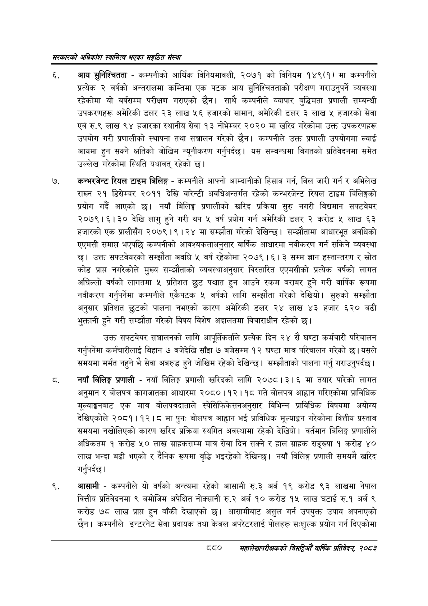

# Page 926 QA

## Rendered page


## Extracted text

```text
सरकारको अधिकांश स्वामित्व भएका सङ्गठित संस्था
आय सुनिश्चितता -कम्पनीको आर्थिक विनियमावली, २०७१ को विनियम १४९(१) मा कम्पनीले प्रत्येक २ वर्षको अन्तरालमा कम्तिमा एक पटक आय सुनिश्चितताको परीक्षण गराउनुपर्ने व्यवस्था रहेकोमा यो वर्षसम्म परीक्षण गराएको छैन। साथै कम्पनीले व्यापार बुद्धिमता प्रणाली सम्बन्धी उपकरणहरू अमेरिकी डलर २३ लाख ५६ हजारको सामान, अमेरिकी डलर ३ लाख ५ हजारको सेवा एवं रु.९ लाख ९४ हजारका स्थानीय सेवा १३ नोभेम्बर २०२० मा खरिद गरेकोमा उक्त उपकरणहरू उपयोग गरी प्रणालीको स्थापना तथा सञ्चालन गरेको छैन। कम्पनीले उक्त प्रणाली उपयोगमा ल्याई आयमा हुन सक्ने क्षतिको जोखिम न्यूनीकरण गर्नुपर्दछ। यस सम्बन्धमा विगतको प्रतिवेदनमा समेत उल्लेख गरेकोमा स्थिति यथावत्‌ रहेको छ।
कन्भरजेन्ट रियल टाइम बिलिङ्ग -कम्पनीले आफ्नो आम्दानीको हिसाब गर्न, बिल जारी गर्न र अभिलेख राख्न २१ डिसेम्बर २०११ देखि वारेन्टी अवधिअन्तर्गत रहेको कन्भरजेन्ट रियल टाइम बिलिङ्गको प्रयोग गर्दै आएको छ। नयाँ बिलिङ्ग प्रणालीको खरिद प्रक्रिया सुरु नगरी विद्यमान सफ्टवेयर २०७९।६।३० देखि लागु हुने गरी थप वर्ष प्रयोग गर्न अमेरिकी डलर २ करोड लाख ६३ हजारको एक प्रालीसँग २०७९।९ | २४ मा सम्झौता गरेको देखिन्छ। सम्झौतामा आधारभूत अवधिको एएमसी समाप्त भएपछि कम्पनीको आवश्यकताअनुसार वार्षिक आधारमा नवीकरण गर्न सकिने व्यवस्था छ। उक्त सफ्टवेयरको सम्झौता अवधि ५ वर्ष रहेकोमा २०७९ | ६। ३ सम्म ज्ञान हस्तान्तरण र स्रोत कोड प्राप्त नगरेकोले मुख्य सम्झौताको व्यवस्थाअनुसार विस्तारित एएमसीको प्रत्येक वर्षको लागत अघिल्लो वर्षको लागतमा ५ प्रतिशत छुट पश्चात हुन आउने रकम बराबर हुने गरी वार्षिक रूपमा नवीकरण गर्नुपर्नेमा कम्पनीले एकैपटक ५ वर्षको लागि सम्झौता गरेको देखियो। सुरुको सम्झौता अनुसार प्रतिशत छुटको पालना नभएको कारण अमेरिकी डलर २४ लाख ४३ हजार ६२० बढी भुक्तानी हुने गरी सम्झौता गरेको विषय विशेष अदालतमा विचाराधीन रहेको छ।
उक्त सफ्टवेयर सञ्चालनको लागि आपूर्तिकर्ताले प्रत्यक दिन २४ सै घण्टा कर्मचारी परिचालन गर्नुपर्नेमा कर्मचारीलाई बिहान ७ बजेदेखि साँझ ७ बजेसम्म १२ घण्टा मात्र परिचालन गरेको छ। यसले समयमा मर्मत नहुने भै सेवा अवरुद्ध हुने जोखिम रहेको देखिन्छ। सम्झौताको पालना गर्नु गराउनुपर्दछ।
नयाँ बिलिङ्ग प्रणाली -नयाँ बिलिङ्ग प्रणाली खरिदको लागि २०७८। ३। ६ मा तयार पारेको लागत अनुमान र बोलपत्र कागजातका आधारमा २०८०।१२। १८ गते बोलपत्र आह्वान गरिएकोमा प्राविधिक मूल्याङ्गबाट एक मात्र बोलपत्रदाताले स्पेसिफिकेसनअनुसार विभिन्न प्राविधिक विषयमा अयोग्य देखिएकोले २०८१।१२।८ मा पुन: बोलपत्र आह्वान भई प्राविधिक मूल्याङ्कन गरेकोमा वित्तीय प्रस्ताव समयमा नखोलिएको कारण खरिद प्रक्रिया स्थगित अवस्थामा रहेको देखियो। वर्तमान बिलिङ्ग प्रणालीले अधिकतम १ करोड ५० लाख ग्राहकसम्म मात्र सेवा दिन सक्ने र हाल ग्राहक सङ्ख्या १ करोड ४० लाख भन्दा बढी भएको र दैनिक रूपमा वृद्धि भइरहेको देखिन्छ। नयाँ विलिङ्ग प्रणाली समयमै खरिद गर्नुपर्दछ।
आसामी -कम्पनीले यो वर्षको अन्त्यमा रहेको आसामी रु.३ अर्ब १९ करोड ९३ लाखमा नेपाल वित्तीय प्रतिवेदनमा ९ बमोजिम अपेक्षित नोक्सानी रु.२ अर्ब १० करोड १५ लाख घटाई रु.१ अर्ब ९ करोड ७८ लाख प्राप्त हुन बाँकी देखाएको | आसामीबाट असुल गर्न उपयुक्त उपाय अपनाएको छैन। कम्पनीले इन्टरनेट सेवा प्रदायक तथा केबल अपरेटरलाई पोलहरू स:शुल्क प्रयोग गर्न दिएकोमा
८०
महालेखापरीक्षकको बिद्या वाषिकि प्रतिवेदन २०८२
```

## Flags
- None
