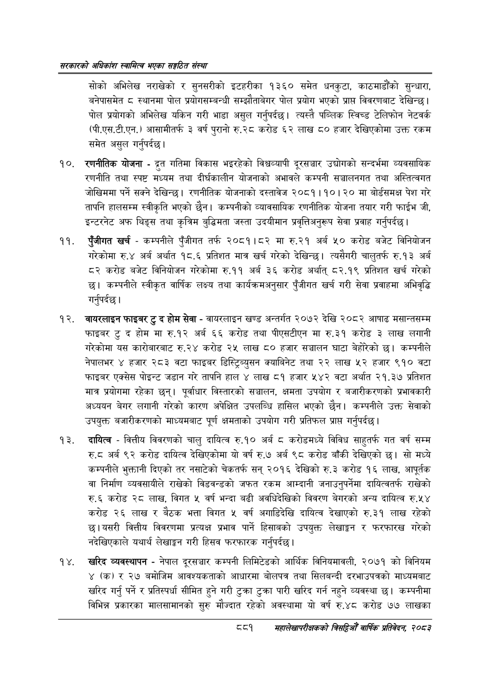

# Page 927 QA

## Rendered page


## Extracted text

```text
सरकारको अधिकांश स्वामित्व भएका सङ्गठित संस्था
सोको अभिलेख नराखेको र सुनसरीको इटहरीका १३६० समेत धनकुटा, काठमाडौंको सुन्धारा, बनेपासमेत ८ स्थानमा पोल प्रयोगसम्बन्धी सम्झौताबेगर पोल प्रयोग भएको प्राप्त विवरणबाट देखिन्छ। पोल प्रयोगको अभिलेख यकिन गरी भाडा असुल गर्नुपर्दछ। त्यस्तै पब्लिक स्विच्ड टेलिफोन नेटवर्क (पी.एस.टी.एन.) आसामीतर्फ ३ वर्ष पुरानो रु.२८ करोड ६२ लाख ८० हजार देखिएकोमा उक्त रकम समेत असुल गर्नुपर्दछ |
रणनीतिक योजना - गतिमा विकास भइरहेको विश्वव्यापी दूरसञ्चार उद्योगको सन्दर्भमा व्यवसायिक रणनीति तथा स्पष्ट मध्यम तथा दीर्घकालीन योजनाको अभावले कम्पनी सञ्चालनगत तथा अस्तित्वगत जोखिममा पर्ने सक्ने देखिन्छ। रणनीतिक योजनाको दस्तावेज २०८१।१०। २० मा बोर्डसमक्ष पेश गरे तापनि हालसम्म स्वीकृति भएको छैन। कम्पनीको व्यावसायिक रणनीतिक योजना तयार गरी फाईभ जी, इन्टरनेट अफ थिङ्स तथा कृत्रिम बुद्धिमता जस्ता उदयीमान प्रवृत्तिअनुरूप सेवा प्रवाह गर्नुपर्दछ।
पुँजीगत खर्च -कम्पनीले पुँजीगत तर्फ २०८१।८२ मा रु.२१ अर्ब ५० करोड बजेट विनियोजन गरेकोमा रु.४ अर्ब अर्थात १८.६ प्रतिशत मात्र खर्च गरेको देखिन्छ। त्यसैगरी चालुतर्फ रु.१३ अर्ब ८२ करोड बजेट विनियोजन गरेकोमा रु.११ अर्ब ३६ करोड अर्थात्‌ ८२.१९ प्रतिशत खर्च गरेको छ। कम्पनीले स्वीकृत वार्षिक लक्ष्य तथा कार्यक्रमअनुसार पुँजीगत खर्च गरी सेवा प्रवाहमा अभिवृद्धि गर्नुपर्दछ |
वायरलाइन फाइबर टु द होम सेवा -वायरलाइन खण्ड अन्तर्गत २०७२ देखि २०८२ आषाढ मसान्तसम्म फाइबर टु द होम मा रु.१२ अर्ब ६६ करोड तथा पीएसटीएन मा रु.३१ करोड ३ लाख लगानी गरेकोमा यस कारोबारबाट रु.२४ करोड २५ लाख ८० हजार सञ्चालन घाटा बेहोरको छ। कम्पनीले नेपालभर ४ हजार २८३ वटा फाइबर डिस्ट्रिब्युसन क्याबिनेट तथा २२ लाख ५२ हजार ९१० वटा फाइबर एक्सेस पोइन्ट जडान गरे तापनि हाल ४ लाख ८१ हजार ५४२ वटा अर्थात २१.३७ प्रतिशत मात्र प्रयोगमा रहेका छन्‌। पूर्वाधार विस्तारको सञ्चालन, क्षमता उपयोग र बजारीकरणको प्रभावकारी अध्ययन बेगर लगानी गरेको कारण अपेक्षित उपलब्धि हासिल भएको छैन। कम्पनीले उक्त सेवाको उपयुक्त बजारीकरणको माध्यमबाट पूर्ण क्षमताको उपयोग गरी प्रतिफल प्राप्त गर्नुपर्दछ |
दायित्व -वित्तीय विवरणको चालु दायित्व रु.१० अर्ब ८ करोडमध्ये विविध साहुतर्फ गत वर्ष सम्म रु. अर्ब ९२ करोड दायित्व देखिएकोमा यो वर्ष रु.७ अर्ब ९८ करोड बाँकी देखिएको छ। सो मध्ये कम्पनीले भुक्तानी दिएको तर नसाटेको चेकतर्फ सन्‌ २०१६ देखिको रु.३ करोड १६ लाख, आपूर्तक वा निर्माण व्यवसायीले राखेको विडवन्डको जफत रकम आम्दानी जनाउनुपर्नेमा दायित्वतर्फ राखेको रु.६ करोड २८ लाख, विगत वर्ष भन्दा बढी अवधिदेखिको विवरण बेगरको अन्य दायित्व रु.५४ करोड २६ लाख र बेठक भत्ता विगत ५ वर्ष अगाडिदेखि दायित्व देखाएको रु.३१ लाख रहेको छ।यसरी वित्तीय विवरणमा प्रत्यक्ष प्रभाव पार्ने हिसाबको उपयुक्त लेखाङ्गन र फरफारख गरेको नदेखिएकाले यथार्थ लेखाङ्गन गरी हिसव फरफारक गर्नुपर्दछ |
खरिद व्यवस्थापन -नेपाल दूरसञ्चार कम्पनी लिमिटेडको आर्थिक विनियमावली, २०७१ को विनियम ४ (क) र २७ बमोजिम आवश्यकताको आधारमा बोलपत्र तथा सिलबन्दी दरभाउपत्रको माध्यमबाट खरिद गर्नु पर्ने र प्रतिस्पर्धा सीमित हुने गरी टुक्रा टुक्रा पारी खरिद गर्न नहुने व्यवस्था छ। कम्पनीमा विभिन्न प्रकारका मालसामानको सुरु मौज्दात रहेको अवस्थामा यो वर्ष रु.४८ करोड ७७ लाखका
८८१
सहालेखापरीक्षकको बिदिओँ वार्षिक प्रतिवेदन २०८२
```

## Flags
- None
