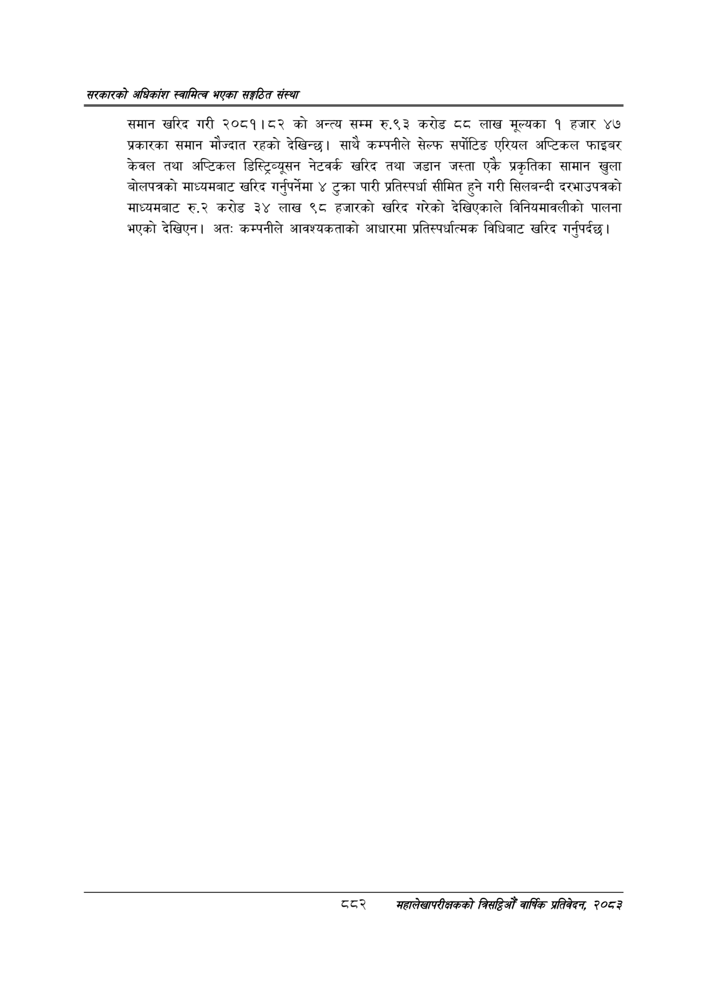

# Page 928 QA

## Rendered page


## Extracted text

```text
सरकारको अधिकांश स्वामित्व भएका सङ्गठित संस्था
समान खरिद गरी २०८१।८२ को अन्त्य सम्म रु.९३ करोड दव लाख मूल्यका १ हजार ४७ प्रकारका समान मौज्दात रहको देखिन्छ। साथै कम्पनीले सेल्फ सर्पोटिङ एरियल अप्टिकल फाइबर केवल तथा अप्टिकल डिस्ट्रिव्यूसन नेटवर्क खरिद तथा जडान जस्ता एकै प्रकृतिका सामान खुला बोलपत्रको माध्यमबाट खरिद गर्नुपर्नेमा ४ टुक्रा पारी प्रतिस्पर्धा सीमित हुने गरी सिलबन्दी दरभाउपत्रको माध्यमबाट रु.२ करोड ३४ लाख ९८ हजारको खरिद गरेको देखिएकाले विनियमावलीको पालना भएको देखिएन। अत: कम्पनीले आवश्यकताको आधारमा प्रतिस्पर्धात्मक विधिबाट खरिद गर्नुपर्दछ |
टदवर२ सहालेखापरीक्षकको बिदिओँ वार्षिक प्रतिवेदन २०८२
```

## Flags
- None
