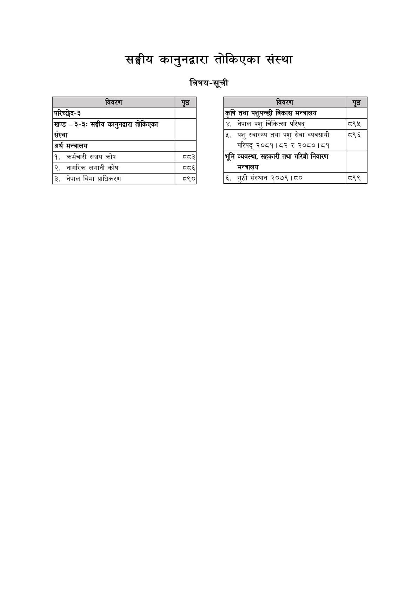

# Page 931 QA

## Rendered page


## Extracted text

```text
परिच्छेद-३
खण्ड
३-३:
संस्था
अर्थ
मन्त्रालय
१.
२.
३.
कर्मचारी
नागरिक
विवरण
सङ्घीय
कानुनद्वारा
सञ्चय
लगानी
नेपाल
बिमा
कोष
कोष
प्राधिकरण
सङ्घीय कानुनद्वारा तोकिएका संस्था विषय-सूची
पृष्ठ
३४
८९०
तोकिएका

|  |  |
| --- | --- |
| २७१८ |  |
|  |  |
| कृषि तथा पशुपन्छी विकास नन्जालय |  |
|  |  |
| ४. नेपाल पशु चिकित्सा परिषद्‌ |  |
|  |  |
| ५. पशु ल्वाल्थ्य तथा पशु सेवा व्यवसायी परिषद्‌ २०८१।८२ र २०८०।८१ | ८९६ |
|  |  |
| भूमि , सहकारी तया भरिजो निवारण नसन्तालय |  |
| ६. बुटी सल्यान २०७९।८० | व्९९ |
```

## Flags
- table_page
- medium_quality_table
