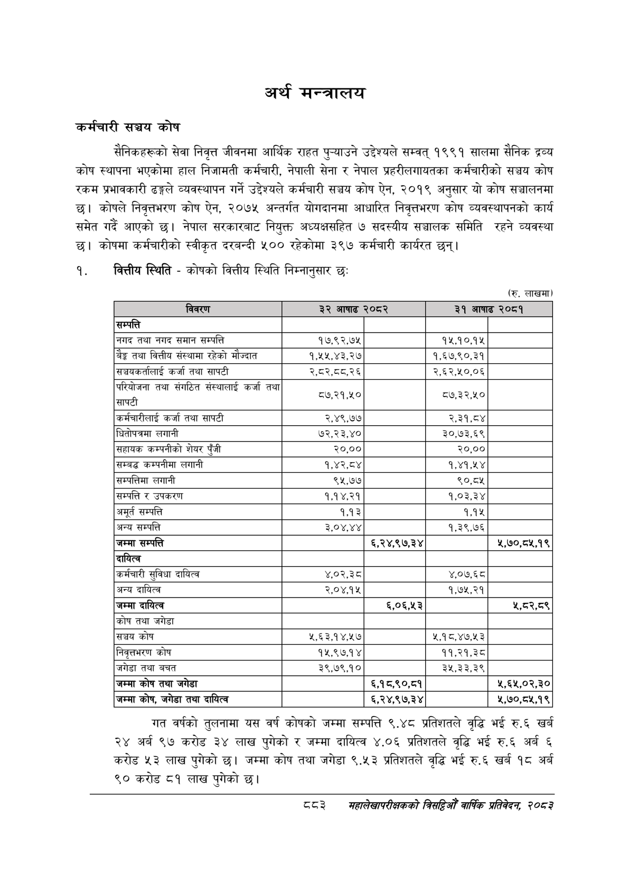

# Page 933 QA

## Rendered page


## Extracted text

```text
कर्मचारी सञ्चय कोष
सैनिकहरूको सेवा निवृत्त जीवनमा आर्थिक राहत पुन्याउने उद्देश्यले सम्वत्‌ १९९१ सालमा सैनिक द्रव्य कोष स्थापना भएकोमा हाल निजामती कर्मचारी, नेपाली सेना र नेपाल प्रहरीलगायतका कर्मचारीको सञ्चय कोष रकम प्रभावकारी ढङ्गले व्यवस्थापन गर्ने उद्देश्यले कर्मचारी सञ्चय कोष ऐन, २०१९ अनुसार यो कोष सञ्चालनमा छ। कोषले निव्तभरण कोष ऐन, २०७५ अन्तर्गत योगदानमा आधारित निवृत्तभरण कोष व्यवस्थापनको कार्य समेत गर्दै आएको | नेपाल सरकारबाट नियुक्त अध्यक्षसहित ७ सदस्यीय सञ्चालक समिति रहने व्यवस्था छ। कोषमा कर्मचारीको स्वीकृत दरबन्दी ५०० रहेकोमा ३९७ कर्मचारी कार्यरत छन्‌।
१. वित्तीय स्थिति -कोषको वित्तीय स्थिति निम्नानुसार छः
(रु. लाखमा)
गत वर्षको तुलनामा यस वर्ष कोषको जम्मा सम्पत्ति ९.४८ प्रतिशतले वृद्धि भई रु.६ खर्ब २४ अर्ब ९७ करोड ३४ लाख पुगेको र जम्मा दायित्व ४.०६ प्रतिशतले वृद्धि भई रु.६ अर्ब ६ करोड ५३ लाख पुगेको | जम्मा कोष तथा जगेडा ९.५३ प्रतिशतले वृद्धि भई रु.६ खर्ब १८ अर्ब ९० करोड ८१ लाख पुगेको छ।
अर्थ मन्त्रालय
८३
मंहालेखापरीक्षकको बितद्िमो वार्षिक प्रतिवेकन, २०८२

|  |  |  |  |  |
| --- | --- | --- | --- | --- |
|  | छ |  | प | ७ रट |
| सम्पत्ति |  |  |  |  |
| नगद तथा नगद समान सम्पत्ति | १७,९२,७५ |  | १५.१०,१५ |  |
| बैङ्क तथा वित्तीय संस्थामा रहेको मौज्दात | १,५५,४३,२७ |  | १,६७,९०,३१ |  |
| सञ्चकर्तालाई कर्जा तथा सापटी | २,८२,८८.२६ |  | २,६२,५०,०६ |  |
| परिवोजना तथा संगठित संल्थालाई कर्जा तथा सापटी | ८७,२१,४० |  | ८७,३२,४० |  |
| कर्मचारीलाई कर्जा तथा सापटी | २,४९,७७ |  | २,३१,८४ |  |
| वितोपत्रमा लगानी | ७२,२३,४० |  | ३०,७३,६९ |  |
| सहायक क“नीको शेयर पुँजी | २०,०० |  | २०,०० |  |
| सम्बद्ध कम्पनीमा लगानी | १,४२,८४ |  | १,४१,५४ |  |
| सम्पत्तिमा लगानी | ९५,७७ |  | ९०,८४५ |  |
| सम्पत्ति र | १,१४,२१ |  | १,०३,३४ |  |
| अमूर्त सम्पत्ति | १,१३ |  | १,१४५ |  |
| अन्य सम्पत्ति | ३,०४,४४ |  | १,३९,७६ |  |
| जम्मा सम्पत्ति |  | ६,२४,९७,३४ |  | ५,७०,८५,१९ |
| दायित्व |  |  |  |  |
| कर्मचारी सुविधा दायित्व | ४,.०२,३८ |  | ४,०७.६८ |  |
| अन्य दायित्व | २,०४.१५ |  | १,७५,२१ |  |
| जम्मा दायित्व |  | ६,०६,५३ |  | ५,८२,८९ |
| 'कोष तथा जगेडा |  |  |  |  |
| सञ्चय कोष | ५,६३.१४,५७ |  | ५,१८,४७,५३ |  |
| निवृत्तभरण कोष | १५,९७.१४ |  | ११,२१,३८ |  |
| जगेडा तथा बचत | ३९,७९,१० |  | ३२५,३३,३९ |  |
| जम्मा कोष तथा जगेडा |  | ६,१८,९०,८१ |  | ५,६५,०२,३० |
| जम्मा कोष, जगेडा तथा दायित्व |  | ६,२४,९७,३४ |  | ५,७०,८५,१९ |
```

## Flags
- table_page
- medium_quality_table
