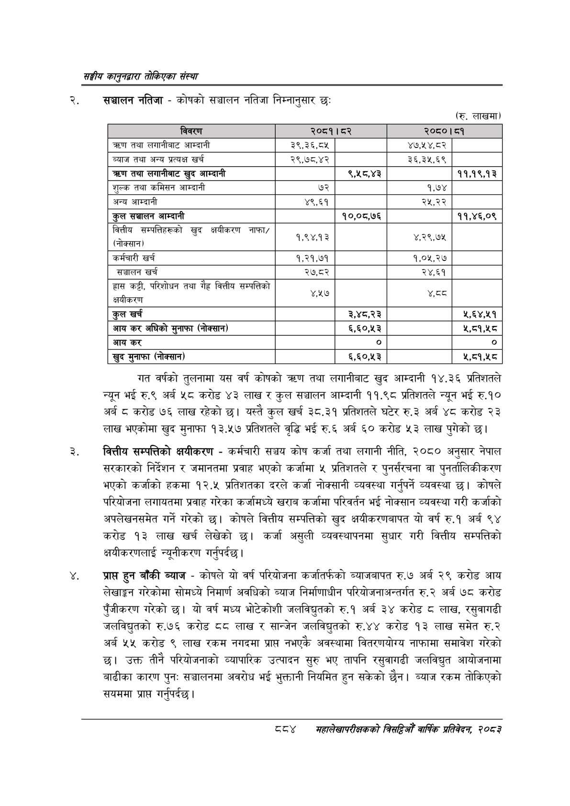

# Page 934 QA

## Rendered page


## Extracted text

```text
सङ्घीय कलुनदवारा तोकिएका संस्था
सञ्चालन नतिजा -कोषको सञ्चालन नतिजा निम्नानुसार छः
(रु. लाखमा)
गत वर्षको तुलनामा यस वर्ष कोषको त्रहण तथा लगानीबाट खुद आम्दानी १४.३६ प्रतिशतले न्यून भई रु.९ अर्ब ५८ करोड ४३ लाख र कुल सञ्चालन आम्दानी ११.९८ प्रतिशतले न्यून भई रु.१० अर्ब © करोड ७६ लाख रहेको छ। यस्तै कुल खर्च ३८.३१ प्रतिशतले घटेर रु.३ अर्ब ४८ करोड २३ लाख भएकोमा खुद मुनाफा १३.५७ प्रतिशतले वृद्धि भई रु.६ अर्ब ६० करोड ५३ लाख पुगेको छ।
वित्तीय सम्पत्तिको क्षयीकरण -कर्मचारी सञ्चय कोष कर्जा तथा लगानी नीति, २०८० अनुसार नेपाल सरकारको निर्देशन र जमानतमा प्रवाह भएको कर्जामा ५ प्रतिशतले र पुनर्संरचना वा पुनर्तालिकीकरण भएको कर्जाको हकमा १२.५ प्रतिशतका दरले कर्जा नोक्सानी व्यवस्था गर्नुपर्ने व्यवस्था | कोषले परियोजना लगायतमा प्रवाह गरेका कर्जामध्ये खराब कर्जामा परिवर्तन भई नोक्सान व्यवस्था गरी कर्जाको अपलेखनसमेत गर्ने गरेको | कोषले वित्तीय सम्पत्तिको खुद क्षयीकरणबापत यो वर्ष रु.१ अर्ब ९४ करोड १३ लाख खर्च लेखेको | कर्जा असुली व्यवस्थापनमा सुधार गरी वित्तीय सम्पत्तिको क्षयीकरणलाई न्यूनीकरण गर्नुपर्दछ |
प्राप्त हुन बाँकी ब्याज -कोषले यो वर्ष परियोजना कर्जातर्फको व्याजबापत रु.७ अर्ब २९ करोड आय लेखाङ्गन गरेकोमा सोमध्ये निमार्ण अवधिको ब्याज निर्माणाधीन परियोजनाअन्तर्गत रु. २ अर्ब ७८ करोड पुँजीकरण गरेको छ। यो वर्ष मध्य भोटेकोशी जलविद्युतको रु.१ अर्ब ३४ करोड ८ लाख, रसुवागढी जलविद्युतको रु.७६ करोड ८८ लाख र सान्जेन जलविद्युतको रु.४४ करोड १३ लाख समेत रु.२ अर्ब २५ करोड ९ लाख रकम नगदमा प्राप्त नभएकै अवस्थामा वितरणयोग्य नाफामा समावेश गरेको छ। उक्त तीनै परियोजनाको व्यापारिक उत्पादन सुरु भए तापनि रसुवागढी जलविद्युत आयोजनामा बाढीका कारण पुन: सञ्चालनमा अवरोध भई भुक्तानी नियमित हुन सकेको छैन। ब्याज रकम तोकिएको सयममा प्राप्त गर्नुपर्दछ |
महालेखपरीक्षकको बितद्िमो वार्षिक प्रतिवेकन, २०८२

|  |  |  |  |  |
| --- | --- | --- | --- | --- |
| [बत | २७८१ | दर |  | दा |
| तथा लगानीबाट आम्दानी | ३९,३६,८५ |  | ४७,५४,८२ |  |
| ब्याज तथा अन्य प्रत्यक्ष खर्च | २९,७८,४२ |  | ३६,३५,६९ |  |
| चरण तथा सभाबाट खुद आन्दानी |  | ९,४५८,४३ |  | ११,१९,१३ |
| शुल्क तथा कमिसन आम्दानी | ७२ |  | १,७४ |  |
| अन्य आम्दानी | ४९,६१ |  | २५,२२ |  |
| कुल सञ्चालन आम्दानी |  | १०,०८,७६ |  | ११,४६,०९ |
| वित्तीय सन्पततिहरूको खुद कवीकरण नाफा/ (नोक्सान) | १,९४,१३ |  | ४,२९,७५ |  |
| कर्मचारी खर्च | १,२१,७१ |  | १,०५,२७ |  |
| सञ्चालन खर्च | २७,८२ |  | २४,६१ |  |
| हास कट्टी, परिशोचन तथा गैह्र वित्तीय सम्पत्तिको क्षवीकरण | ४५७ |  | ४०८ |  |
| कुल खर्च |  | ३,४८,२३ |  | ५,६४,५१ |
| आय कर अघिको मुनाफा (नोक्सान) |  | ६,६०,५३ |  | ५,८१,५८ |
| आय कर |  | ० |  | ० |
| 'खुद मुनाफा (नोक्सान) |  | ६,६०,५३ |  | ५५,८१,१५८ |
```

## Flags
- table_page
- medium_quality_table
