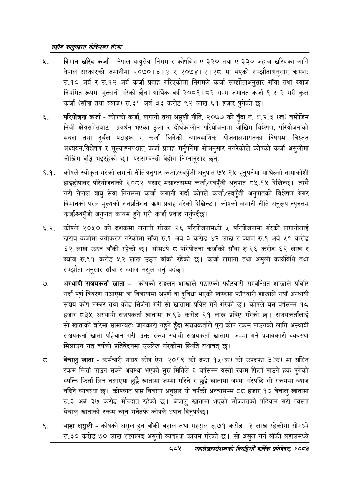

# Page 935 QA

## Rendered page


## Extracted text

```text
सङ्घीय कलुनदवारा तोकिएका संस्था
विमान खरिद कर्जा -नेपाल वायुसेवा निगम र कोषबिच ए-३२० तथा ए-३३० जहाज खरिदका लागि नेपाल सरकारको जमानीमा २०७०।३।४ र २०७४।२।२८ मा भएको सम्झौताअनुसार क्रमशः रु.१० अर्ब र रु.१२ अर्ब कर्जा प्रवाह गरिएकोमा निगमले कर्जा सम्झौताअनुसार साँवा तथा ब्याज नियमित रूपमा भुक्तानी गरेको छैन। आर्थिक वर्ष २०८१।८२ सम्म जमानत कर्जा १ र २ गरी कुल कर्जा (साँवा तथा ब्याज) रु.३१ अर्ब ३३ करोड ९२ लाख ६१ हजार पुगेको छ।
परियोजना कर्जा -कोषको कर्जा, लगानी तथा असुली नीति, २०७७ को बुँदा नं. ८.२.३ (ख) बमोजिम निजी क्षेत्रसमेतबाट प्रवर्धन भएका ठुला र दीर्घकालीन परियोजनामा जोखिम विश्लेषण, परियोजनाको सबल तथा दुर्बल पक्षहरू र कर्जा लिनेको व्यावसायिक योजनालगायतका विषयमा विस्तृत अध्ययन,विश्लेषण र मूल्याङ्गनपश्चात्‌ कर्जा प्रवाह गर्नुपर्नेमा सोअनुसार नगरेकोले कोषको कर्जा असुलीमा जोखिम वृद्धि भइरहेको छ। यससम्बन्धी बेहोरा निम्नानुसार छन्‌ः
६.१. कोषले स्वीकृत गरेको लगानी नीतिअनुसार कर्जा/स्वपुँजी अनुपात ७५:२५ हुनुपर्नेमा माथिल्लो तामाकोशी हाइड्रोपावर परियोजनाको २०८२ असार मसान्तसम्म कर्जा/स्वपूँजी अनुपात ८५:१५ देखिन्छ। त्यसै गरी नेपाल वायु सेवा निगममा कर्जा लगानी गर्दा कोषले कर्जा/स्वपूँजी अनुपातको विश्लेषण बेगर विमानको परल मूल्यको शतप्रतिशत त्ररण प्रवाह गरेको देखिन्छ। कोषको लगानी नीति अनुरूप न्यूनतम कर्जा/स्वपुँजी अनुपात कायम हुने गरी कर्जा प्रवाह गर्नुपर्दछ।
६.२. कोषले २०५० को दशकमा लगानी गरेका २६ परियोजनामध्ये « परियोजनामा गरेको लगानीलाई खराब कर्जामा वर्गीकरण गरेकोमा साँवा रु.१ अर्ब ३ करोड ४२ लाख र ब्याज रु.१ अर्ब ५९ करोड ६२ लाख उठ्न बाँकी रहेको छ। सोमध्ये ८ परियोजना कर्जाको साँवा रु.२६ करोड ६२ लाख र ब्याज रु.९१ करोड ५२ लाख उठ्न बाँकी रहेको छ। कर्जा लगानी तथा असुली कार्यविधि तथा सम्झौता अनुसार साँवा र ब्याज असुल गर्नु पर्दछ।
अस्थायी सञ्चयकर्ता खाता -कोषको सङ्लन शाखाले पठाएको फाँटवारी सम्बन्धित शाखाले प्रविष्टि गर्दा पूर्ण विवरण नआएमा वा विवरणमा अपूर्ण वा दुविधा भएको खण्डमा फाँटवारी शाखाले नयाँ अस्थायी सञ्चय कोष नम्बर तथा कोड सिर्जना गरी सो खातामा प्रविष्ट गर्ने गरेको छ। कोषले यस वर्षसम्म १८ हजार ८३४५ अस्थायी सञ्चयकर्ता खातामा रु.९३ करोड २१ लाख प्रविष्ट गरेको छ। सञ्चयकर्तालाई सो खाताको बारेमा सामान्यत: जानकारी नहुने हुँदा सञ्चयकर्ताले पूरा कोष रकम पाउनको लागि अस्थायी सञ्चयकर्ता खाता पहिचान गरी उक्त रकम स्थायी सञ्चयकर्ता खातामा जम्मा गर्ने प्रभावकारी व्यवस्था मिलाउन गत वर्षको प्रतिवेदनमा उल्लेख गरेकोमा स्थिति यथावत्‌ छ।
बेचालु खाता -कर्मचारी सञ्चय कोष ऐन, २०१९ को दफा १५(क) को उपदफा ३(क) मा सञ्चित रकम फिर्ता पाउन सक्ने अवस्था भएको सुरु मितिले ६ वर्षसम्म यस्तो रकम फिर्ता पाउने हक पुगेको व्यक्ति फिर्ता लिन नआएमा छुट्टै खातामा जम्मा गरिने र छुट्टै खातामा जम्मा गरेपछि सो रकममा ब्याज नदिने व्यवस्था छ। कोषबाट प्राप्त विवरण अनुसार यो वर्षको अन्त्यसम्म दद हजार १० बेचालु खातामा रु.३ अर्ब ३७ करोड मौज्दात रहेको छ। बेचालु खातामा भएको मौज्दातको पहिचान गरी त्यस्ता बेचालु खाताको रकम न्यून गर्नेतर्फ कोषले ध्यान दिनुपर्दछ |
भाडा असुली -कोषको असुल हुन बाँकी बहाल तथा महसुल रु.७१ करोड ३ लाख रहेकोमा सोमध्ये रु.३० करोड ७० लाख शङ्कास्पद असुली व्यवस्था कायम गरेको | सो असुल गर्न बाँकी बहालमध्ये
मंहालेखापरीक्षकको वार्षिक प्रतिवेकन २०८२
```

## Flags
- None
