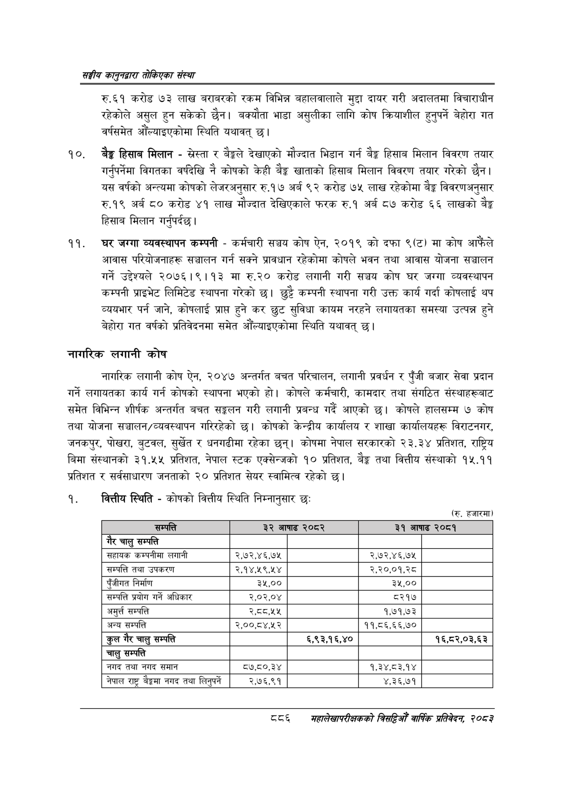

# Page 936 QA

## Rendered page


## Extracted text

```text
सङ्घीय कलुनदवारा तोकिएका संस्था
रु.६१ करोड ७३ लाख बराबरको रकम विभिन्न बहालवालाले मुद्दा दायर गरी अदालतमा विचाराधीन रहेकोले असुल हुन सकेको छैन। बक्यौता भाडा असुलीका लागि कोष क्रियाशील हुनुपर्ने बेहोरा गत वर्षसमेत औँल्याइएकोमा स्थिति यथावत्‌ छ।
हिसाब मिलान -सस्ता र देखाएको मौज्दात भिडान गर्न बैङ्क हिसाब मिलान विवरण तयार गर्नुपर्नेमा विगतका वर्षदेखि नै कोषको केही बैङ्क खाताको हिसाब मिलान विवरण तयार गरेको छैन। यस वर्षको अन्त्यमा कोषको लेजरअनुसार रु.१७ अर्ब ९२ करोड ७५ लाख रहेकोमा बैङ्क विवरणअनुसार रु.१९ अर्ब ८० करोड ४१ लाख मौज्दात देखिएकाले फरक रु.१ अर्ब ८७ करोड ६६ लाखको बेङ्ग हिसाब मिलान गर्नुपर्दछ |
चर जग्गा व्यवस्थापन कम्पनी -कर्मचारी सञ्चय कोष ऐन, २०१९ को दफा ९(ट) मा कोष आफैंले आवास परियोजनाहरू सञ्चालन गर्न सक्ने प्रावधान रहेकोमा कोषले भवन तथा आवास योजना सञ्चालन गर्ने उद्देश्यले २०७६।९।१३ मा रु.२० करोड लगानी गरी सञ्चय कोष घर जग्गा व्यवस्थापन कम्पनी प्राइभेट लिमिटेड स्थापना गरेको छ। छुट्टै कम्पनी स्थापना गरी उक्त कार्य गर्दा कोषलाई थप व्ययभार पर्न जाने, कोषलाई प्राप्त हुने कर छुट सुविधा कायम नरहने लगायतका समस्या उत्पन्न हुने बेहोरा गत वर्षको प्रतिवेदनमा समेत औँल्याइएकोमा स्थिति यथावत्‌ छ।
नागरिक लगानी कोष
नागरिक लगानी कोष ऐन, २०४७ अन्तर्गत बचत परिचालन, लगानी प्रवर्धन र पुँजी बजार सेवा प्रदान गर्ने लगायतका कार्य गर्न कोषको स्थापना भएको हो। कोषले कर्मचारी, कामदार तथा संगठित संस्थाहरूबाट समेत विभिन्न शीर्षक अन्तर्गत बचत सङ्गलन गरी लगानी प्रबन्ध गर्दै आएको छ। कोषले हालसम्म ७ कोष तथा योजना सञ्चालन/व्यवस्थापन गरिरहेको | कोषको केन्द्रीय कार्यालय र शाखा कार्यालयहरू विराटनगर, जनकपुर, पोखरा, बुटवल, सुर्खेत र धनगढीमा रहेका | कोषमा नेपाल सरकारको २३,३४ प्रतिशत, राष्ट्रिय बिमा संस्थानको ३१.५५ प्रतिशत, नेपाल स्टक एक्सेन्जको १० प्रतिशत, बैङ्क तथा वित्तीय संस्थाको १५.११ प्रतिशत र सर्वसाधारण जनताको २० प्रतिशत सेयर स्वामित्व रहेको छ।
वित्तीय स्थिति -कोषको वित्तीय स्थिति निम्नानुसार छः
(रु. हजारमा)
८
महालेखपरीक्षकको बितद्रिमो वार्षिक प्रतिवेकन २०८२

| २ चालु सम्पत्ति | यै |  | २ ४ | थाक २२५. |
| --- | --- | --- | --- | --- |
| सहायक कमपनीना लगानी | २,७२,४६,७५ |  | २,७२,४६,७४५ |  |
| सम्पत्ति तथा उपकरण | २,१४,५९,५४ |  | २,२०,०१,.२८ |  |
| पुँजीगत निर्माण | ३५,०० |  | ३५,०० |  |
| सम्पत्ति प्रयोग गर्ने अधिकार | २,०२,०४ |  | ८२१७ |  |
| अमुर्त सम्पत्ति | २,८८,५५ |  | १,७१,७३ |  |
| अन्य सम्पत्ति | २,००,८४,५२ |  | ११,८६,६६,७० |  |
| कुल गैर चालु सम्पत्ति |  | ६,९३,१६,४० |  | १६,८२,०३,६३ |
| चालु सम्पत्ति |  |  |  |  |
| नगद तथा नगद समान | ८७,८०,३४ |  | १,३४,८३,१४ |  |
| नेपाल राष्ट्र बैङ्कमा नगद तथा लिनुपर्ने | २,७६,९१ |  | ४,३६,७१ |  |
```

## Flags
- table_page
- medium_quality_table
