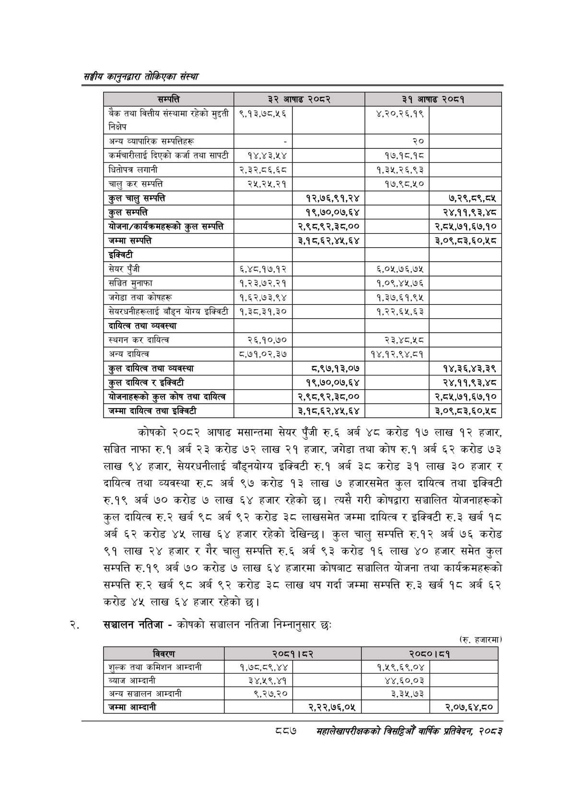

# Page 937 QA

## Rendered page


## Extracted text

```text
सङ्घीय कलुनदवारा तोकिएका संस्था
कोषको २०८२ आषाढ मसान्तमा सेयर पुँजी रु.६ अर्ब ४८ करोड १७ लाख १२ हजार, सञ्चित नाफा रु.१ अर्ब २३ करोड ७२ लाख २१ हजार, जगेडा तथा कोष रु.१ अर्ब ६२ करोड ७३ लाख ९४ हजार, सेयरधनीलाई बाँड्नयोग्य इक्विटी रु.१ अर्ब ३८ करोड ३१ लाख ३० हजार र दायित्व तथा व्यवस्था रु.८ अर्ब ९७ करोड १३ लाख ७ हजारसमेत कुल दायित्व तथा इक्विटी रु.१९ अर्ब ७० करोड ७ लाख ६४ हजार रहेको छ। त्यसै गरी कोषद्वारा सञ्चालित योजनाहरूको कुल दायित्व रु.२ खर्ब ९८ अर्ब ९२ करोड ३८ लाखसमेत जम्मा दायित्व र इक्विटी रु.३ खर्ब १८ अर्ब ६२ करोड ४५ लाख ६४ हजार रहेको देखिन्छ। कुल चालु सम्पत्ति रु.१२ अर्ब ७६ करोड ९१ लाख २४ हजार र गैर चालु सम्पत्ति रु.६ अर्ब ९३ करोड १६ लाख ४० हजार समेत कुल सम्पत्ति रु.१९ अर्ब ७० करोड ७ लाख ६४ हजारमा कोषबाट सञ्चालित योजना तथा कार्यक्रमहरूको सम्पत्ति रु.२ खर्ब ९८ अर्ब ९२ करोड ३८ लाख थप गर्दा जम्मा सम्पत्ति रु.३ खर्ब १८ अर्ब ६२ करोड ४५ लाख ६४ हजार रहेको छ।
सञ्चालन नतिजा -कोषको सञ्चालन नतिजा निम्नानुसार छः
(रु. हजारमा)
८८७
महालेखपरीक्षकको वार्षिक प्रतिवेकन, २०८२

|  |  |  |  |  |
| --- | --- | --- | --- | --- |
| सी | २४ ५ | ११० रेम, | गरा |  |
| बैंक तथा वित्तीय संस्थामा रहेको मुइती निक्षेप | ९,१३,७८,५६ |  | ४,२०,२६,१९ |  |
| अन्य व्यापारिक खन्पतिहरू |  |  | २० |  |
| कर्मचारीलाई दिएको कर्जा तथा सापटी | १४,४३,५४ |  | १७,१८,.१८ |  |
| धितोपत्र लगानी | २,.३२,८६,६८ |  | १,३५,२६,९३ |  |
| चालु कर सम्पत्ति | २५,२५,२१ |  | १७,६८,१० |  |
| कुल चालु सम्पत्ति |  | १२,७६,९१,२४ |  | ७,२९,८९,८५ |
| कुल सम्पत्ति |  | १९,७०,०७,६४ |  | २४,११,९३,४८ |
| 'योजना/कार्षकःभहरूको कुल सम्पत्ति |  | २,९८,९२,३८,०० |  | २,८५,७१,६७,१० |
| जम्मा सम्पत्ति |  | ३,१८,६२,४४५,६४ |  | ३,०९,८३,६०,५८ |
| इक्विटी |  |  |  |  |
| सेयर पुँजी | ६,४८.१७.१२ |  | ६,०१५,७६,७५ |  |
| सञ्चित मुनाफा | १,२३,७२,२१ |  | १,०९,४४५.७६ |  |
| जगेडा तथा कोषहरू | १,६२,७३,९४ |  | १,३७.६१,९४५ |  |
| सेयरधनीहरूलाई बाँड्न योग्य इक्विटी | १,३८,३१,३० |  | १.२२.६५.६३ |  |
| दायित्व तथा व्यवस्था |  |  |  |  |
| स्थगन कर दायित्व | २६,१०,७० |  | २३,४८,५८ |  |
| अन्य दायित्व | ५,७१,०२,३७ |  | १४,१२,९४,८१ |  |
| कुल दायित्व तथा व्यवस्था |  | ८,९७,१३,०७ |  | १४,३६,४३,३९ |
| कुल दायित्व र इक्विटी |  | १९,७०,०७,६४ |  | २४,११,९३,४८ |
| बोजनाहरूको कुल कोष तथा दायित्व |  | २,९८,९२,३८,०० |  | २,८५,७१,६७,१० |
| जम्मा दायित्व तथा इक्विटी |  | ३,१८,६२,४४५,६४ |  | ३,०९,८३,६०,५८ |

| नबरण |  | बर |  | १७ |
| --- | --- | --- | --- | --- |
| शुल्क तथा कमिशन आम्दानी | १,७८,८९,४४ |  | १,१९,६९,०४ |  |
| ब्याज आम्दानी | ३४,५९,४१ |  | ४४,६०,०३ |  |
| अन्य सञ्चालन आम्दानी | ९,२७,२० |  | ३३९३ |  |
| जम्मा आम्दानी |  | २,२२,७६,०४५ |  | २,०७,६४,८० |
```

## Flags
- table_page
- medium_quality_table
