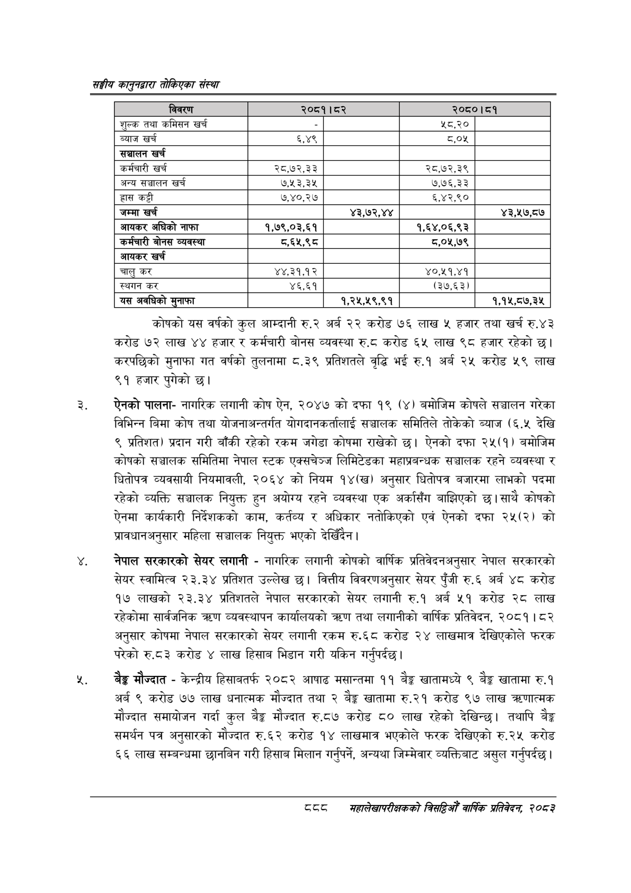

# Page 938 QA

## Rendered page


## Extracted text

```text
सङ्घीय कलुनदवारा तोकिएका संस्था
कोषको यस वर्षको कुल आम्दानी रु.२ अर्ब २२ करोड ७६ लाख ५ हजार तथा खर्च रु.४३ करोड ७२ लाख ४४ हजार र कर्मचारी बोनस व्यवस्था रु.८ करोड ६५ लाख ९८ हजार रहेको छ। करपछिको मुनाफा गत वर्षको तुलनामा ८.३९ प्रतिशतले वृद्धि भई रु.१ अर्ब २५ करोड ५९ लाख ९१ हजार पुगेको छ।
ऐनको पालनानागरिक लगानी कोष ऐन, २०४७ को दफा १९ (४) बमोजिम कोषले सञ्चालन गरेका विभिन्न बिमा कोष तथा योजनाअन्तर्गत योगदानकर्तालाई सञ्चालक समितिले तोकेको ब्याज (६.५ देखि ९ प्रतिशत) प्रदान गरी बाँकी रहेको रकम जगेडा कोषमा राखेको | ऐनको दफा २५(१) बमोजिम कोषको सञ्चालक समितिमा नेपाल स्टक एक्सचेञ्ज लिमिटेडका महाप्रबन्धक सञ्चालक रहने व्यवस्था र धितोपत्र व्यवसायी नियमावली, २०६४ को नियम १४(ख) अनुसार धितोपत्र बजारमा लाभको पदमा रहेको व्यक्ति सञ्चालक नियुक्त हुन अयोग्य रहने व्यवस्था एक अर्कासँग बाझिएको छ। साथै कोषको ऐनमा कार्यकारी निर्देशकको काम, कर्तव्य र अधिकार नतोकिएको एवं ऐनको दफा २५(२) को प्रावधानअनुसार महिला सञ्चालक नियुक्त भएको देखिँदैन।
नेपाल सरकारको सेयर लगानी -नागरिक लगानी कोषको वार्षिक प्रतिवेदनअनुसार नेपाल सरकारको सेयर स्वामित्व २३.३४ प्रतिशत उल्लेख छ। वित्तीय विवरणअनुसार सेयर पुँजी रु. ६ अर्ब ४८ करोड १७ लाखको २३.३४ प्रतिशतले नेपाल सरकारको सेयर लगानी रु.१ अर्ब ५१ करोड २८ लाख रहेकोमा सार्वजनिक ० व्यवस्थापन कार्यालयको त्रहण तथा लगानीको वार्षिक प्रतिवेदन, २०८१। ८२ अनुसार कोषमा नेपाल सरकारको सेयर लगानी रकम रु.६८ करोड २४ लाखमात्र देखिएकोले फरक परेको रु.८३ करोड ४ लाख हिसाब भिडान गरी यकिन गर्नुपर्दछ |
बेङ्ग मौज्दात -केन्द्रीय हिसाबतर्फ २०८२ आषाढ मसान्तमा ११ ९% खातामध्ये ९ बैङ्क खातामा रु.१ अर्ब ९ करोड ७७ लाख धनात्मक मौज्दात तथा २ बेङ्ग खातामा रु.२१ करोड ९७ लाख त्रणात्मक मौज्दात समायोजन गर्दा कुल बेङ्ग मौज्दात रु.८७ करोड ८० लाख रहेको देखिन्छ। तथापि बेङ्ग समर्थन पत्र अनुसारको मौज्दात रु.६२ करोड १४ लाखमात्र भएकोले फरक देखिएको रु.२५ करोड ६६ लाख सम्बन्धमा छानबिन गरी हिसाब मिलान गर्नुपर्ने, अन्यथा जिम्मेवार व्यक्तिबाट असुल गर्नुपर्दछ |
दद
महालेखपरीक्षकको बितद्रिमो वार्षिक प्रतिवेकन, २०८२

|  |  |  |  |  |
| --- | --- | --- | --- | --- |
| एरर |  | डा | ०० | ८" |
| शुल्क तथा कमिसन खर्च |  |  | ४५,३० |  |
| व्याज खर्च | ६,४९ |  | ८,०४५ |  |
| सञ्चालन खर्च |  |  |  |  |
| कर्मचारी खर्च | २८,७२,३३ |  | २८,७२,३९ |  |
| अन्य सञ्चालन खर्च | ७,१३,३५ |  | ७,७६,३३ |  |
| हास कट्टी | ७,४०,२७ |  | ५,४२,९० |  |
| जम्मा खर्च |  | ४३,७२,४४ |  | ४३,१७,८७ |
| आयकर अघिको नाफा | १,७९,०३,६१ |  | १,६४,०६,९३ |  |
| कर्मचारी बोनस व्यबस्था | व,६५,९८ |  | ८,०५,७९ |  |
| आयकर खर्च |  |  |  |  |
| चालु कर | ४४,३१,१२ |  | ४०,५१,४१ |  |
| स्थगन कर | ४६,६१ |  | (३७,६३) |  |
| यस अवधिको मुनाफा |  | १,२५,५९,९१ |  | १,१५,८७,३४५ |
```

## Flags
- table_page
- medium_quality_table
