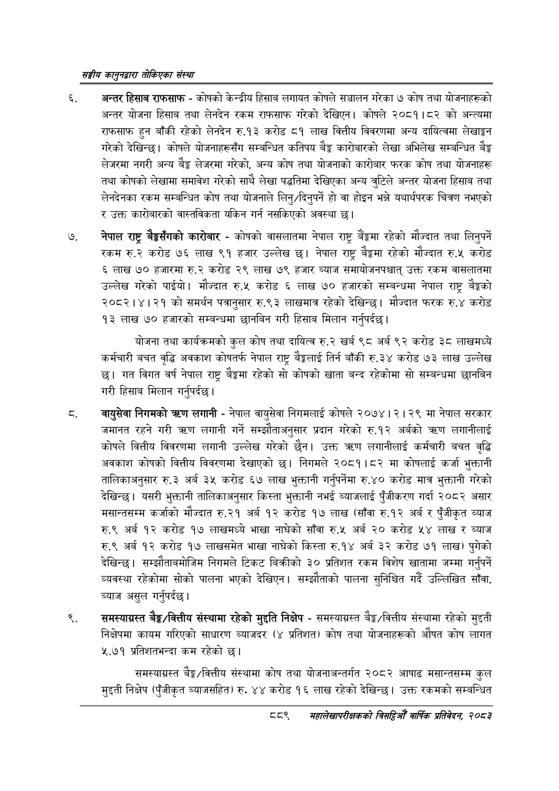

# Page 939 QA

## Rendered page


## Extracted text

```text
सङ्घीय कलुनदवारा तोकिएका संस्था
अन्तर हिसाब राफसाफ -कोषको केन्द्रीय हिसाब लगायत कोषले सञ्चालन गरेका ७ कोष तथा योजनाहरूको अन्तर योजना हिसाब तथा लेनदेन रकम राफसाफ गरेको देखिएन। कोषले २०८१।८२ को अन्त्यमा राफसाफ हुन बाँकी रहेको लेनदेन रु.१३ करोड ८१ लाख वित्तीय विवरणमा अन्य दायित्वमा लेखाङ्गन गरेको देखिन्छ। कोषले योजनाहरूसँग सम्बन्धित कतिपय बैङ्क कारोबारको लेखा अभिलेख सम्बन्धित बैङ्क लेजरमा नगरी अन्य बेङ्ग लेजरमा गरेको, अन्य कोष तथा योजनाको कारोबार फरक कोष तथा योजनाहरू तथा कोषको लेखामा समावेश गरेको साथै लेखा पद्धतिमा देखिएका अन्य चरुटिले अन्तर योजना हिसाब तथा लेनदेनका रकम सम्बन्धित कोष तथा योजनाले लिनु/दिनुपर्ने हो वा होइन भन्ने यथार्थपरक चित्रण नभएको र उक्त कारोबारको वास्तविकता यकिन गर्न नसकिएको अवस्था छ।
नेपाल राष्ट्र बैङ्कसँगको कारोबार -कोषको वासलातमा नेपाल राष्ट्र बैङ्कमा रहेको मौज्दात तथा लिनुपर्ने रकम रु.२ करोड ७६ लाख ९१ हजार उल्लेख छ। नेपाल राष्ट्र बैङ्कमा रहेको मौज्दात रु.५ करोड ६ लाख ७० हजारमा रु.२ करोड २९ लाख ७९ हजार ब्याज समायोजनपश्चात्‌ उक्त रकम वासलातमा उल्लेख गरेको पाईयो। मौज्दात रु.५ करोड ६ लाख ७० हजारको सम्बन्धमा नेपाल राष्ट्र बैङ्कको २०८२।४।२१ को समर्थन पत्रानुसार रु.९३ लाखमात्र रहेको देखिन्छ। मौज्दात फरक रु.४ करोड ९३ लाख ७० हजारको सम्बन्धमा छानबिन गरी हिसाब मिलान गर्नुपर्दछ |
योजना तथा कार्यक्रमको कुल कोष तथा दायित्व रु.२ खर्ब ९८ अर्ब ९२ करोड ३८ लाखमध्ये कर्मचारी बचत वृद्धि अवकाश कोषतर्फ नेपाल राष्ट्र बैङ्कलाई तिर्न बाँकी रु.३४ करोड ७३ लाख उल्लेख छ। गत विगत वर्ष नेपाल राष्ट्र बैङ्कमा रहेको सो कोषको खाता बन्द रहेकोमा सो सम्बन्धमा छानबिन गरी हिसाब मिलान गर्नुपर्दछ।
वायुसेवा निगमको त्रटण लगानी -नेपाल वायुसेवा निगमलाई कोषले २०७४। २। २९ मा नेपाल सरकार जमानत रहने गरी त्रण लगानी गर्ने सम्झौताअनुसार प्रदान गरेको रु.१२ अर्वको करण लगानीलाई कोषले वित्तीय विवरणमा लगानी उल्लेख गरेको छैन। उक्त लगानीलाई कर्मचारी बचत वृद्धि अवकाश कोषको वित्तीय विवरणमा देखाएको छ। निगमले २०८१।८२ मा कोषलाई कर्जा भुक्तानी तालिकाअनुसार रु.३ अर्ब ३५ करोड ६७ लाख भुक्तानी गर्नुपर्नेमा रु.४० करोड मात्र भुक्तानी गरेको देखिन्छ। यसरी भुक्तानी तालिकाअनुसार किस्ता भुक्तानी नभई ब्याजलाई पुँजीकरण गर्दा २०८२ असार मसान्तसम्म कर्जाको मौज्दात रु.२१ अर्ब १२ करोड १७ लाख (साँवा रु.१२ अर्ब र पुँजीकृत ब्याज रु.९ अर्ब १२ करोड १७ लाखमध्ये भाखा नाघेको साँवा रु.५ अर्ब २० करोड ५४ लाख र ब्याज रु.९ अर्ब १२ करोड १७ लाखसमेत भाखा नाघेको किस्ता रु.१४ अर्ब ३२ करोड ७१ लाख) पुगेको देखिन्छ। सम्झौताबमोजिम निगमले टिकट बिक्रीको ३० प्रतिशत रकम विशेष खातामा जम्मा गर्नुपर्ने व्यवस्था रहेकोमा सोको पालना भएको देखिएन। सम्झौताको पालना सुनिश्चित गर्दै उल्लिखित साँवा, ब्याज असुल गर्नुपर्दछ।
समस्याग्रस्त बेङ्ग/वित्तीय संस्थामा रहेको मुद्दति निक्षेप -समस्याग्रस्त बेङ्क/वित्तीय संस्थामा रहेको मुद्दती निक्षेपमा कायम गरिएको साधारण ब्याजदर (४ प्रतिशत) कोष तथा योजनाहरूको औषत कोष लागत ५.७१ प्रतिशतभन्दा कम रहेको |
समस्याग्रस्त बैङ्क/वित्तीय संस्थामा कोष तथा योजनाअन्तर्गत २०८२ आषाढ मसान्तसम्म कुल मुद्दती निक्षेप (पुँजीकृत ब्याजसहित) रु. ४४ करोड १६ लाख रहेको देखिन्छ। उक्त रकमको सम्बन्धित
८९
महालेखपरीक्षकको वार्षिक , २०८२
```

## Flags
- None
