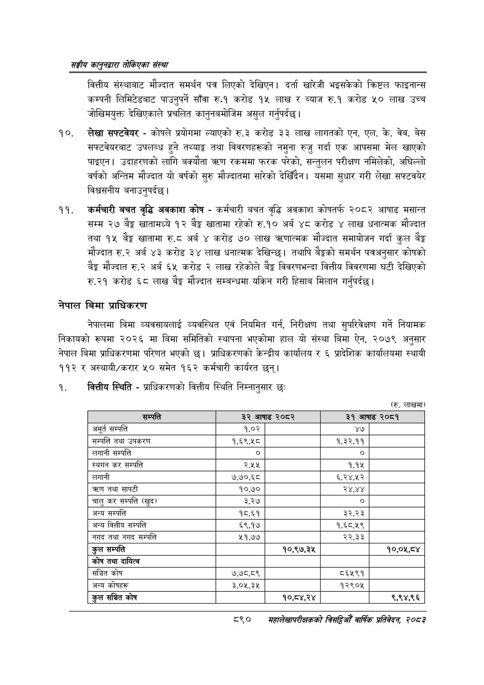

# Page 940 QA

## Rendered page


## Extracted text

```text
सङ्घीय कलुनदवारा तोकिएका संस्था
वित्तीय संस्थाबाट मौज्दात समर्थन पत्र लिएको देखिएन। दर्ता खारेजी भइसकेको क्रिष्टल फाइनान्स कम्पनी लिमिटेडबाट पाउनुपर्ने साँवा रु.१ करोड १५ लाख र ब्याज रु.१ करोड ५० लाख उच्च जोखिमयुक्त देखिएकाले प्रचलित कानुनबमोजिम असुल गर्नुपर्दछ |
लेखा सफ्टवेयर -कोषले प्रयोगमा ल्याएको रु.३ करोड ३३ लाख लागतको एन. एल. के. वेब, बेस सफ्टवेयरबाट उपलब्ध हुने तथ्याङ्क तथा विवरणहरूको नमुना रुजु गर्दा एक आपसमा मेल खाएको पाइएन। उदाहरणको लागि बक्यौता ० रकममा फरक परेको, सन्तुलन परीक्षण नमिलेको, अघिल्लो वर्षको अन्तिम मौज्दात यो वर्षको सुरु मौज्दातमा सारेको देखिँदैन। यसमा सुधार गरी लेखा सफ्टवयेर विश्वसनीय बनाउनुपर्दछ |
कर्मचारी बचत वृद्धि अवकाश कोष -कर्मचारी बचत वृद्धि अवकाश कोषतर्फ २०८२ आषाढ मसान्त सम्म २७ बैङ्क खातामध्ये १२ बेङ्ग खातामा रहेको रु.१० अर्ब ४८ करोड ४ लाख धनात्मक मौज्दात तथा १५ बैङ्क खातामा रु.८ अर्ब ४ करोड ७० लाख त्रदरणात्मक मौज्दात समायोजन गर्दा कुल बैङ्क मौज्दात रु.२ अर्ब ४३ करोड ३४ लाख धनात्मक देखिन्छ। तथापि बैङ्कको समर्थन पत्रअनुसार कोषको बेङ्ग मौज्दात रु.२ अर्ब ६५ करोड २ लाख रहेकोले बेङ्ग विवरणभन्दा वित्तीय विवरणमा घटी देखिएको रु.२१ करोड ६८ लाख ३ मौज्दात सम्बन्धमा यकिन गरी हिसाव मिलान गर्नुपर्दछ |
नेपाल बिमा प्राधिकरण
नेपालमा बिमा व्यवसायलाई व्यवस्थित एवं नियमित गर्न, निरीक्षण तथा सुपरिवेक्षण गर्ने नियामक निकायको रूपमा २०२६ मा बिमा समितिको स्थापना भएकोमा हाल यो संस्था बिमा ऐन, २०७९ अनुसार नेपाल बिमा प्राधिकरणमा परिणत भएको छ। प्राधिकरणको केन्द्रीय कार्यालय ६ प्रादेशिक कार्यालयमा स्थायी ११२ र अस्थायी/करार ५० समेत १६२ कर्मचारी कार्यरत छन्‌।
वित्तीय स्थिति -प्राधिकरणको वित्तीय स्थिति निम्नानुसार छः
(रु. लाखमा)
८९०
महालेखापरीक्षकको वार्षिक प्रतिवेदन; २०८२

| सम्पत्ति | ३२ आषाढ | २०८२ | ३१ आषाढ | २०८१ |
| --- | --- | --- | --- | --- |
| अमूर्त सम्पत्ति | १,०२ |  | ४७ |  |
| सम्पत्ति तथा उपकरण | १,६९,५८ |  | १,३२,११ |  |
| 'लगानी सम्पत्ति | ० |  | ० |  |
| स्थगन कर सम्पत्ति | २,४५५ |  | १,१५ |  |
| 'लगानी | ७,७०,६८ |  |  |  |
| तथा सापटी | १०,७० |  | २४,४४ |  |
| चालु कर सम्पत्ति (खुद) | ३३६ |  | ० |  |
| अन्य सम्पत्ति | १८,६१ |  | ३२,२३ |  |
| अन्य वित्तीय सम्पत्ति | ६९,१४७ |  | १,६८,५९ |  |
| नगद तथा नगद सम्पत्ति | ५१,७७ |  | २२,३३ |  |
| कुल सम्पत्ति |  | १०,९७,३५ |  | १०,०४५,८४ |
| 'कोष तथा दायित्व |  |  |  |  |
| सञ्चित कोष | ७,७८,८९ |  | ८६४५९१ |  |
| अन्य कोषहरू | ३,०५,३५ |  | १२९०४५ |  |
| कुल सञ्चित कोष |  | १०,८४,२४ |  | ९,९४,९६ |
```

## Flags
- table_page
- medium_quality_table
