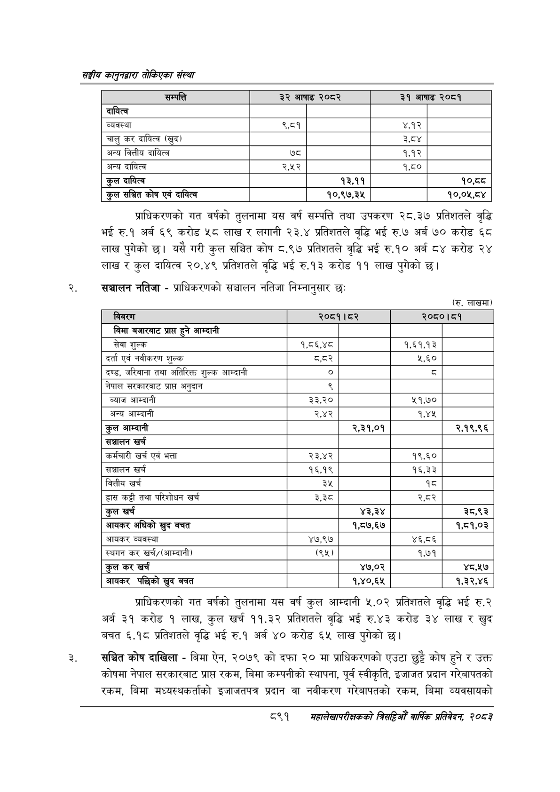

# Page 941 QA

## Rendered page


## Extracted text

```text
सङ्घीय कलुनदवारा तोकिएका संस्था
प्राधिकरणको गत वर्षको तुलनामा यस वर्ष सम्पत्ति तथा उपकरण २८.३७ प्रतिशतले वृद्धि भई रु.१ अर्ब ६९ करोड ५८ लाख र लगानी २३.४ प्रतिशतले वृद्धि भई रु.७ अर्ब ७० करोड ६८ लाख पुगेको छ। यसै गरी कुल सञ्चित कोष ८.९७ प्रतिशतले वृद्धि भई रु.१० अर्ब ८४ करोड २४ लाख र कुल दायित्व २०.४९ प्रतिशतले वृद्धि भई रु.१३ करोड ११ लाख पुगेको छ।
सञ्चालन नतिजा -प्राधिकरणको सञ्चालन नतिजा निम्नानुसार छः
(रु. लाखमा)
प्राधिकरणको गत वर्षको तुलनामा यस वर्ष कुल आम्दानी ५.०२ प्रतिशतले वृद्धि भई रु.२ अर्ब ३१ करोड १ लाख, कुल खर्च ११.३२ प्रतिशतले वृद्धि भई रु.४३ करोड ३४ लाख र खुद बचत ६.१८ प्रतिशतले वृद्धि भई रु.१ अर्ब ४० करोड ६५ लाख पुगेको छ।
सञ्चित कोष दाखिला -बिमा ऐन, २०७९ को दफा २० मा प्राधिकरणको एउटा छुट्टै कोष हुने र उक्त कोषमा नेपाल सरकारबाट प्राप्त रकम, बिमा कम्पनीको स्थापना, पूर्व स्वीकृति, इजाजत प्रदान गरेबापतको रकम, बिमा मध्यस्थकर्ताको इजाजतपत्र प्रदान वा नवीकरण गरेबापतको रकम, बिमा व्यवसायको
८९१
महालेखापरीक्षकको वार्षिक प्रतिवेकन, २०८२

| सम्पत्ति | ३२ आषाढ | २०८२ | ३१ आषाढ | २०८१ |
| --- | --- | --- | --- | --- |
| दायित्व |  |  |  |  |
| व्यवस्था | २.५ |  | ४.१२ |  |
| चालु कर दायित्व (खुद। |  |  | ३,८८४ |  |
| अन्य वित्तीय दायित्व | ७ |  | १,१२ |  |
| अन्य दायित्व | २,४५२ |  | १,८० |  |
| कुल दायित्व |  | १३,११ |  | १०,५५ |
| कुल सञ्चित कोष एवं दायित्व |  | १०,९७,३५ |  | १०,०५,८४ |

| विवरण | २०८१।८२ |  | २०८०।८१ |  |
| --- | --- | --- | --- | --- |
| बिमा नजारबाट प्राप्त हुने आन्दानी |  |  |  |  |
| सेवा शुल्क | १,८६,४८ |  | १.६१.१३ |  |
| दर्ता एवं नीक९०५ शुल्क | वदर |  | ५,६० |  |
| दण्ड, जरिवाना तथा अतिरिक्त शुल्क आम्दानी | ० |  | ५ |  |
| नेपाल सरकारबाट प्राप्त अनुदान | ९ |  |  |  |
| ब्याज आम्दानी | ३३,२० |  | २१,७० |  |
| अन्य आम्दानी | २,४२ |  | १,४४५ |  |
| कुल आम्दानी |  | २,३१,०१ |  | २,१९,९६ |
| सञ्चालन खर्च |  |  |  |  |
| कर्मचारी खर्च एवं भत्ता | २३,४२ |  | १९,६० |  |
| सञ्चालन खर्च | १६,१९ |  | १६,३३ |  |
| वित्तीय खर्च | ३५ |  | १८ |  |
| हास कट्टी तथा परिशोधन खर्च | ३,३८ |  | २,८२ |  |
| कुल खर्च |  | ४३,३४ |  | ३८,९३ |
| आयकर अघिको खुद बचत |  | १,८७,६७ |  | १,८१,०३ |
| आयकर व्यवस्था | ४७,९७ |  | ४६,८६ |  |
| स्थगन कर खर्च/(आम्दानी। | (९५) |  | १,७१ |  |
| कुल कर खर्च |  | ४७,०२ |  | ४८,५१७ |
| आयकर पछिको खुद बचत |  | १,४०,६५ |  | १,३२,४६ |
```

## Flags
- table_page
- medium_quality_table
