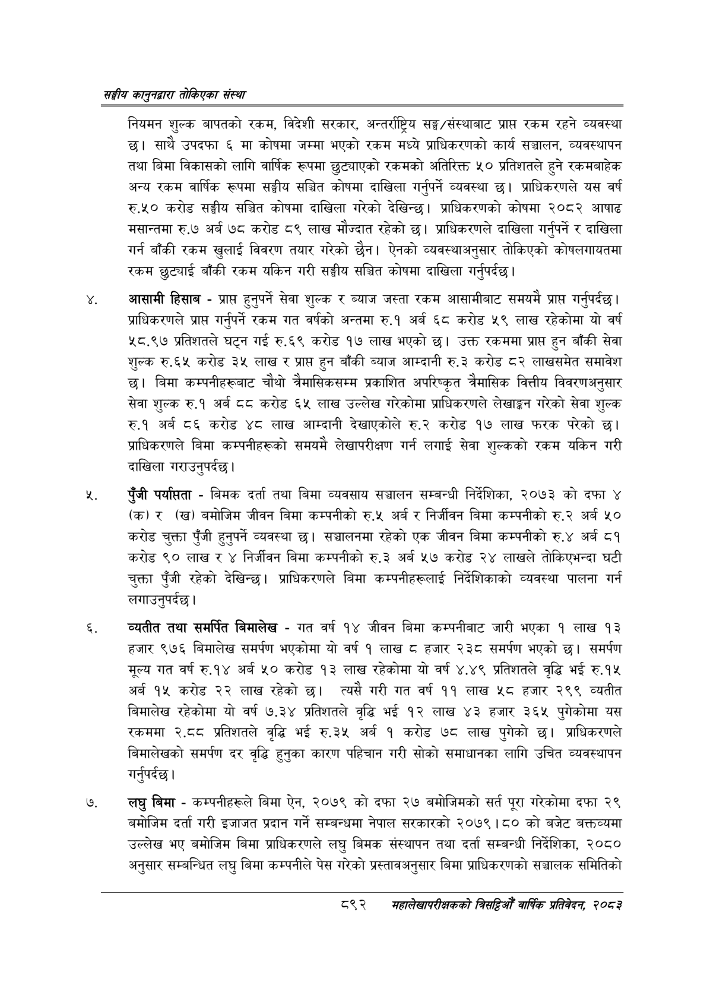

# Page 942 QA

## Rendered page


## Extracted text

```text
सङ्घीय कलुनदवारा तोकिएका संस्था
नियमन शुल्क बापतको रकम, विदेशी सरकार, अन्तर्राष्ट्रिय सङ्घ/संस्थाबाट प्रापत रकम रहने व्यवस्था छ। साथै उपदफा मा कोषमा जम्मा भएको रकम मध्ये प्राधिकरणको कार्य सञ्चालन, व्यवस्थापन तथा बिमा विकासको लागि वार्षिक रूपमा छुट्याएको रकमको अतिरिक्त ५० प्रतिशतले हुने रकमबाहेक अन्य रकम वार्षिक रूपमा सङ्घीय सञ्चित कोषमा दाखिला गर्नुपर्ने व्यवस्था छ। प्राधिकरणले यस वर्ष रु.५० करोड सङ्घीय सञ्चित कोषमा दाखिला गरेको देखिन्छ। प्राधिकरणको कोषमा २०८२ आषाढ मसान्तमा रु.७ अर्ब ७८ करोड ८९ लाख मौज्दात रहेको छ। प्राधिकरणले दाखिला गर्नुपर्ने र दाखिला गर्न बाँकी रकम खुलाई विवरण तयार गरेको छैन। ऐनको व्यवस्थाअनुसार तोकिएको कोषलगायतमा रकम छुट्याई बाँकी रकम यकिन गरी सङ्घीय सञ्चित कोषमा दाखिला गर्नुपर्दछ |
आसामी हिसाब -प्राप्त हुनुपर्ने सेवा शुल्क र ब्याज जस्ता रकम आसामीबाट समयमै प्राप्त गर्नुपर्दछ | प्राधिकरणले प्राप्त गर्नुपर्ने रकम गत वर्षको अन्तमा रु.१ अर्ब ६८ करोड ५९ लाख रहेकोमा यो वर्ष ५८.९७ प्रतिशतले घट्न गई रु. ६९ करोड १७ लाख भएको छ। उक्त रकममा प्राप्त हुन बाँकी सेवा शुल्क रु.६५ करोड ३५ लाख र प्राप्त हुन बाँकी ब्याज आम्दानी रु.३ करोड ८२ लाखसमेत समावेश छ। बिमा कम्पनीहरूबाट चौथो त्रैमासिकसम्म प्रकाशित अपरिष्कृत त्रैमासिक वित्तीय विवरणअनुसार सेवा शुल्क रु.१ अर्ब ८८ करोड ६५ लाख उल्लेख गरेकोमा प्राधिकरणले लेखाङ्गन गरेको सेवा शुल्क रु.१ अर्ब ८६ करोड ४८ लाख आम्दानी देखाएकोले रु.२ करोड १७ लाख फरक परेको छ। प्राधिकरणले बिमा कम्पनीहरूको समयमै लेखापरीक्षण गर्न लगाई सेवा शुल्कको रकम यकिन गरी दाखिला गराउनुपर्दछ।
पुँजी पर्यासता -बिमक दर्ता तथा बिमा व्यवसाय सञ्चालन सम्बन्धी निर्देशिका, २०७३ को दफा ४ (क) र () बमोजिम जीवन बिमा कम्पनीको रु.५ अर्ब र निर्जीवन बिमा कम्पनीको रु.२ अर्ब ५० करोड चुक्ता पुँजी हुनुपर्ने व्यवस्था | सञ्चालनमा रहेको एक जीवन बिमा कम्पनीको रु.४ अर्ब ८१ करोड ९० लाख र ४ निर्जीवन बिमा कम्पनीको रु.३ अर्ब ५७ करोड २४ लाखले तोकिएभन्दा घटी चुक्ता पुँजी रहेको देखिन्छ। प्राधिकरणले बिमा कम्पनीहरूलाई निर्देशिकाको व्यवस्था पालना गर्न लगाउनुपर्दछ।
व्यतीत तथा समर्पित बिमालेख -गत वर्ष १४ जीवन बिमा कम्पनीबाट जारी भएका १ लाख १३ हजार ९७६ बिमालेख समर्पण भएकोमा यो वर्ष १ लाख ८ हजार २३८ समर्पण भएको छ। समर्पण मूल्य गत वर्ष रु.१४ अर्ब ५० करोड १३ लाख रहेकोमा यो वर्ष ४.४९ प्रतिशतले वृद्धि भई रु.१५ अर्ब १५ करोड २२ लाख रहेको छ। त्यसै गरी गत वर्ष ११ लाख ५८ हजार २९९ व्यतीत बिमालेख रहेकोमा यो वर्ष ७.३४ प्रतिशतले वृद्धि भई १२ लाख ४३ हजार ३२६५ पुगेकोमा यस रकममा २.८ प्रतिशतले वृद्धि भई रु.३५ अर्ब १ करोड ७८ लाख पुगेको छ। प्राधिकरणले बिमालेखको समर्पण दर वृद्धि हुनुका कारण पहिचान गरी सोको समाधानका लागि उचित व्यवस्थापन गर्नुपर्दछ |
लघु बिमा -कम्पनीहरूले बिमा ऐन, २०७९ को दफा २७ बमोजिमको सर्त पूरा गरेकोमा दफा २९ बमोजिम दर्ता गरी इजाजत प्रदान गर्ने सम्बन्धमा नेपाल सरकारको २०७९।८० को बजेट बक्तव्यमा उल्लेख भए बमोजिम बिमा प्राधिकरणले लघु बिमक संस्थापन तथा दर्ता सम्बन्धी निर्देशिका, २०८० अनुसार सम्बन्धित लघु बिमा कम्पनीले पेस गरेको प्रस्तावअनुसार बिमा प्राधिकरणको सञ्चालक समितिको
८९२
महालेखापरीक्षकको वार्षिक , २०८२
```

## Flags
- None
