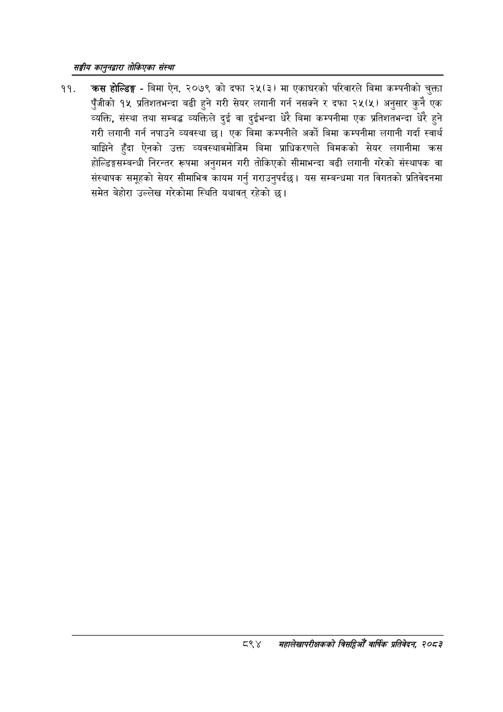

# Page 944 QA

## Rendered page


## Extracted text

```text
सङ्घीय कलुनदवारा तोकिएका संस्था
क्रस होल्डिङ्ग -बिमा ऐन, २०७९ को दफा २५(३) मा एकाघरको परिवारले बिमा कम्पनीको चुक्ता पुँजीको १५ प्रतिशतभन्दा बढी हुने गरी सेयर लगानी गर्न नसक्ने र दफा २५(५) अनुसार कुनै एक व्यक्ति, संस्था तथा सम्बद्ध व्यक्तिले दुई वा दुईभन्दा धेरै बिमा कम्पनीमा एक प्रतिशतभन्दा धेरै हुने गरी लगानी गर्न नपाउने व्यवस्था | एक बिमा कम्पनीले अर्को बिमा कम्पनीमा लगानी गर्दा स्वार्थ बाझिने हुँदा ऐनको उक्त व्यवस्थाबमोजिम बिमा प्राधिकरणले बिमकको सेयर लगानीमा क्रस होल्डिङ्गसम्बन्धी निरन्तर रूपमा अनुगमन गरी तोकिएको सीमाभन्दा बढी लगानी गरेको संस्थापक वा संस्थापक समूहको सेयर सीमाभित्र कायम गर्नु गराउनुपर्दछ। यस सम्बन्धमा गत विगतको प्रतिवेदनमा समेत बेहोरा उल्लेख गरेकोमा स्थिति यथावत्‌ रहेको छ।
८९४ मंहालेखापरीक्षकको वार्षिक प्रतिवेकन, २०८२
```

## Flags
- None
