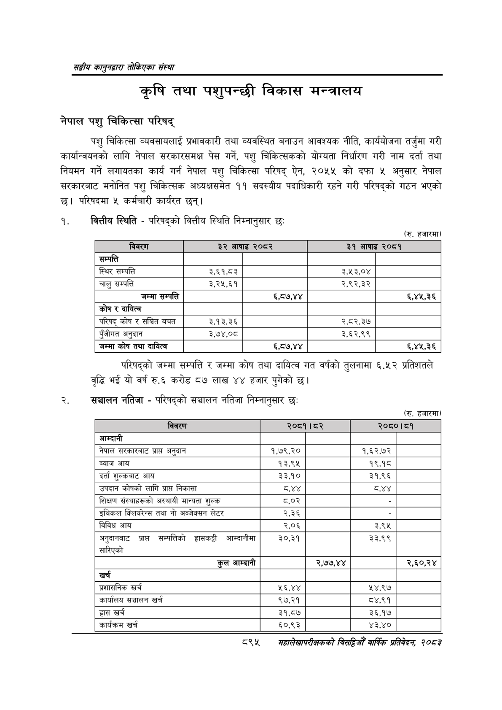

# Page 945 QA

## Rendered page


## Extracted text

```text
सङ्घीय कलुनदवारा तोकिएका संस्था
कृषि तथा पशुपन्छी विकास मन्त्रालय
नेपाल पशु चिकित्सा परिषद्‌
पशु चिकित्सा व्यवसायलाई प्रभावकारी तथा व्यवस्थित बनाउन आवश्यक नीति, कार्ययोजना तर्जुमा गरी कार्यान्वयनको लागि नेपाल सरकारसमक्ष पेस गर्ने, पशु चिकित्सकको योग्यता निर्धारण गरी नाम दर्ता तथा नियमन गर्ने लगायतका कार्य गर्न नेपाल पशु चिकित्सा परिषद्‌ ऐन, २०५५ को दफा ५ अनुसार नेपाल सरकारबाट मनोनित पशु चिकित्सक अध्यक्षसमेत ११ सदस्यीय पदाधिकारी रहने गरी परिषद्को गठन भएको छ। परिषदमा ५ कर्मचारी कार्यरत छन्‌।
१. वित्तीय स्थिति -परिषद्को वित्तीय स्थिति निम्नानुसार छः
(रु. हजारमा)
परिषद्को जम्मा सम्पत्ति र जम्मा कोष तथा दायित्व गत वर्षको तुलनामा ६.५२ प्रतिशतले वृद्धि भई यो वर्ष रु.६ करोड ८७ लाख ४४ हजार पुगेको छ।
२. संञ्चालन नतिजा -परिषद्को सञ्चालन नतिजा निम्नानुसार छः
(रु. हजारमा)
८९५
महालेखापरीक्षकको वार्षिक प्रतिवेदन; २०८२

|  |  |  |  |  |
| --- | --- | --- | --- | --- |
| रीति | ३ ५ | १७७ ~ | २] ५१। | र०५ा |
| सम्पत्ति |  |  |  |  |
| स्थिर सम्पत्ति | ३,६१,८३ |  | ३,४३,० |  |
| चालु सम्पत्ति | ३.२५.६१ |  | २,.९२,३२ |  |
| जम्मा सम्पत्ति |  | ६,८७,४४ |  | ६,४५,३६ |
| 'कोष र दायित्व |  |  |  |  |
| परिषद्‌ कोष र सञ्चित बचत | ३.१३,.३६ |  | २,८२,३७ |  |
| पुँजीगत अनुदान | ३,७४,०८ |  | ३,६२,९९ |  |
| जम्मा कोष तथा दायित्व |  | ६,८७,४४ |  | ६,४५,३६ |

| छि | ना |  |  | दा. |
| --- | --- | --- | --- | --- |
| आन्दानी |  |  |  |  |
| नेपाल €९क९१॥८ प्राप्त अनुदान | १,७९,२० |  | १,६२,७२ |  |
| ब्याज आय | १३,९४५ |  | १९,१८ |  |
| दर्ता इुल्कबाट आय | ३३,१० |  | ३१,९६ |  |
| उपदान कोषको लागि प्राप्त निकासा | ८२१ |  |  |  |
| शिक्षण संस्थाहरूको अस्थायी मान्यता शुल्क | ८०२ |  |  |  |
| इथिकल।क्लिबरन्त तथा नो जन्जक्सन लेटर | २,३६ |  |  |  |
| बिविध आय | २,०६ |  | ३,९४५ |  |
| अनुबानबाट प्राप्त सम्पत्तिको आन्दानीमा सारिएको | ३०,३१ |  | ३३,९९ |  |
| कुल आम्दानी |  | २,७७,४४ |  | २,६०,२४ |
| खर्च |  |  |  |  |
| त्रशासनिक खर्च | २६,४४ |  | ५४,९७ |  |
| कार्यालय सञ्चालन खर्च | ९७,२१ |  | ८४,९१ |  |
| हास खर्च | ३१,८७४ |  | ३६,१७४ |  |
| कार्यक्रम खर्च | ६०,९३ |  | ४३,४० |  |
```

## Flags
- table_page
- medium_quality_table
