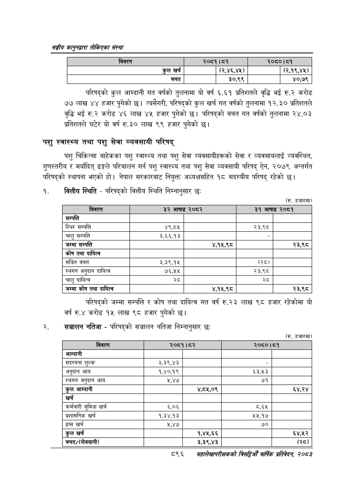

# Page 946 QA

## Rendered page


## Extracted text

```text
सङ्घीय कलुनदवारा तोकिएका संस्था
परिषद्को कुल आम्दानी गत वर्षको तुलनामा यो वर्ष ६.६१ प्रतिशतले वृद्धि भई रु.२ करोड ७७ लाख ४४ हजार पुगेको छ। त्यसैगरी, परिषद्को कुल खर्च गत वर्षको तुलनामा १२.३० प्रतिशतले वृद्धि भई रु.२ करोड ४६ लाख ४५ हजार पुगेको छ। परिषद्को बचत गत वर्षको तुलनामा २४.०३ प्रतिशतले घटेर यो वर्ष रु.३० लाख ९९ हजार पुगेको छ।
पशु स्वास्थ्य तथा पशु सेवा व्यवसायी परिषद्‌
पशु चिकित्सा बाहेकका पशु स्वास्थ्य तथा पशु सेवा व्यवसायीहरूको सेवा र व्यवसायलाई व्यवस्थित, गुणस्तरीय र मर्यादित्‌ ढङ्गले परिचालन गर्न पशु स्वास्थ्य तथा पशु सेवा व्यवसायी परिषद्‌ ऐन, २०७९ अन्तर्गत परिषद्को स्थापना भएको हो। नेपाल सरकारबाट नियुक्त अध्यक्षसहित १८ सदस्यीय परिषद्‌ रहेको छ।
१. बकित्तीय स्थिति -परिषद्को वित्तीय स्थिति निम्नानुसार छः
(रु. हजारमा)
परिषद्को जम्मा सम्पत्ति र कोष तथा दायित्व गत वर्ष रु.२३ लाख ९८ हजार रहेकोमा यो वर्ष रु.४ करोड १५ लाख ९८ हजार पुगेको |
२. सञ्चालन नतिजा -परिषद्को सञ्चालन नतिजा निम्नानुसार छः
(रु. हजारमा)
८९६
महालेखापरीक्षकको वार्षिक प्रतिवेकन, २०८२

| विवरण    | २०८१। ८२   | २०८०।८१   |
|----------|------------|-----------|
| कुल खर्च | (२,४६,४५)  | (२,१९,४५) |
| बचत      | ३०,९९      | ४०,७९     |

|  |  |  |  |  |
| --- | --- | --- | --- | --- |
| नबरण |  |  |  | ३९५ |
| सम्पत्ति |  |  |  |  |
| स्थिर सम्पत्ति | ४९,८४५ |  | २३,९८ |  |
| चालु सम्पत्ति | ३.६६,१३ |  |  |  |
| जम्मा सम्पत्ति |  | ४,१५,९८ |  | २३,९८ |
| 'कोष तथा दायित्व |  |  |  |  |
| सञ्चित वचत | ३,३९.१५ |  | (२८) |  |
| स्थगन अनुदान दायित्व | ७६,५१५ |  | २३,९८ |  |
| चालु दायित्व | स्व |  | स्व |  |
| जम्मा कोष तथा दायित्व |  | ४,१५,९८ |  | २३,९८० |

|  |  |  |  |  |
| --- | --- | --- | --- | --- |
| मबरण | २६५१ | ५२ | ७०५० | ५ |
| आम्दानी |  |  |  |  |
| सद्ल्यता शुल्क | ३,३९,४३ |  |  |  |
| अनुदान आय | १,४०,१९ |  | ६३,५३ |  |
| स्थगत अनुदान आय | श,४७ |  | ७१ |  |
| कुल आम्दानी |  | ४,८५,०९ |  | ६४,२४ |
| खर्च |  |  |  |  |
| कर्मचारी सुविधा खर्च | ६,०६ |  | ८.६४५ |  |
| प्रशासनिक खर्च | १,३४,१३ |  | ५५,१७ |  |
| हास खर्च | ५,४७ |  | ७० |  |
| कुल खर्च |  | १,४४५,६६ |  | ६४,२५२ |
|  |  | ३,३९,४३ |  | (२८) |
```

## Flags
- table_page
- medium_quality_table
