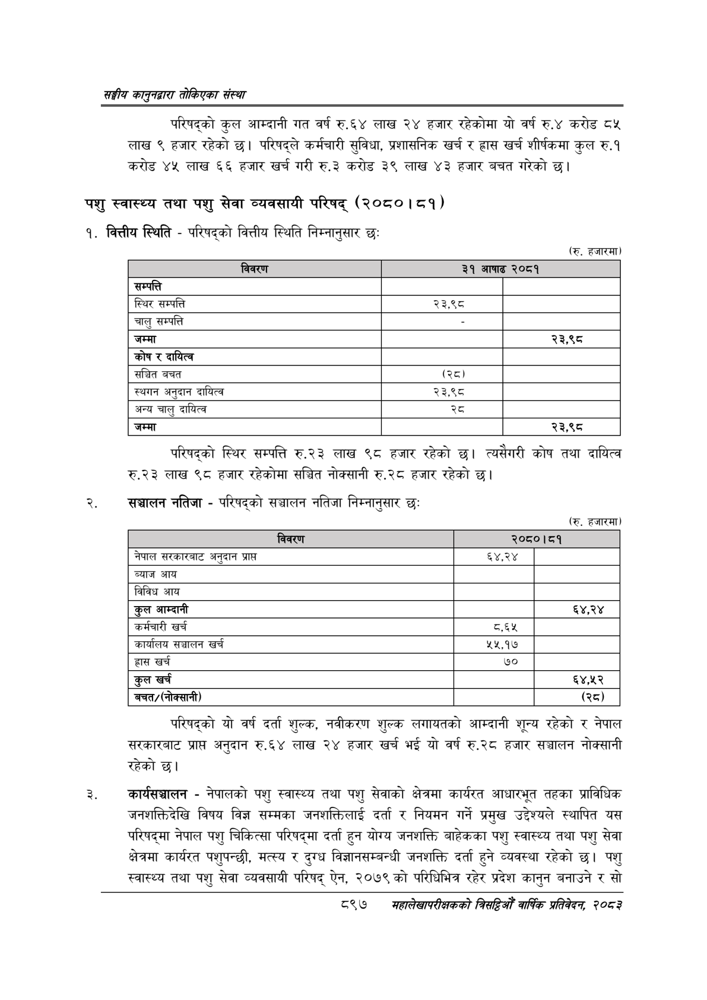

# Page 947 QA

## Rendered page


## Extracted text

```text
सङ्घीय कलुनदवारा तोकिएका संस्था
परिषद्को कुल आम्दानी गत वर्ष रु.६४ लाख २४ हजार रहेकोमा यो वर्ष रु.४ करोड ८५ लाख ९ हजार रहेको छ। परिषद्ले कर्मचारी सुविधा, प्रशासनिक खर्च र हास खर्च शीर्षकमा कुल रु.१ करोड ४५ लाख ६६ हजार खर्च गरी रु.३ करोड ३९ लाख ४३ हजार बचत गरेको छ।
पशु स्वास्थ्य तथा पशु सेवा व्यवसायी परिषद्‌ (२०८०। ८१)
१. वित्तीय स्थिति -परिषद्को वित्तीय स्थिति निम्नानुसार छः
(रु. हजारमा)
परिषद्को स्थिर सम्पत्ति रु.२३ लाख ९८ हजार रहेको छ। त्यसैगरी कोष तथा दायित्व रु.२३ लाख ९८ हजार रहेकोमा सञ्चित नोक्सानी रु.२८ हजार रहेको छ।
संञ्चालन नतिजा -परिषद्को सञ्चालन नतिजा निम्नानुसार छः
(रु. हजारमा)
परिषद्को यो वर्ष दर्ता शुल्क, नवीकरण शुल्क लगायतको आम्दानी शून्य रहेको र नेपाल सरकारबाट प्राप्त अनुदान रु.६४ लाख २४ हजार खर्च भई यो वर्ष रु.२८ हजार सञ्चालन नोक्सानी रहेको छ।
कार्यसञ्चालन -नेपालको पशु स्वास्थ्य तथा पशु सेवाको क्षेत्रमा कार्यरत आधारभूत तहका प्राविधिक जनशक्तिदेखि विषय विज्ञ सम्मका जनशक्तिलाई दर्ता र नियमन गर्ने प्रमुख उद्देश्यले स्थापित यस परिषद्मा नेपाल पशु चिकित्सा परिषद्मा दर्ता हुन योग्य जनशक्ति बाहेकका पशु स्वास्थ्य तथा पशु सेवा क्षेत्रमा कार्यरत पशुपन्छी, मत्स्य र दुग्ध विज्ञानसम्बन्धी जनशक्ति दर्ता हुने व्यवस्था रहेको पशु स्वास्थ्य तथा पशु सेवा व्यवसायी परिषद्‌ ऐन, २०७९ को परिधिभित्र रहेर प्रदेश कानुन बनाउने र सो
८९७
महालेखपरीक्षकको बितद्रिमो वार्षिक प्रतिवेकन, २०८२

|  |  |  |
| --- | --- | --- |
| ल्याए | २६ ०। | \| सिदा |
| सम्पत्ति |  |  |
| स्थिर सम्पत्ति | २३,९८८ |  |
| चालु सम्पत्ति |  |  |
| जम्मा |  | २३,९८ |
| 'कोष र दायित्व |  |  |
| सञ्चित बचत |  |  |
| स्थगन अनुदान दायित्व | २३,९८ |  |
| अन्य चालु दायित्व |  |  |
| जम्मा |  | २३,९८ |

|  |  |  |
| --- | --- | --- |
| नबवरण |  |  |
| नेपाल अनुदान प्राप्त | ६४,२४ |  |
| ब्याज आय |  |  |
| विविध आय |  |  |
| कुल आम्दानी |  | ६४,२४ |
| कर्मचारी खर्च | ८.६४ |  |
| कार्यालय सञ्चालन खर्च | ५५,१७ |  |
| हास खर्च | ७० |  |
| कुल खर्च |  | ६४,४५२ |
| 'बचत/(१नोक्सानी) |  | (२८) |
```

## Flags
- table_page
- medium_quality_table
