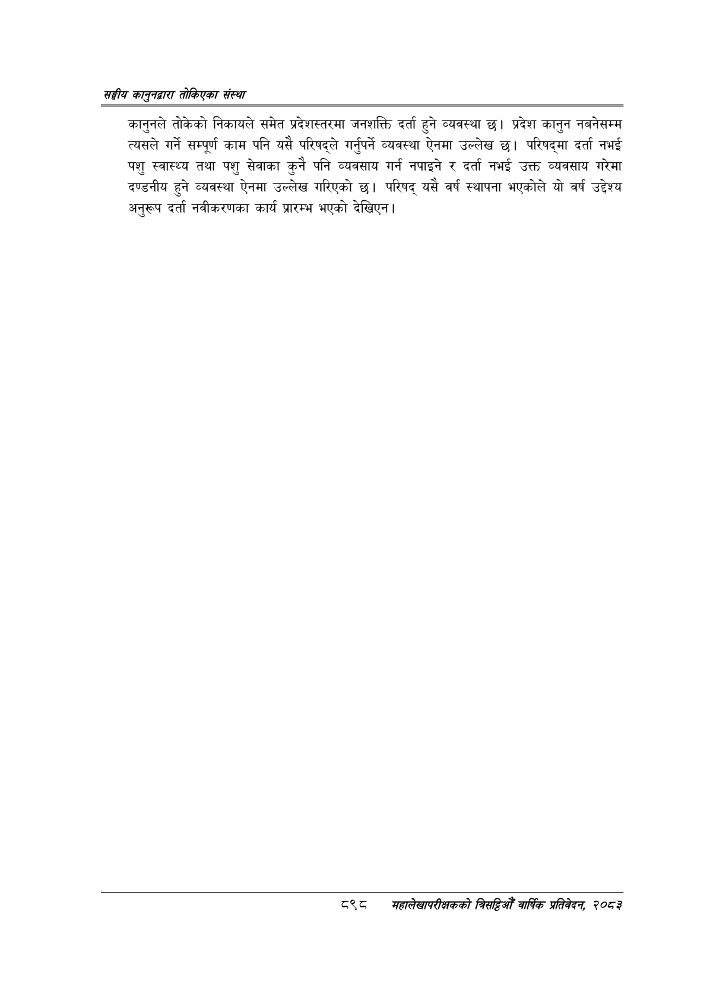

# Page 948 QA

## Rendered page


## Extracted text

```text
सङ्घीय कलुनदवारा तोकिएका संस्था
कानुनले तोकेको निकायले समेत प्रदेशस्तरमा जनशक्ति दर्ता हुने व्यवस्था छ। प्रदेश कानुन नबनेसम्म त्यसले गर्ने सम्पूर्ण काम पनि यसै परिषद्ले गर्नुपर्ने व्यवस्था ऐनमा उल्लेख छ। परिषद्मा दर्ता नभई पशु स्वास्थ्य तथा पशु सेवाका कुनै पनि व्यवसाय गर्न नपाइने र दर्ता नभई उक्त व्यवसाय गरेमा दण्डनीय हुने व्यवस्था ऐनमा उल्लेख गरिएको छ। परिषद्‌ यसै वर्ष स्थापना भएकोले यो वर्ष उद्देश्य अनुरूप दर्ता नवीकरणका कार्य प्रारम्भ भएको देखिएन |
८९८ महालेखपरीक्षकको वार्षिक प्रतिवेकन, २०८२
```

## Flags
- None
