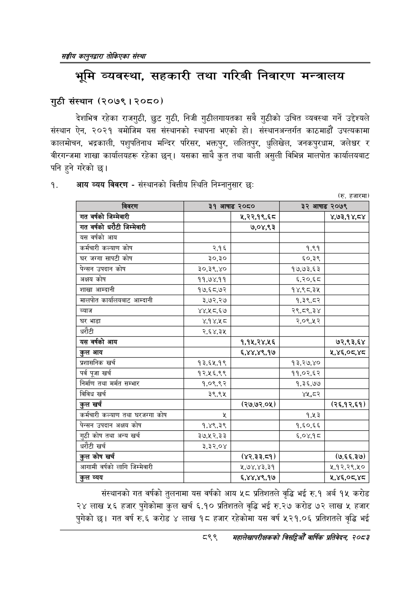

# Page 949 QA

## Rendered page


## Extracted text

```text
सङ्घीय कलुनदवारा तोकिएका संस्था
भूमि व्यवस्था, सहकारी तथा गरिबी निवारण मन्त्रालय
गुठी संस्थान (२०७९। २०८०)
देशभित्र रहेका राजगुठी, छुट गुठी, निजी गुठीलगायतका सबै गुठीको उचित व्यवस्था गर्ने उद्देश्यले संस्थान ऐन, २०२१ बमोजिम यस संस्थानको स्थापना भएको हो। संस्थानअन्तर्गत काठमाडौं उपत्यकामा कालमोचन, भद्रकाली, पशुपतिनाथ मन्दिर परिसर, भक्तपुर, ललितपुर, धुलिखेल, जनकपुरधाम, जलेश्वर र वीरगन्जमा शाखा कार्यालयहरू रहेका छन्‌। यसका साथै कुत तथा बाली असुली विभिन्न मालपोत कार्यालयबाट पनि हुने गरेको छ।
१. आय व्यय विवरण -संस्थानको वित्तीय स्थिति निम्नानुसार छः
(रु. हजारमा)
संस्थानको गत वर्षको तुलनामा यस वर्षको आय ५८ प्रतिशतले वृद्धि भई रु.१ अर्ब १५ करोड २४ लाख ५६ हजार पुगेकोमा कुल खर्च ६.१० प्रतिशतले वृद्धि भई रु.२७ करोड ७२ लाख ५ हजार पुगेको छ। गत वर्ष रु.६ करोड ४ लाख १८ हजार रहेकोमा यस वर्ष ५२१.०६ प्रतिशतले वृद्धि भई
८९९
महालेखापरीक्षकको वार्षिक प्रतिवेकन, २०८२

|  |  |  |  |  |
| --- | --- | --- | --- | --- |
| जबरण | २९ भाषाङ |  | आषाढ | २०७- |
| वर्षको जिन्मेवारी |  | ५,२२,१९,६८ |  | ४,७३,१४,८४ |
| गत वर्षको धरौटी जिन्मेवारी |  | ७,०४,९३ |  |  |
| यस वर्षको आय |  |  |  |  |
| कर्मचारी कल्याण कोष | २.१६ |  | १,९१ |  |
| घर जग्गा सापटी कोष | ३०,३० |  | €०,३% |  |
| पेन्सन उपदान कोष | ३०,३९,४० |  | १७.७३,६३ |  |
| अक्षय कोष | ११,७४.११ |  | ६,.२०,६८ |  |
| शाखा आम्दानी | १७,६८.७२ |  | १४,९८,.३५ |  |
| मालपोत कार्यालयबाट आम्दानी | ३,७२,२७ |  | १,३९,८२ |  |
| ब्याज | ४४,५८,६७ |  | २९,८९,३४ |  |
| घर भाडा | ४,१४,२० |  | २,०९,४५२ |  |
| धरौटी | २,६४,३४५ |  |  |  |
| 'यस वर्षको आय |  | १,१५,२४,२५६ |  | ७२,९३,६४ |
| कुल आय |  | ६,४४,४९,१७ |  | २,४६,०८,४८ |
| प्रशासनिक खर्च | १३,६२५.१९ |  | १३,२७,४० |  |
| पर्व पूजा खर्च | १२,५६,९९ |  | ११,०२,.६२ |  |
| निर्माण तथा मर्मत सम्भार | १,०९,९२ |  | १,३६,७७ |  |
| विविध खर्च | ३९,९५ |  | ४५,८०२ |  |
| कुल खर्च |  | (२७,७२,०५) |  | (२६,१२,६१) |
| कर्मचारी कल्याण तथा घरजग्गा कोष |  |  | ९४३ |  |
| पेन्सन उपदान अक्षय कोष | १,४९,३९ |  | १,६०,.६६ |  |
| गुठी कोष तथा अन्य खर्च | ३७,१२,३३ |  | ६,०४.१८ |  |
| धरौटी खर्च | ३,३२,०४ |  |  |  |
| कुल कोष खर्च |  | (३,३३,५९) |  | (७.६६.३७) |
| आगामी वर्षको लागि जिम्मेवारी |  | २,७४,४३,३१ |  | ५,१२,२९,४१० |
| कुल व्यय |  | ६,४४,४९,१७ |  | ,§,०५,५ |
```

## Flags
- table_page
- medium_quality_table
