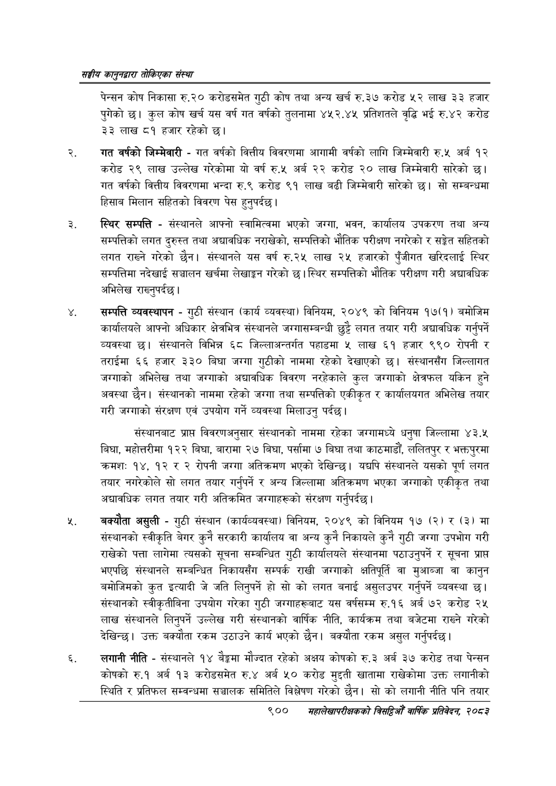

# Page 950 QA

## Rendered page


## Extracted text

```text
सङ्घीय कलुनदवारा तोकिएका संस्था
पेन्सन कोष निकासा रु.२० करोडसमेत गुठी कोष तथा अन्य खर्च रु.३७ करोड ५२ लाख ३३ हजार पुगेको | कुल कोष खर्च यस वर्ष गत वर्षको तुलनामा ४५२.४५ प्रतिशतले वृद्धि भई रु.४२ करोड ३३ लाख ८१ हजार रहेको छ।
गत वर्षको जिम्मेवारी -गत वर्षको वित्तीय विवरणमा आगामी वर्षको लागि जिम्मेवारी रु.५ अर्ब १२ करोड २९ लाख उल्लेख गरेकोमा यो वर्ष रु.५ अर्ब २२ करोड २० लाख जिम्मेवारी सारेको | गत वर्षको वित्तीय विवरणमा भन्दा रु.९ करोड ९१ लाख बढी जिम्मेवारी सारेको छ। सो सम्बन्धमा हिसाब मिलान सहितको विवरण पेस हुनुपर्दछ।
स्थिर सम्पत्ति -संस्थानले आफ्नो स्वामित्वमा भएको जग्गा, भवन, कार्यालय उपकरण तथा अन्य सम्पत्तिको लगत दुरुस्त तथा अद्यावधिक नराखेको, सम्पत्तिको भौतिक परीक्षण नगरेको र सङ्गेत सहितको लगत राख्ने गरेको छैन। संस्थानले यस वर्ष रु.२५ लाख २५ हजारको पुँजीगत खरिदलाई स्थिर सम्पत्तिमा नदेखाई सञ्चालन खर्चमा लेखाङ्गन गरेको छ। स्थिर सम्पत्तिको भौतिक परीक्षण गरी अद्यावधिक अभिलेख राख्नुपर्दछ |
सम्पत्ति व्यवस्थापन -गुठी संस्थान (कार्य व्यवस्था) विनियम, २०४९ को विनियम १७(१) बमोजिम कार्यालयले आफ्नो अधिकार क्षेत्रभित्र संस्थानले जग्गासम्बन्धी छुट्टै लगत तयार गरी अद्यावधिक गर्नुपर्ने व्यवस्था | संस्थानले विभिन्न ६८ जिल्लाअन्तर्गत पहाडमा « लाख ६१ हजार ९९० रोपनी र तराईमा ६६ हजार ३३० बिघा जग्गा गुठीको नाममा रहेको देखाएको छ। संस्थानसँग जिल्लागत जग्गाको अभिलेख तथा जग्गाको अद्यावधिक विवरण नरहेकाले कुल जग्गाको क्षेत्रफल यकिन हुने अवस्था छैन। संस्थानको नाममा रहेको जग्गा तथा सम्पत्तिको एकीकृत र कार्यालयगत अभिलेख तयार गरी जग्गाको संरक्षण एवं उपयोग गर्ने व्यवस्था मिलाउनु पर्दछ।
संस्थानबाट प्राप्त विवरणअनुसार संस्थानको नाममा रहेका जग्गामध्ये धनुषा जिल्लामा ४३.५ बिघा, महोत्तरीमा १२२ बिघा, बारामा २७ बिघा, पर्सामा ७ बिघा तथा काठमाडौं, ललितपुर र भक्तपुरमा क्रमशः १४, १२ र २ रोपनी जग्गा अतिक्रमण भएको देखिन्छ। यद्यपि संस्थानले यसको पूर्ण लगत तयार नगरेकोले सो लगत तयार गर्नुपर्ने र अन्य जिल्लामा अतिक्रमण भएका जग्गाको एकीकृत तथा अद्यावधिक लगत तयार गरी अतिक्रमित जग्गाहरूको संरक्षण गर्नुपर्दछ |
बक्यौता असुली -गुठी संस्थान (कार्यव्यवस्था) विनियम, २०४९ को विनियम १७ (२) र (३) मा संस्थानको स्वीकृति बेगर कुनै सरकारी कार्यालय वा अन्य कुनै निकायले कुनै गुठी जग्गा उपभोग गरी राखेको पत्ता लागेमा त्यसको सूचना सम्बन्धित गुठी कार्यालयले संस्थानमा पठाउनुपर्ने र सूचना प्राप्त भएपछि संस्थानले सम्बन्धित निकायसँग सम्पर्क राखी जग्गाको क्षतिपूर्ति वा मुआब्जा वा कानुन बमोजिमको कुत इत्यादी जे जति लिनुपर्ने हो सो को लगत बनाई असुलउपर गर्नुपर्ने व्यवस्था | संस्थानको स्वीकृतीबिना उपयोग गरेका गुठी जग्गाहरूबाट यस वर्षसम्म रु.१६ अर्ब ७२ करोड २५ लाख संस्थानले लिनुपर्ने उल्लेख गरी संस्थानको वार्षिक नीति, कार्यक्रम तथा बजेटमा राख्ने गरेको देखिन्छ। उक्त बक्यौता रकम उठाउने कार्य भएको छैन। बक्यौता रकम असुल गर्नुपर्दछ |
लगानी नीति -संस्थानले १४ बेङ्गमा मौज्दात रहेको अक्षय कोषको रु.३ अर्ब ३० करोड तथा पेन्सन कोषको रु.१ अर्ब १३ करोडसमेत रु.४ अर्ब ५० करोड मुद्दती खातामा राखेकोमा उक्त लगानीको स्थिति र प्रतिफल सम्वन्धमा सञ्चालक समितिले विश्लेषण गरेको छैन। सो को लगानी नीति पनि तयार
९००
महालेखापरीक्षकको वार्षिक प्रतिवेकन, २०८२
```

## Flags
- None
