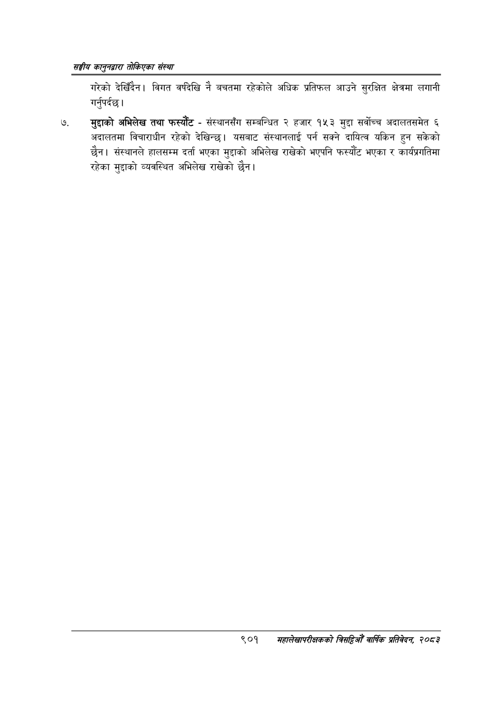

# Page 951 QA

## Rendered page


## Extracted text

```text
सङ्घीय कलुनदवारा तोकिएका संस्था
गरेको देखिँदैन। विगत वर्षदेखि नै बचतमा रहेकोले अधिक प्रतिफल आउने सुरक्षित क्षेत्रमा लगानी गर्नुपर्दछ |
मुद्दाको अभिलेख तथा फस्यौट -संस्थानसँग सम्बन्धित २ हजार १५३ मुद्दा सर्वोच्च अदालतसमेत ६ अदालतमा विचाराधीन रहेको देखिन्छ। यसबाट संस्थानलाई पर्न सक्ने दायित्व यकिन हुन सकेको छैन। संस्थानले हालसम्म दर्ता भएका मुद्दाको अभिलेख राखेको भएपनि फस्यौट भएका र कार्यप्रगतिमा रहेका मुद्दाको व्यवस्थित अभिलेख राखेको छैन |
९०१
समृहालेखापरीक्षकको वार्षिक प्रतिवेकन २०८२
```

## Flags
- None
