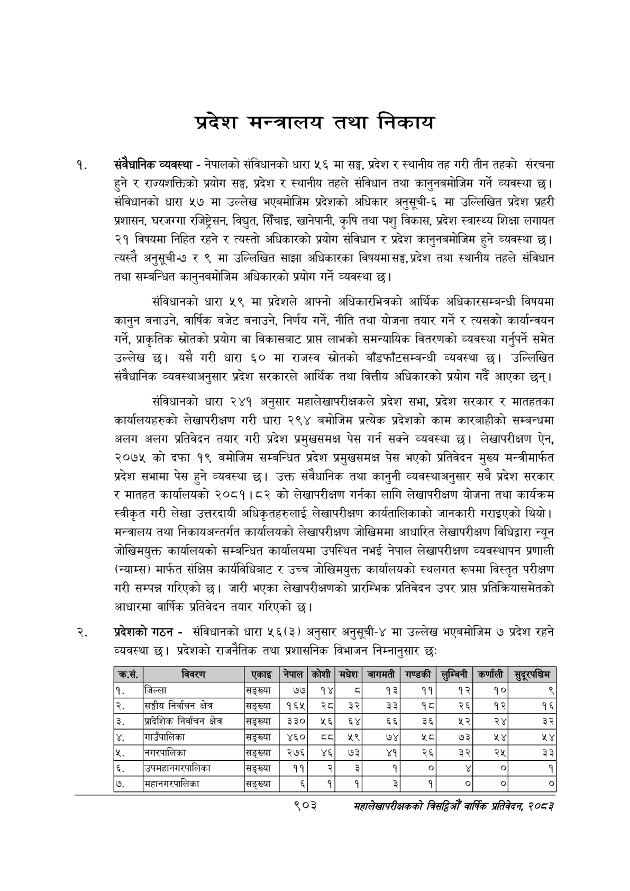

# Page 955 QA

## Rendered page


## Extracted text

```text
प्रदेश मन्त्रालय तथा निकाय
संवैधानिक व्यवस्था -नेपालको संविधानको धारा ५६ मा सङ्ग, प्रदेश र स्थानीय तह गरी तीन तहको संरचना हुने र राज्यशक्तिको प्रयोग सङ्ग, प्रदेश र स्थानीय तहले संविधान तथा कानुनबमोजिम गर्ने व्यवस्था छ। संविधानको धारा ५७ मा उल्लेख भएबमोजिम प्रदेशको अधिकार अनुसूची-६ मा उल्लिखित प्रदेश प्रहरी प्रशासन, घरजग्गा रजिष्ट्रेसन, विद्युत, सिँचाइ, खानेपानी, कृषि तथा पशु विकास, प्रदेश स्वास्थ्य शिक्षा लगायत २१ विषयमा निहित रहने र त्यस्तो अधिकारको प्रयोग संविधान र प्रदेश कानुनबमोजिम हुने व्यवस्था | त्यस्तै अनुसूची-७ र ९ मा उल्लिखित साझा अधिकारका विषयमा सङ्ग, प्रदेश तथा स्थानीय तहले संविधान तथा सम्बन्धित कानुनबमोजिम अधिकारको प्रयोग गर्ने व्यवस्था |
संविधानको धारा ५९ मा प्रदेशले आफ्नो अधिकारभित्रको आर्थिक अधिकारसम्बन्धी विषयमा कानुन बनाउने, वार्षिक बजेट बनाउने, निर्णय गर्ने, नीति तथा योजना तयार गर्ने र त्यसको कार्यान्वयन गर्ने, प्राकृतिक स्रोतको प्रयोग वा विकासबाट प्राप्त लाभको समन्यायिक वितरणको व्यवस्था गर्नुपर्ने समेत उल्लेख छ। यसै गरी धारा ६० मा राजस्व स्रोतको बाँडफाँटसम्बन्धी व्यवस्था छ। उल्लिखित संवैधानिक व्यवस्थाअनुसार प्रदेश सरकारले आर्थिक तथा वित्तीय अधिकारको प्रयोग गर्दै आएका छन्‌।
संविधानको धारा २४१ अनुसार महालेखापरीक्षकले प्रदेश सभा, प्रदेश सरकार र मातहतका कार्यालयहरुको लेखापरीक्षण गरी धारा २९४ बमोजिम प्रत्येक प्रदेशको काम कारबाहीको सम्बन्धमा अलग अलग प्रतिवेदन तयार गरी प्रदेश प्रमुखसमक्ष पेस गर्न सक्ने व्यवस्था छ। लेखापरीक्षण ऐन, २०७५ को दफा १९ बमोजिम सम्बन्धित प्रदेश प्रमुखसमक्ष पेस भएको प्रतिवेदन मुख्य मन्त्रीमार्फत प्रदेश सभामा पेस हुने व्यवस्था छ। उक्त संवैधानिक तथा कानुनी व्यवस्थाअनुसार सबै प्रदेश सरकार र मातहत कार्यालयको २०८१।८२ को लेखापरीक्षण गर्नका लागि लेखापरीक्षण योजना तथा कार्यक्रम स्वीकृत गरी लेखा उत्तरदायी अधिकृतहरुलाई लेखापरीक्षण कार्यतालिकाको जानकारी गराइएको थियो। मन्त्रालय तथा निकायअन्तर्गत कार्यालयको लेखापरीक्षण जोखिममा आधारित लेखापरीक्षण विधिद्वारा न्यून जोखिमयुक्त कार्यालयको सम्बन्धित कार्यालयमा उपस्थित नभई नेपाल लेखापरीक्षण व्यवस्थापन प्रणाली (न्याम्स) मार्फत संक्षिप्त कार्यविधिबाट र उच्च जोखिमयुक्त कार्यालयको स्थलगत रूपमा विस्तृत परीक्षण गरी सम्पन्न गरिएको छ। जारी भएका लेखापरीक्षणको प्रारम्भिक प्रतिवेदन उपर प्राप्त प्रतिक्रियासमेतको आधारमा वार्षिक प्रतिवेदन तयार गरिएको छ।
प्रदेशको गठन -संविधानको धारा ५६(३) अनुसार अनुसूची-४ मा उल्लेख भएबमोजिम ७ प्रदेश रहने व्यवस्था छ। प्रदेशको राजनैतिक तथा प्रशासनिक विभाजन निम्नानुसार छः
९०३
महालेखापरीक्षकको वार्षिक प्रतिवेदन; २०८२

|    |                            | एकाइ    | &#124; नेपाल   | &#124; कोशी   | मधेश &#124;   |   बागमती | गण्डकी    | &#124; लुम्बिनी &#124;   | कर्णाली &#124;   | सुदूरपश्चिम   |
|----|----------------------------|---------|----------------|---------------|---------------|----------|-----------|--------------------------|------------------|---------------|
| १. |                            | सङ्ख्या | ७७&#124;       | १४            | ठ             |       १३ | ११        | १२                       | १०               | ९             |
| २  |                            | सङ्ख्या | [१६५           | २८            | ३२            |       ३३ | १८        | २६                       | १२               | १६            |
| ३  | प्रादेशिक निर्वाचन क्षेत्र | सङ्ख्या | &#124; ३३०     | ५६]           | ६४            |       ६६ | ३६        | %R                       | २४               | ३२            |
| ४. | गाउँपालिका                 | सङ्ख्या | &#124; ४६०]    | ८८,           | ५९            |       ७४ | शर्ट      | ७३                       | २४               | %Y            |
| ५. | नगरपालिका                  | सङ्ख्या | &#124; २७६     | ४६&#124;      | ७३            |       ४१ | २६        | ३२                       | २५               | 33            |
| &  | उपमहानगरपालिका नगरपालिका   | सङ्ख्या | ११             | R             | 2             |        १ | &#124; ०] | ¥ । &#124;               | ०                | १             |
| ७  | महानगरपालिका               | सङ्ख्या | &              | १             | 1             |        3 | १         | &#124; ०]                | 7 &#124;         | ०]            |
```

## Flags
- table_page
