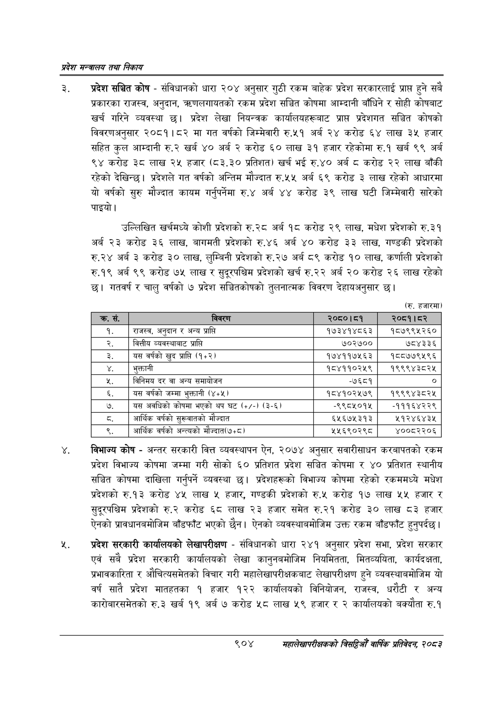

# Page 956 QA

## Rendered page


## Extracted text

```text
प्रदेश मन्त्रालय तथा निकाय
प्रदेश सञ्चित कोष -संविधानको धारा २०४ अनुसार गुठी रकम बाहेक प्रदेश सरकारलाई प्राप्त हुने सबै प्रकारका राजस्व, अनुदान, त्रधणलगायतको रकम प्रदेश सञ्चित कोषमा आम्दानी बाँधिने र सोही कोषबाट खर्च गरिने व्यवस्था छ। प्रदेश लेखा नियन्त्रक कार्यालयहरूबाट प्राप्त प्रदेशगत सञ्चित कोषको विवरणअनुसार २०८१।८२ मा गत वर्षको जिम्मेवारी रु.५१ अर्ब २४ करोड ६४ लाख ३५ हजार सहित कुल आम्दानी रु.२ खर्ब ४० अर्ब २ करोड ६० लाख ३१ हजार रहेकोमा रु.१ खर्ब ९९ अर्ब ९४ करोड ३८ लाख २५ हजार (८३.३० प्रतिशत) खर्च भई रु.४० अर्ब ८ करोड २२ लाख बाँकी रहेको देखिन्छ। प्रदेशले गत वर्षको अन्तिम मौज्दात रु.५५ अर्ब ६९ करोड ३ लाख रहेको आधारमा यो वर्षको सुरु मौज्दात कायम गर्नुपर्नेमा रु.४ अर्ब ४४ करोड ३९ लाख घटी जिम्मेवारी सारेको पाइयो।
उल्लिखित खर्चमध्ये कोशी प्रदेशको रु. २८ अर्ब १८ करोड २९ लाख, मधेश प्रदेशको रु.३१ अर्ब २३ करोड ३६ लाख, बागमती प्रदेशको रु.४६ अर्ब ४० करोड ३३ लाख, गण्डकी प्रदेशको रु.२४ अर्ब ३ करोड ३० लाख, लुम्बिनी प्रदेशको रु.२७ अर्ब ८९ करोड १० लाख, कर्णाली प्रदेशको रु.१९ अर्ब ९९ करोड ७५ लाख र सुदूरपश्चिम प्रदेशको खर्च रु.२२ अर्ब २० करोड २६ लाख रहेको छ। गतवर्ष र चालु वर्षको ७ प्रदेश सञ्चितकोषको तुलनात्मक विवरण देहायअनुसार |
(रु. हजारमा)
विभाज्य कोष -अन्तर सरकारी वित्त व्यवस्थापन ऐन, २०७४ अनुसार सवारीसाधन करबापतको रकम प्रदेश विभाज्य कोषमा जम्मा गरी सोको ६० प्रतिशत प्रदेश सञ्चित कोषमा र ४० प्रतिशत स्थानीय सञ्चित कोषमा दाखिला गर्नुपर्ने व्यवस्था छ। प्रदेशहरूको विभाज्य कोषमा रहेको रकममध्ये मधेश प्रदेशको रु.१३ करोड ४५ लाख ५ हजार, गण्डकी प्रदेशको रु.५« करोड १७ लाख ५५ हजार र सुदूरपश्चिम प्रदेशको रु.२ करोड ६८ लाख २३ हजार समेत रु.२१ करोड ३० लाख ८३ हजार ऐनको प्रावधानबमोजिम बाँडफाँट भएको छैन। ऐनको व्यवस्थाबमोजिम उक्त रकम बाँडफाँट हुनुपर्दछ।
प्रदेश सरकारी कार्यालयको लेखापरीक्षण -संविधानको धारा २४१ अनुसार प्रदेश सभा, प्रदेश सरकार एवं सबै प्रदेश सरकारी कार्यालयको लेखा कानुनबमोजिम नियमितता, मितव्ययिता, कार्यदक्षता, प्रभावकारिता र औचित्यसमेतको विचार गरी महालेखापरीक्षकबाट लेखापरीक्षण हुने व्यवस्थाबमोजिम यो वर्ष सातै प्रदेश मातहतका १ हजार १२२ कार्यालयको विनियोजन, राजस्व, धरौटी र अन्य कारोबारसमेतको रु.३ खर्ब १९ अर्ब ७ करोड ५८ लाख ५९ हजार र २ कार्यालयको बक्यौता रु.१
९०४
महालेखापरीक्षकको वार्षिक प्रतिवेदन; २०८२

| १. | राजस्व, अनुदान र अन्य प्राप्ति | १७३४१४८६३ | १८७९९५२६० |
| --- | --- | --- | --- |
| २. | वित्तीय व्यवस्थाबाट प्राप्ति | ७०२७०० | ७८४३३६ |
| ३. | यस वर्षको खुद प्राप्ति (१५२) | १७४११७५६३ | १८८७७९५९६ |
|  | भुक्तानी | १८४११०२१५९ | १९९९४३८२५ |
| ५, | विनिमय दर वा अन्य समायोजन | -७६८१ | ० |
| ६. | यस वर्षको जम्मा भुक्तानी (४४५) | १८४१०२५७९ | १९९९४३८२५ |
| ७. | यस अवधिको कोषमा भएको थप घट (+/-) (३-६) | -९९८४५०१५ | -१११६४२२९ |
|  | आर्थिक वर्षको सुल्वातको मौज्दात | ६५६७५३१३ | ५१२४६४३४५ |
| ९. | आर्थिक वर्षको अन्त्वको मौज्दात(७५८) | ५५६९०२९८ | ४००८२२०६ |
```

## Flags
- table_page
- medium_quality_table
