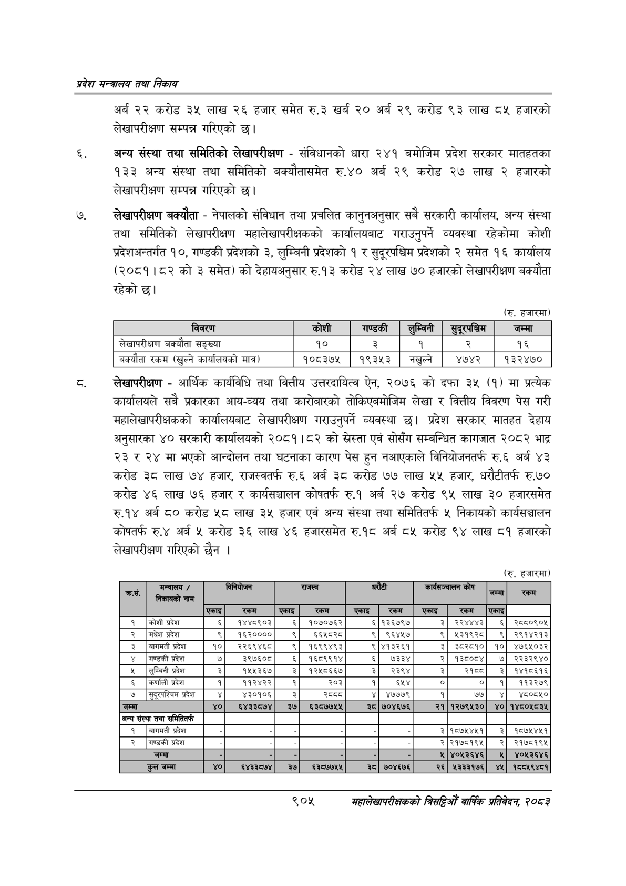

# Page 957 QA

## Rendered page


## Extracted text

```text
प्रदेश मन्त्रालय तथा निकाय
अर्ब २२ करोड ३५ लाख २६ हजार समेत रु.३ खर्ब २० अर्ब २९ करोड ९३ लाख ८४५ हजारको लेखापरीक्षण सम्पन्न गरिएको छ।
अन्य संस्था तथा समितिको लेखापरीक्षण -संविधानको धारा २४१ बमोजिम प्रदेश सरकार मातहतका १३३ अन्य संस्था तथा समितिको बक्यौतासमेत रु.४० अर्ब २९ करोड २७ लाख २ हजारको लेखापरीक्षण सम्पन्न गरिएको छ।
लेखापरीक्षण बक्यौता -नेपालको संविधान तथा प्रचलित कानुनअनुसार सबै सरकारी कार्यालय, अन्य संस्था तथा समितिको लेखापरीक्षण महालेखापरीक्षकको कार्यालयबाट गराउनुपर्ने व्यवस्था रहेकोमा कोशी प्रदेशअन्तर्गत १०, गण्डकी प्रदेशको ३, लुम्बिनी प्रदेशको १ र सुदूरपश्चिम प्रदेशको २ समेत १६ कार्यालय (२०८१।८२ को ३ समेत) को देहायअनुसार रु.१३ करोड २४ लाख ७० हजारको लेखापरीक्षण बक्यौता रहेको छ।
(र. हजारमा)
लेखापरीक्षण -आर्थिक कार्यविधि तथा वित्तीय उत्तरदायित्व ऐन, २०७६ को दफा ३५ (१) मा प्रत्येक कार्यालयले सबै प्रकारका आय-व्यय तथा कारोबारको तोकिएबमोजिम लेखा र वित्तीय विवरण पेस गरी महालेखापरीक्षकको कार्यालयबाट लेखापरीक्षण गराउनुपर्ने व्यवस्था छ। प्रदेश सरकार मातहत देहाय अनुसारका ४० सरकारी कार्यालयको २०८१।८२ को एवं सोसँग सम्बन्धित कागजात २०८२ भाद्र २३ र २४ मा भएको आन्दोलन तथा घटनाका कारण पेस हुन नआएकाले विनियोजनतर्फ रु.६ अर्ब ४३ करोड ३८ लाख ७४ हजार, राजस्वतर्फ रु.६ अर्ब ३८ करोड ७७ लाख ५५ हजार, धरौटीतर्फ रु.७० करोड ४६ लाख ७६ हजार र कार्यसञ्चालन कोषतर्फ रु.१ अर्ब २७ करोड ९५ लाख ३० हजारसमेत रु.१४ अर्ब ८० करोड लाख ३५ हजार एवं अन्य संस्था तथा समितितर्फ ५ निकायको कार्यसञ्चालन कोषतर्फ रु.४ अर्ब करोड ३६ लाख ४६ हजारसमेत रु.१८ अर्ब ८५ करोड ९४ लाख ८१ हजारको लेखापरीक्षण गरिएको छैन।
(रु. हजारमा)
३७|
९०५
महालेखापरीक्षकको वार्षिक प्रतिवेदन; २०८२

| विवरण | 'कोशी | गण्डकी | लुम्विनी | सुपूरपचिन | जम्मा |
| --- | --- | --- | --- | --- | --- |
| लेखापरीक्षण बक्यौता सङ्ख्या | १० | २ | १ | २ | १६ |
| बक्यौता रकम (खुल्ने कार्यालयको मात्र) | १०८३७५ | १९३५३ | नखुल्ने | ४७४२ | १३२४७० |

| क्रस,                            | मन्त्रालय / 'निकायको नाम         | लि                               | लि                               | जि ।                             | जि ।                             | लि                               | लि                               | कार्यसञ्चालन कोष                 | कार्यसञ्चालन कोष                 | [जन्म                            | रकम                              |
|----------------------------------|----------------------------------|----------------------------------|----------------------------------|----------------------------------|----------------------------------|----------------------------------|----------------------------------|----------------------------------|----------------------------------|----------------------------------|----------------------------------|
| क्रस,                            | मन्त्रालय / 'निकायको नाम         | [एकाइ                            | रकम                              | &#124; ।_ ।&#124;एकाइ]           | रकम                              | एकाइ                             | रकम                              | एकाइ                             | रकम                              | @R                               |                                  |
| १                                | ।&#124;कोशी प्रदेश               | ६]                               | १४४८९०३                          | ६&#124;                          | &#124; १०७०७६२                   |                                  | &#124; &#124; ६&#124;१३६७९७      | &#124; ३&#124;                   | २२४४४३                           | ६&#124;                          | २८८०९०५                          |
| २                                | ।&#124;मधेश प्रदेश               | ९                                | १६२००००                          | ९                                | ६६५८२८                           | ९&#124;                          | ९६४५७                            | ९]                               | ५३१९२८                           | ९&#124;                          | २९१४२१३                          |
| ३                                | ।&#124;बागमती प्रदेश             | १०&#124;                         | 
```

## Flags
- table_page
- medium_quality_table
