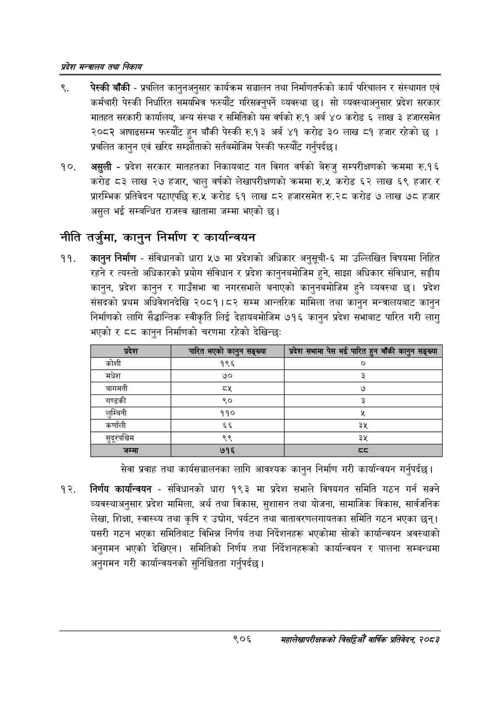

# Page 958 QA

## Rendered page


## Extracted text

```text
प्रदेश मन्त्रालय तथा निकाय
पेस्की बाँकी -प्रचलित कानुनअनुसार कार्यक्रम सञ्चालन तथा निर्माणतर्फको कार्य परिचालन र संस्थागत एवं कर्मचारी पेस्की निर्धारित समयभित्र फस्यौट गरिसक्नुपर्ने व्यवस्था छ। सो व्यवस्थाअनुसार प्रदेश सरकार मातहत सरकारी कार्यालय, अन्य संस्था र समितिको यस वर्षको रु.१ अर्ब ४० करोड ६ लाख ३ हजारसमेत २०८२ आषाढसम्म फस्यौट हुन बाँकी पेस्की रु.१३ अर्ब ४१ करोड ३० लाख ८१ हजार रहेको छ | प्रचलित कानुन एवं खरिद सम्झौताको सर्तबमोजिम पेस्की फस्यौट गर्नुपर्दछ।
असुली -प्रदेश सरकार मातहतका निकायबाट गत विगत वर्षको बेरुजु सम्परीक्षणको क्रममा रु.१६ करोड ८३ लाख २७ हजार, चालु वर्षको लेखापरीक्षणको क्रममा रु.५ करोड ६२ लाख ६९ हजार र प्रारम्भिक प्रतिवेदन पठाएपछि रु.५ करोड ६१ लाख ८२ हजारसमेत रु.२८ करोड ७ लाख ७८ हजार असुल भई सम्बन्धित राजस्व खातामा जम्मा भएको छ।
नीति तर्जुमा, कानुन निर्माण र कार्यान्वयन
कानुन निर्माण -संविधानको धारा ५७ मा प्रदेशको अधिकार अनुसूची-६ मा उल्लिखित विषयमा निहित रहने र त्यस्तो अधिकारको प्रयोग संविधान र प्रदेश कानुनबमोजिम हुने, साझा अधिकार संविधान, सङ्घीय कानुन, प्रदेश कानुन र गाउँसभा वा नगरसभाले बनाएको कानुनबमोजिम हुने व्यवस्था छ। प्रदेश संसदको प्रथम अधिवेशनदेखि २०८१।८२ सम्म आन्तरिक मामिला तथा कानुन मन्त्रालयबाट कानुन निर्माणको लागि सैद्धान्तिक स्वीकृति लिई देहायबमोजिम ७१६ कानुन प्रदेश सभाबाट पारित गरी लागु भएको र कानुन निर्माणको चरणमा रहेको देखिन्छ:
सेवा प्रवाह तथा कार्यसञ्चालनका लागि आवश्यक कानुन निर्माण गरी कार्यान्वयन गर्नुपर्दछ |
निर्णय कार्यान्वयन -संविधानको धारा १९३ मा प्रदेश सभाले विषयगत समिति गठन गर्न सक्ने व्यवस्थाअनुसार प्रदेश मामिला, अर्थ तथा विकास, सुशासन तथा योजना, सामाजिक विकास, सार्वजनिक लेखा, शिक्षा, स्वास्थ्य तथा कृषि र उद्योग, पर्यटन तथा वातावरणलगायतका समिति गठन भएका छन्‌। यसरी गठन भएका समितिबाट विभिन्न निर्णय तथा निर्देशनहरू भएकोमा सोको कार्यान्वयन अवस्थाको अनुगमन भएको देखिएन। समितिको निर्णय तथा निर्देशनहरूको कार्यान्वयन र पालना सम्बन्धमा अनुगमन गरी कार्यान्वयनको सुनिश्चितता गर्नुपर्दछ |
९०६
महालेखापरीक्षकको वार्षिक प्रतिवेदन; २०८२

| कोशी | १९६ |
| --- | --- |
| मधेश | ७० |
|  |  |
| गण्डकी | ९० |
| लुम्बिनी | ११० |
| कर्णाली | ६६ |
| सुदूरपश्चिम | ९९ |
```

## Flags
- table_page
- medium_quality_table
