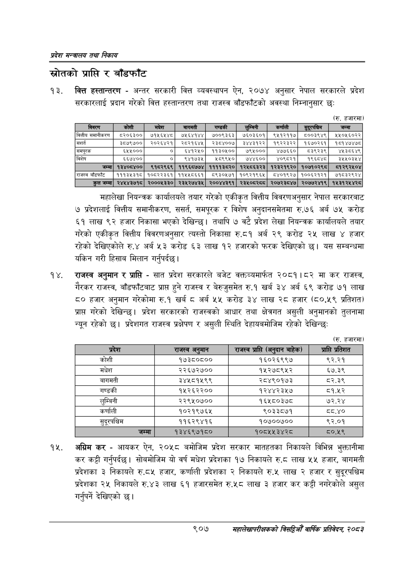

# Page 959 QA

## Rendered page


## Extracted text

```text
प्रदेश मन्त्रालय तथा निकाय
स्रोतको प्राप्ति र बाँडफाँट
वित्त हस्तान्तरण -अन्तर सरकारी वित्त व्यवस्थापन ऐन, २०७४ अनुसार नेपाल सरकारले प्रदेश सरकारलाई प्रदान गरेको वित्त हस्तान्तरण तथा राजस्व बाँडफाँटको अवस्था निम्नानुसार छ:
(रु. हजारमा)
महालेखा नियन्त्रक कार्यालयले तयार गरेको एकीकृत वित्तीय विवरणअनुसार नेपाल सरकारबाट ७ प्रदेशलाई वित्तीय समानीकरण, ससर्त, समपूरक र विशेष अनुदानसमेतमा रु.७६ अर्ब ७५ करोड ६१ लाख ९२ हजार निकासा भएको देखिन्छ। तथापि ७ वटै प्रदेश लेखा नियन्त्रक कार्यालयले तयार गरेको एकीकृत वित्तीय विवरणअनुसार त्यस्तो निकासा रु.८१ अर्ब २९ करोड २५ लाख ४ हजार रहेको देखिएकोले रु.४ अर्ब ५३ करोड ६३ लाख १२ हजारको फरक देखिएको छ। यस सम्बन्धमा यकिन गरी हिसाब मिलान गर्नुपर्दछ।
राजस्व अनुमान र प्राप्ति -सात प्रदेश सरकारले बजेट वक्तव्यमार्फत २०८१।८२ मा कर राजस्व, गैरकर राजस्व, बाँडफाँटबाट प्राप्त हुने राजस्व र बेरुजुसमेत रु.१ खर्ब ३४ अर्ब ६९ करोड ७१ लाख ८० हजार अनुमान गरेकोमा रु.१ खर्ब © अर्ब ५५ करोड ३४ लाख २८ हजार (८०.५९ प्रतिशत) प्राप्त गरेको देखिन्छ। प्रदेश सरकारको राजस्वको आधार तथा क्षेत्रगत असुली अनुमानको तुलनामा न्यून रहेको छ। प्रदेशगत राजस्व प्रक्षेपण र असुली स्थिति देहायबमोजिम रहेको देखिन्छ:
(रु. हजारमा)
अग्रिम कर -आयकर ऐन, २०५८ बमोजिम प्रदेश सरकार मातहतका निकायले विभिन्न भुक्तानीमा कर कट्टी गर्नुपर्दछ। सोबमोजिम यो वर्ष मधेश प्रदेशका १७ निकायले रु.८ लाख ५५ हजार, बागमती प्रदेशका ३ निकायले रु.८५ हजार, कर्णाली प्रदेशका २ निकायले रु.५ लाख २ हजार र सुदूरपश्चिम प्रदेशका २५ निकायले रु.४३ लाख ६१ हजारसमेत रु.५८ लाख ३ हजार कर कट्टी नगरेकोले असुल गर्नुपर्ने देखिएको छ।
९०७
महालेखापरीक्षकको वार्षिक प्रतिवेदन; २०८२

| विवरण                  | कोशी           | मधेश           | 'बागमती         | गण्डकी         | लुम्बिनी       | कर्णाली        | सुदूरपश्चिम    | &#124; जम्मा ।   |
|------------------------|----------------|----------------|-----------------|----------------|----------------|----------------|----------------|------------------|
| वित्तीय समानीकरण       | ८२०६३००&#124;  | ७१५६५४८        | ७५६४१४४         | ७००९३६३        | ७६5०३६०१       | ९५१२११७        | ८००३९४९        | ५२५०५६०२२        |
| सशर्त                  | ३८७९७००]&#124; | २०२६४२१]       | २८०२१६४५&#124;] | २३८४००७]       | ३४४३१२२]       | १९२२३२२]       | १६७०२६१]       | १८१४७४७८         |
| समपूरक                 | ६५५०००         | न              | ६४१२५०]         | ११३०५००]       | ७९५०००         | ४७७६६०&#124;   | ८३९२३९&#124;   | ४५३८६४९          |
| विशेष                  | ६६७४००]        | ०]             | ९४१७३१५]        | १५०९९५०&#124;] | ७४४६००]&#124;  | ४०९८२१         | १९६८४८         | ३५५०३४५४         |
| [ जम्मा]               | १३४०८४००       | ९१८२९६९&#124;  | ११९६८७७४&#124;  | ११११३८२०&#124; | १२५८६३२३&#124; | १२३२१९२०&#124; | १०७१०२९८&#124; | व१२९२५०४         |
| राजस्व बाँडफाँट &#124; | १११३५३१८&#124; | १०८२२३६१।      | ११५५८६६१&#124;  | ८९३०५७१]       | १०९२१९६५&#124; | ८४०१९२७]       | १००६२१२१&#124; | ७१८३२९२४         |
| कुल जम्मा]             | २४५४३७१८&#124; | २०००५३३०&#124; | २३५२७४३४५&#124; | २००४४३९१&#124; | २३४०८२८८&#124; | २०७२३८४७&#124; | २०७७२४१९]      | १५३१२४५४२८       |

| कोशी | १७३८०८०० | १६०२६९९७ | ९२.२१ |
| --- | --- | --- | --- |
| मधेश | २२६७२७०० | १५२७८९५२ | ६७.३९ |
| बागमती | ३४४५८१५९९ | २८४९०१७३ | ८२.३९ |
| गण्डकी | १५२६२२०० | १२४४२३५७ | ८१.४५२ |
| लुम्बिनी | २२९५०७०० | १६५८०३७८ | ७२.२४ |
| कर्णाली | १०२१९७६५ | ९०३३८७१ | द्.४० |
| सुदूरपश्चिम | ११६२९४१६ | १०७००७०० | ९२.०१ |
```

## Flags
- table_page
- medium_quality_table
