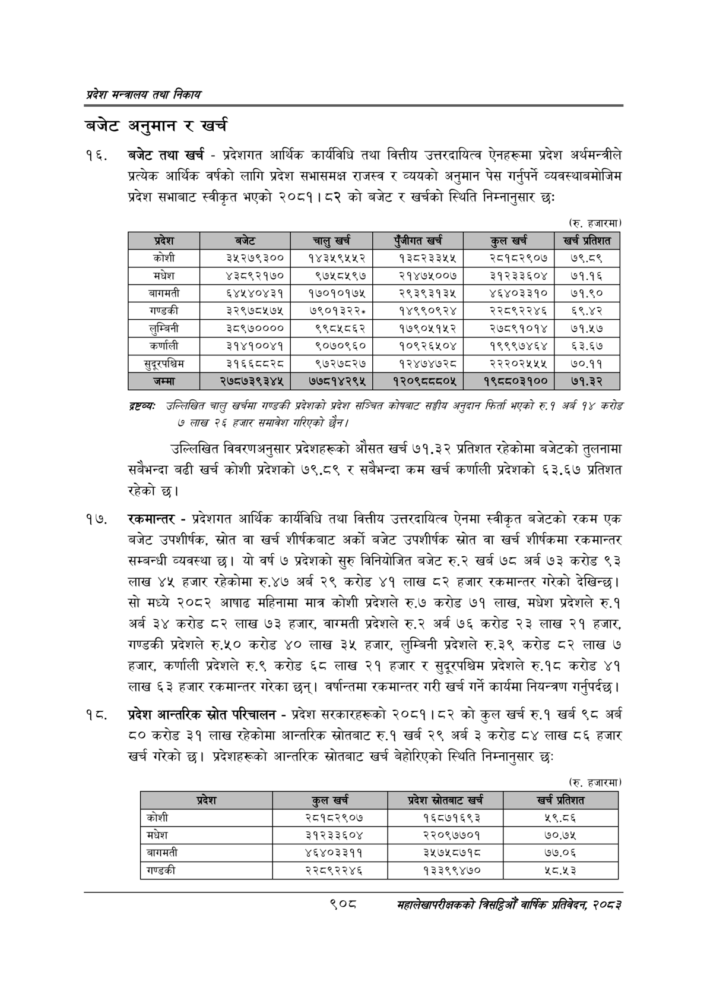

# Page 960 QA

## Rendered page


## Extracted text

```text
प्रदेश मन्त्रालय तथा निकाय
बजेट अनुमान र खर्च
बजेट तथा खर्च -प्रदेशगत आर्थिक कार्यविधि तथा वित्तीय उत्तरदायित्व ऐनहरूमा प्रदेश अर्थमन्त्रीले प्रत्येक आर्थिक वर्षको लागि प्रदेश सभासमक्ष राजस्व र व्ययको अनुमान पेस गर्नुपर्ने व्यवस्थाबमोजिम प्रदेश सभाबाट स्वीकृत भएको २०८१।८२ को बजेट र खर्चको स्थिति निम्नानुसार छः
(रु. हजारमा)
द्रष्टव्यः उल्लिखित चालु खर्चमा गण्डकी प्रदेशको प्रदेश सञ्चित कोषबाट सङ्घीय अनृदान फिर्ता भएको रु. १ अर्ब १४ करोङ ७ लाख २५ हजार समावेश गरिएको /
उल्लिखित विवरणअनुसार प्रदेशहरूको औसत खर्च ७१.३२ प्रतिशत रहेकोमा बजेटको तुलनामा सबैभन्दा बढी खर्च कोशी प्रदेशको ७९.८९ र सबैभन्दा कम खर्च कर्णाली प्रदेशको ६३.६७ प्रतिशत रहेको छ।
रकमान्तर -प्रदेशगत आर्थिक कार्यविधि तथा वित्तीय उत्तरदायित्व ऐनमा स्वीकृत बजेटको रकम एक बजेट उपशीर्षक, स्रोत वा खर्च शीर्षकबाट अर्को बजेट उपशीर्षक स्रोत वा खर्च शीर्षकमा रकमान्तर सम्बन्धी व्यवस्था छ। यो वर्ष ७ प्रदेशको सुरु विनियोजित बजेट रु.२ खर्ब ७८ अर्ब ७३ करोड ९३ लाख ४४५ हजार रहेकोमा रु.४७ अर्ब २९ करोड ४१ लाख ८२ हजार रकमान्तर गरेको देखिन्छ | सो मध्ये २०८२ आषाढ महिनामा मात्र कोशी प्रदेशले रु.७ करोड ७१ लाख, मधेश प्रदेशले रु.१ अर्ब ३४ करोड ८२ लाख ७३ हजार, वाग्मती प्रदेशले रु.२ अर्ब ७६ करोड २३ लाख २१ हजार, गण्डकी प्रदेशले रु.५० करोड लाख ३५ हजार, लुम्बिनी प्रदेशले रु.३९ करोड ८२ लाख ७ हजार, कर्णाली प्रदेशले रु.९ करोड ६८ लाख २१ हजार र सुदूरपश्चिम प्रदेशले रु.१८ करोड ४१ लाख ६३ हजार रकमान्तर गरेका छन्‌। वर्षान्तमा रकमान्तर गरी खर्च गर्ने कार्यमा नियन्त्रण गर्नुपर्दछ |
प्रदेश आन्तरिक स्रोत परिचालन -प्रदेश सरकारहरूको २०८१।८२ को कुल खर्च रु.१ खर्ब ९८ अर्ब ८० करोड ३१ लाख रहेकोमा आन्तरिक स्रोतबाट रु.१ खर्ब २९ अर्ब ३ करोड ८४ लाख ८६ हजार खर्च गरेको | प्रदेशहरूको आन्तरिक स्रोतबाट खर्च बेहोरिएको स्थिति निम्नानुसार छः
(रु. हजारमा)
९०८
महालेखापरीक्षकको वार्षिक प्रतिवेदन; २०८२

| कोशी | ३५२७९३०० | १४३४५९५४५२ | १३८२३३५४५ | २८१८२९०७ | ७९.८९ |
| --- | --- | --- | --- | --- | --- |
| मधेश | ४३८९२१७० | ९७५८४१९७ | २१४७५००७ | ३१२३३६०४ | ७१.१६ |
| बागमती | ६४४५४०४३१ | १७०१०१७४५ | २९३९३१३५ | ४६४०३३१० | ७१.९० |
| गण्डकी | ३२९७८५७४५ | ७९०१३२२, | १४९९०९२४ | २२८९२२४६ | ६९.४२ |
| लुम्बिनी | ३८९७०००० | ९९८५८६२ | १७९०५१५२ | २७८९१०१४ | ५७१.५७ |
| कर्णाली | ३१४१००४१ | ९०७०९६० | १०९२६४१०४ | १९९९७४६४ | ६३.६७ |
| सुदूरपन्चिम | ३१६६८८२८ | ९७२७८२७ | १२४७४७२८ | २२२०२४५५४५ | ७०.११ |

| कोशी | २८१८२९०७ | १६८७१६९३ | २५९.८६ |
| --- | --- | --- | --- |
| मधेश | ३१२३३६०४ | २२०९७७०१ | ७०.७५ |
| जानमती | ४६४०३३११ | ३५७५८७१८ | ७७.०६ |
| गण्डकी | २२८९२२४६ | १३३९९४७० |  |
```

## Flags
- table_page
- medium_quality_table
