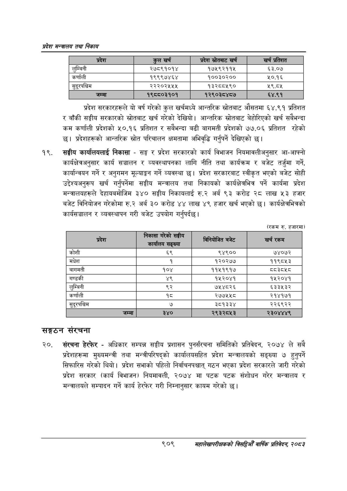

# Page 961 QA

## Rendered page


## Extracted text

```text
प्रदेश मन्त्रालय तथा निकाय
प्रदेश सरकारहरूले यो वर्ष गरेको कुल खर्चमध्ये आन्तरिक स्रोतबाट औसतमा ६४.९१ प्रतिशत र बाँकी सङ्घीय सरकारको स्रोतबाट खर्च गरेको देखियो। आन्तरिक स्रोतबाट बेहोरिएको खर्च सबैभन्दा कम कर्णाली प्रदेशको ५०.१६ प्रतिशत र सबैभन्दा बढी बागमती प्रदेशको ७७.०६ प्रतिशत रहेको छ। प्रदेशहरूको आन्तरिक स्रोत परिचालन क्षमतामा अभिवृद्धि गर्नुपर्ने देखिएको छ।
सङ्घीय कार्यालयलाई निकासा -सङ्घ र प्रदेश सरकारको कार्य विभाजन नियमावलीअनुसार आ-आफ्नो कार्यक्षेत्रअनुसार कार्य सञ्चालन र व्यवस्थापनका लागि नीति तथा कार्यक्रम र बजेट तर्जुमा गर्ने, कार्यान्वयन गर्ने र अनुगमन मूल्याङ्कन गर्ने व्यवस्था छ। प्रदेश सरकारबाट स्वीकृत भएको बजेट सोही उद्देश्यअनुरूप खर्च गर्नुपर्नेमा सङ्घीय मन्त्रालय तथा निकायको कार्यक्षेत्रभित्र पर्ने कार्यमा प्रदेश मन्त्रालयहरूले देहायबमोजिम ३४० सङ्घीय निकायलाई रु.२ अर्ब ९३ करोड २८ लाख ५३ हजार बजेट विनियोजन गरेकोमा रु.२ अर्ब ३० करोड ४४ लाख ४९ हजार खर्च भएको | कार्यक्षेत्रभित्रको कार्यसञ्चालन र व्यवस्थापन गरी बजेट उपयोग गर्नुपर्दछ।
(रकम रु. हजारमा)
सङ्गठन संरचना
संरचना हेरफेर -अधिकार सम्पन्न सङ्घीय प्रशासन पुनर्संरचना समितिको प्रतिवेदन, २०७४ ले सबै प्रदेशहरूमा मुख्यमन्त्री तथा मन्त्रीपरिषद्को कार्यालयसहित प्रदेश मन्त्रालयको सङ्ख्या ७ हुनुपर्ने सिफारिस गरेको थियो। प्रदेश सभाको पहिलो निर्वाचनपश्चात्‌ गठन भएका प्रदेश सरकारले जारी गरेको प्रदेश सरकार (कार्य विभाजन) नियमावली, २०७४ मा पटक पटक संशोधन गरेर मन्त्रालय र मन्त्रालयले सम्पादन गर्ने कार्य हेरफेर गरी निम्नानुसार कायम गरेको |
९०९
महालेखापरीक्षकको वार्षिक प्रतिवेदन; २०८२

| प्रदेश           | कुल खर्च   |   प्रदेश स्रोतबाट खर्च | खर्च प्रतिशत   |
|------------------|------------|------------------------|----------------|
| लुम्बिनी         | २७८९१०१४   |              १७५९२११४५ | ६३.०७          |
| कर्णाली          | _१९९९७४६४  |               १००३०२०० | ५०.१६          |
| सुदूरपश्चिम [___ | २२२०२५५४५  |               १३२८८५९० | ९.ठश           |
| जम्मा            | १९८८०३१०१  |              १२९०३८४८७ | ६४.९१          |

(रकम रु. हजारमा)

| प्रदेश        |   निकाला गरका सङ्घीय कार्यालय सङ्ख्या | e e     |   खर्च रकम |
|---------------|---------------------------------------|---------|------------|
| कोशी          |                                    ६९ | ९४९००   |      ७४०७२ |
| मधेश          |                                     १ | १२०२७७  |     ११९८५३ |
| बागमती        |                                   १०४ | ११५१९१७ |     ८८३८५८ |
| गण्डकी        |                                    ४९ | १५२०४१  |     १५२०४१ |
| लुम्बिनी      |                                    ९२ | ७५४८२६  |     ६३३५३२ |
| कर्णाली       |                                    १८ | २७७५५८  |     २१४१७१ |
| सुदूरपश्चिम । |                                     ७ | 35933Y  |     २२६९२२ |
| जम्मा]        |                                   ३४० | २९३२८५३ |    २३०४४४९ |
```

## Flags
- table_page
