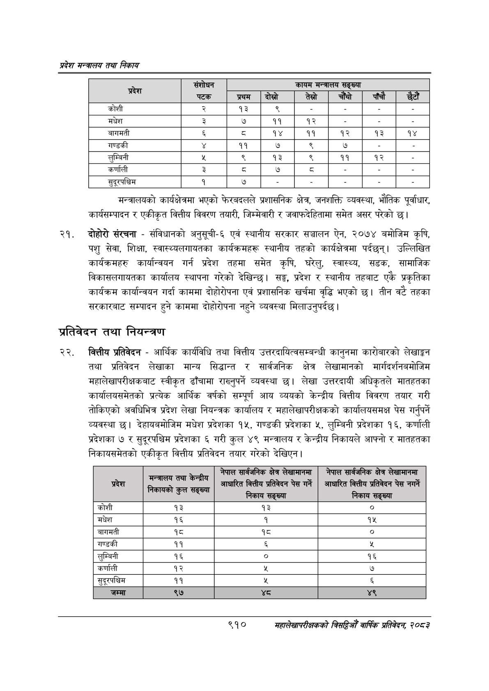

# Page 962 QA

## Rendered page


## Extracted text

```text
प्रदेश मन्त्रालय तथा निकाय
मन्त्रालयको कार्यक्षेत्रमा भएको फेरबदलले प्रशासनिक क्षेत्र, जनशक्ति व्यवस्था, भौतिक पूर्वाधार, कार्यसम्पादन र एकीकृत वित्तीय विवरण तयारी, जिम्मेवारी र जवाफदेहितामा समेत असर परेको छ।
दोहोरो संरचना -संविधानको अनुसूची-६ एवं स्थानीय सरकार सञ्चालन ऐन, २०७४ बमोजिम कृषि, पशु सेवा, शिक्षा, स्वास्थ्यलगायतका कार्यक्रमहरू स्थानीय तहको कार्यक्षेत्रमा पर्दछन्‌। उल्लिखित कार्यक्रमहरु कार्यान्वयन गर्न प्रदेश तहमा समेत कृषि, घरेलु, स्वास्थ्य सडक, सामाजिक विकासलगायतका कार्यालय स्थापना गरेको देखिन्छ। सङ्घ, प्रदेश र स्थानीय तहबाट एकै प्रकृतिका कार्यक्रम कार्यान्वयन गर्दा काममा दोहोरोपना एवं प्रशासनिक खर्चमा वृद्धि भएको | तीन वटै तहका सरकारबाट सम्पादन हुने काममा दोहोरोपना नहुने व्यवस्था मिलाउनुपर्दछ।
प्रतिवेदन तथा नियन्त्रण
वित्तीय प्रतिवेदन -आर्थिक कार्यविधि तथा वित्तीय उत्तरदायित्वसम्बन्धी कानुनमा कारोबारको लेखाङ्गन तथा प्रतिवेदन लेखाका मान्य सिद्धान्त र सार्वजनिक क्षेत्र लेखामानको मार्गदर्शनबमोजिम महालेखापरीक्षकबाट स्वीकृत ढाँचामा राख्नुपर्ने व्यवस्था छ। लेखा उत्तरदायी अधिकृतले मातहतका कार्यालयसमेतको प्रत्यक आर्थिक वर्षको सम्पूर्ण आय व्ययको केन्द्रीय वित्तीय विवरण तयार गरी तोकिएको अवधिभित्र प्रदेश लेखा नियन्त्रक कार्यालय र महालेखापरीक्षकको कार्यालयसमक्ष पेस गर्नुपर्ने व्यवस्था | देहायबमोजिम मधेश प्रदेशका १५, गण्डकी प्रदेशका ५, लुम्बिनी प्रदेशका १६, कर्णाली प्रदेशका ७ र सुदूरपश्चिम प्रदेशका ६ गरी कुल ४९ मन्त्रालय र केन्द्रीय निकायले आफ्नो र मातहतका निकायसमेतको एकीकृत वित्तीय प्रतिवेदन तयार गरेको देखिएन |
लेखामानमा
नेपाल
सार्वजनिक
सेखामानमा
९१०
महालेखापरीक्षकको वार्षिक प्रतिवेदन; २०८२

| प्रदेश | संशोधन |  |  | कायम भन्तरालय | सङ्ख्या |  |  |
| --- | --- | --- | --- | --- | --- | --- | --- |
|  | पटक | प्रथम | दोस्रो | तेस्रो | चाँया | पाँचौ | हँटौँ |
| कोशी |  | १३ | ९ |  |  |  |  |
| मधेश | ३ | ७ | ११ | १२ |  |  |  |
| बागमती |  | ३ | १४ | ११ | १२ | १३ | १४ |
| गण्डकी |  | ११ | ७ | ९ | ७ |  |  |
| लुम्बिनी |  | ९ | १३ | ९ | ११ | १२ |  |
| कर्णाली | ३ | द्‌ | ७ |  |  |  |  |
| सुदूरपश्चिम | १ | ७ |  |  |  |  |  |

| प्रदेश             | e o g निकायको AR   | S B आधारित वित्तीय प्रतिवेदन पेस गर्ने निकाय सङ्ख्या   | S &#124; आधारित वित्तीय प्रतिवेदन पेस नगर्ने निकाय सङ्ख्या &#124; ।   |
|--------------------|--------------------|--------------------------------------------------------|-----------------------------------------------------------------------|
| कोशी               | १३                 | १३                                                     | ०                                                                     |
| मधेश               | १६                 | [१                                                     | १५                                                                    |
| बागमती             | 9z                 | १८                                                     | &#124; ०                                                              |
| गण्डकी             | ११                 | &                                                      | 3                                                                     |
| लुम्बिनी           | १६                 | &#124; ०                                               | १६                                                                    |
| कर्णाली            | १२                 | Y                                                      | ७                                                                     |
| सुदूरपश्चिम &#124; | ११                 | %                                                      |                                                                       |
| जम्मा              | ९७                 | थ्व                                                    | ४९                                                                    |
```

## Flags
- table_page
- medium_quality_table
