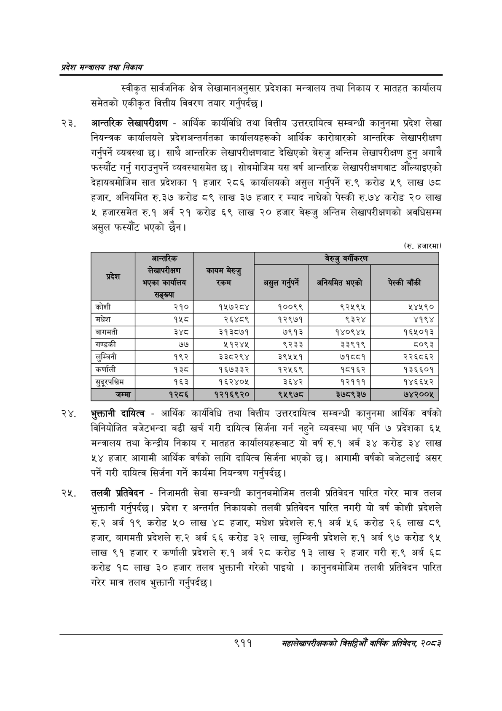

# Page 963 QA

## Rendered page


## Extracted text

```text
प्रदेश मन्त्रालय तथा निकाय
स्वीकृत सार्वजनिक क्षेत्र लेखामानअनुसार प्रदेशका मन्त्रालय तथा निकाय र मातहत कार्यालय समेतको एकीकृत वित्तीय विवरण तयार गर्नुपर्दछ |
आन्तरिक लेखापरीक्षण -आर्थिक कार्यविधि तथा वित्तीय उत्तरदायित्व सम्बन्धी कानुनमा प्रदेश लेखा नियन्त्रक कार्यालयले प्रदेशअन्तर्गतका कार्यालयहरूको आर्थिक कारोबारको आन्तरिक लेखापरीक्षण गर्नुपर्ने व्यवस्था छ। साथै आन्तरिक लेखापरीक्षणबाट देखिएको बेरुजु अन्तिम लेखापरीक्षण हुन्‌ अगावै फस्यौट गर्नु गराउनुपर्ने व्यवस्थासमेत छ। सोबमोजिम यस वर्ष आन्तरिक लेखापरीक्षणबाट औंल्याइएको देहायबमोजिम सात प्रदेशका १ हजार २८६ कार्यालयको असुल गर्नुपर्ने रु.९ करोड ५९ लाख ७८ हजार, अनियमित रु.३७ करोड ८९ लाख ३७ हजार र म्याद नाघेको पेस्की रु.७४ करोड २० लाख हजारसमेत रु.१ अर्ब २१ करोड ६९ लाख ० हजार बेरूजु अन्तिम लेखापरीक्षणको अवधिसम्म असुल फस्यौट भएको |
(रु. हजारमा)
भुक्तानी दायित्व -आर्थिक कार्यविधि तथा वित्तीय उत्तरदायित्व सम्बन्धी कानुनमा आर्थिक वर्षको विनियोजित बजेटभन्दा बढी खर्च गरी दायित्व सिर्जना गर्न नहुने व्यवस्था भए पनि ७ प्रदेशका ६५ मन्त्रालय तथा केन्द्रीय निकाय र मातहत कार्यालयहरूबाट यो वर्ष रु.१ अर्ब ३४ करोड ३४ लाख ४४ हजार आगामी आर्थिक वर्षको लागि दायित्व सिर्जना भएको छ। आगामी वर्षको बजेटलाई असर पर्ने गरी दायित्व सिर्जना गर्ने कार्यमा नियन्त्रण गर्नुपर्दछ |
तलबी प्रतिवेदन -निजामती सेवा सम्बन्धी कानुनबमोजिम तलबी प्रतिवेदन पारित गरेर मात्र तलब भुक्तानी गर्नुपर्दछ। प्रदेश र अन्तर्गत निकायको तलबी प्रतिवेदन पारित नगरी यो वर्ष कोशी प्रदेशले अर्ब १९ करोड ५० लाख ४८ हजार, मधेश प्रदेशले रु.१ अर्ब २६ करोड २६ लाख ८९ हजार, बागमती प्रदेशले रु.२ अर्ब ६६ करोड ३२ लाख, लुम्बिनी प्रदेशले रु.१ अर्ब ९७ करोड ९५ लाख ९१ हजार र कर्णाली प्रदेशले रु.१ अर्ब २८ करोड १३ लाख २ हजार गरी रु.९ अर्ब ६८ करोड १८ लाख ३० हजार तलब भुक्तानी गरेको पाइयो। कानुनबमोजिम तलबी प्रतिवेदन पारित गरेर मात्र तलब भुक्तानी गर्नुपर्दछ |
९११
महालेखापरीक्षकको वार्षिक प्रतिवेदन; २०८२

|             | आन्तरिक                           |                 | बेरुजु वर्गीकरण   | बेरुजु वर्गीकरण   | बेरुजु वर्गीकरण   |
|-------------|-----------------------------------|-----------------|-------------------|-------------------|-------------------|
| प्रदेश      | लेखापरीक्षण भएका कार्यालय सङ्ख्या | कायम बेरुजु रकम | असुल गर्नुपर्ने   | अनियमित भएको      | पेस्की बाँकी      |
| कोशी        | २१०                               | १५७२८४          | १००९९             | ९२५९५             | ५४५९०             |
| मधेश        | १५८                               | २६४८९           | १२९७१             | ९३२४              | ४१९४              |
| बागमती      | ३४८                               | ३१३८७१          | ७९१३              | १४०९४१५           | १६५०१३            |
| गण्डकी      | ७७                                | २१२४            | ९२३३              | ३३९१९             | ८०९३              |
| लुम्बिनी    | १९२                               | ३३८२९४          | ३९५४५१            | ७१८८१             | २२६८६२            |
| कर्णाली     | १३८                               | १६७३३२          | १२५६९             | १८१६२             | १३६६०१            |
| सुदूरपश्चिम | १६३                               | १६२४०५          | ३६४२              | १२१११             | १४६६५२            |
| जम्मा       | १२८६                              | १२१६९२०         | ९५९७८             | ३७८९३७            | ७४२००५            |
```

## Flags
- table_page
