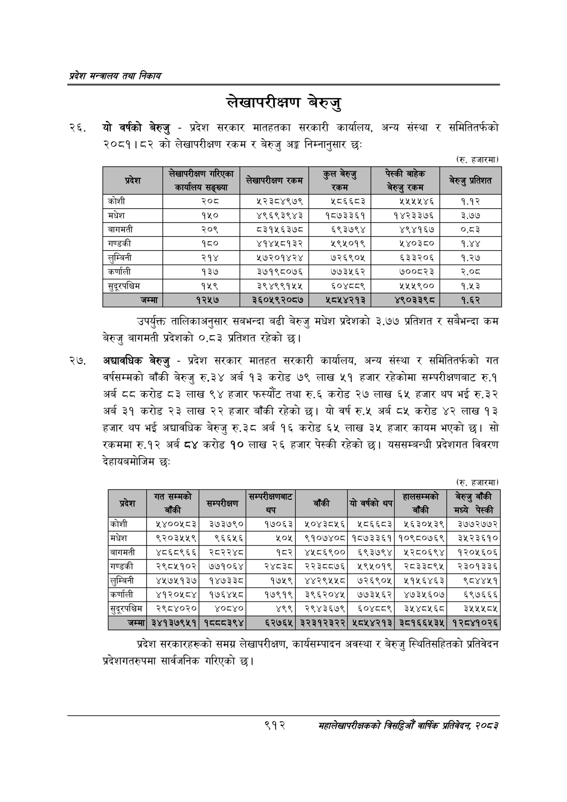

# Page 964 QA

## Rendered page


## Extracted text

```text
प्रदेश मन्त्रालय तथा निकाय
लेखापरीक्षण बेरुजु
यो वर्षको बेरुजु -प्रदेश सरकार मातहतका सरकारी कार्यालय, अन्य संस्था र समितितर्फको २०८१।८२ को लेखापरीक्षण रकम र बेरुजु अङ्ग निम्नानुसार छः
(रु. हजारमा)
उपर्युक्त तालिकाअनुसार सबभन्दा बढी बेरुजु मधेश प्रदेशको ३.७७ प्रतिशत र सबैभन्दा कम बेरुजु बागमती प्रदेशको ०.५३ प्रतिशत रहेको |
अद्यावधिक बेरुजु -प्रदेश सरकार मातहत सरकारी कार्यालय, अन्य संस्था र समितितर्फको गत वर्षसम्मको बाँकी बेरुजु रु.३४ अर्ब १३ करोड ७९ लाख ५१ हजार रहेकोमा सम्परीक्षणबाट रु.१ अर्ब ८८ करोड ८३ लाख ९४ हजार फस्यौट तथा रु.६ करोड २७ लाख ६५ हजार थप भई रु.३२ अर्ब ३१ करोड २३ लाख २२ हजार बाँकी रहेको | यो वर्ष रु.५ अर्ब ८५ करोड ४२ लाख १३ हजार थप भई अद्यावधिक बेरुजु रु.३८ अर्ब १६ करोड ६५ लाख ३५ हजार कायम भएको छ। सो रकममा रु.१२ अर्ब ८४ करोड १० लाख २६ हजार पेस्की रहेको छ। यससम्बन्धी प्रदेशगत विवरण देहायबमोजिम छः
(रु. हजारमा)
प्रदेश सरकारहरूको समग्र लेखापरीक्षण, कार्यसम्पादन अवस्था र बेरुजु स्थितिसहितको प्रतिवेदन प्रदेशगतरुपमा सार्वजनिक गरिएको छ।
९१२
महालेखापरीक्षकको वार्षिक प्रतिवेदन; २०८२

| २०८ | ५२३८४९७९ १८६६८३ |
| --- | --- |
| १५० | ४९६९३९४३ १८७३३६१ |
| २०९ | ८३१५६३७८ ६९३७९४ |
| १८० | ४१४४५८१३२ ५९४५०१९ |
| २१४ | ₹७२०१४२४ ५२६९०५ |
| १३७ | ३७१९८०७६ ७७३५६२ |
| १५९ | ३९४९९१५५ ६०४८८९ |

| प्रदेश प्रदेश   | गत सम्मको बाँकी              | सम्परीक्षण सम्परीक्षण   | सम्परीक्षणबाट थप   | बाँकी         | यो वर्षको थप   | हालसम्मको बाँकी              |   बेरुजु बाँकी मध्ये पेस्की |
|-----------------|------------------------------|-------------------------|--------------------|---------------|----------------|------------------------------|-----------------------------|
| कोशी            | ५४००५८३&#124;                | ३७३७९०]                 | १७०६३&#124;        | ५०४३८५६]      | ५८०६६८३&#124;  | ५६३०५३९]                     |                     ३७७२७७२ |
| मधेश            | ९२०३४५५९]                    | ९६६१६                   | ५०५]               | ९१०७४०८&#124; |                | १८७३३६१[&#124;१०९८०७६९&#124; |                     ३५२३६१० |
| बागमती          | &#124; ४८६८९६६]              | २०२२४८                  | १८२]               | ४४१८६९००]     | ६९३७९४&#124;   | १२८०६९४]                     |                     १२०१६०६ |
| गण्डकी &#124;   | २९८५१०२]&#124;               | ७७१०६४&#124;            | २४३                | २२३८०७६]      | ५९५०१९]&#124;  | २८३३८९४५]                    |                     २३०१३३६ |
| लुम्बिनी        | &#124; ४५७५१३७&#124;         | १४७३३८                  | १७५९]              | ४४२९५५८       | ७२६९०५]        | ५११६४६३]                     |                      ९८४४५१ |
| कर्णाली         | &#124; ४१२०५८४&#124;] &#124; | १७६४५८]                 | १७९१९&#124;        | ३९६२०४५&#124; | ७७३१५६२&#124;  | ४७३१५६०७]                    |                      ६९७६६६ |
| सुदूरपश्चिम     | २९८४०२०&#124;                | _४०८४०                  | ४९९]               | २९४३६७९&#124; | ६०४८८९&#124;   | ३१४८१५६८]&#124;              |                   ३१४१४५८४५ |
| जम्मा]          | ३४१३७९५१&#124;               | पठवव३९४&#124;           | ६२७६५]             | ३२३१२३२२]     | ५८५४२१३&#124;  | ३०१६६४५३५&#124;              |                    १२८४१०२६ |
```

## Flags
- table_page
- medium_quality_table
