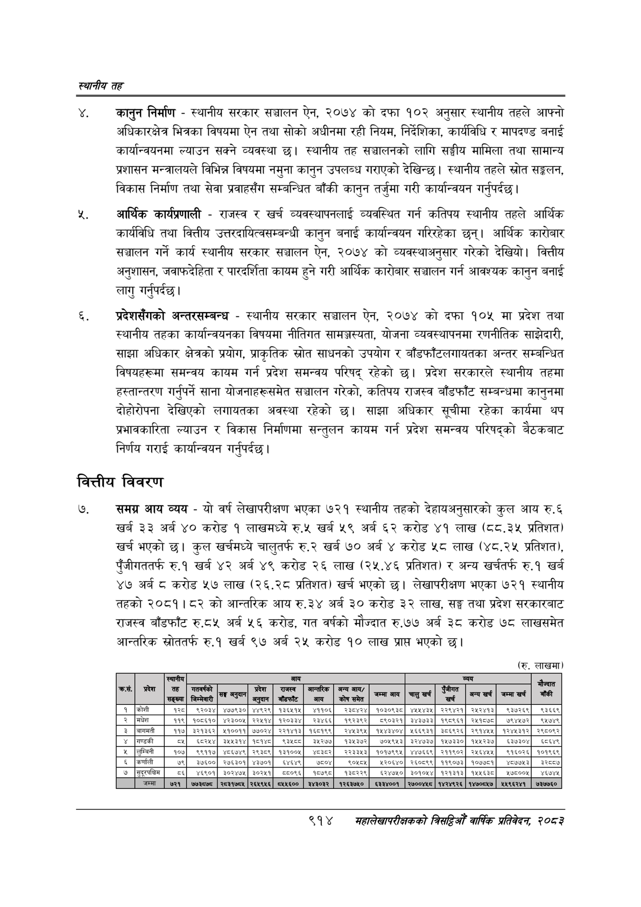

# Page 968 QA

## Rendered page


## Extracted text

```text
स्थानीय तह
. कानुन निर्माण -स्थानीय सरकार सञ्चालन ऐन, २०७४ को दफा १०२ अनुसार स्थानीय तहले आफ्नो अधिकारक्षेत्र भित्रका विषयमा ऐन तथा सोको अधीनमा रही नियम, निर्देशिका, कार्यविधि र मापदण्ड बनाई कार्यान्वयनमा ल्याउन सक्ने व्यवस्था छ। स्थानीय तह सञ्चालनको लागि सङ्घीय मामिला तथा सामान्य प्रशासन मन्त्रालयले विभिन्न विषयमा नमुना कानुन उपलब्ध गराएको देखिन्छ। स्थानीय तहले स्रोत सङ्कलन, विकास निर्माण तथा सेवा प्रवाहसँग सम्बन्धित बाँकी कानुन तर्जुमा गरी कार्यान्वयन गर्नुपर्दछ |
आर्थिक कार्यप्रणाली -राजस्व र खर्च व्यवस्थापनलाई व्यवस्थित गर्न कतिपय स्थानीय तहले आर्थिक कार्यविधि तथा वित्तीय उत्तरदायित्वसम्बन्धी कानुन बनाई कार्यान्वयन गरिरहेका छन्‌। आर्थिक कारोबार सञ्चालन गर्ने कार्य स्थानीय सरकार सञ्चालन ऐन, २०७४ को व्यवस्थाअनुसार गरेको देखियो। वित्तीय अनुशासन, जवाफदेहिता र पारदर्शिता कायम हुने गरी आर्थिक कारोबार सञ्चालन गर्न आवश्यक कानुन बनाई लागु गर्नुपर्दछ |
प्रदेशसँगको अन्तरसम्बन्ध -स्थानीय सरकार सञ्चालन ऐन, २०७४ को दफा १०४ मा प्रदेश तथा स्थानीय तहका कार्यान्वयनका विषयमा नीतिगत सामञ्जस्यता, योजना व्यवस्थापनमा रणनीतिक साझेदारी, साझा अधिकार क्षेत्रको प्रयोग, प्राकृतिक स्रोत साधनको उपयोग र बाँडफाँटलगायतका अन्तर सम्बन्धित विषयहरूमा समन्वय कायम गर्न प्रदेश समन्वय परिषद्‌ रहेको छ। प्रदेश सरकारले स्थानीय तहमा हस्तान्तरण गर्नुपर्ने साना योजनाहरूसमेत सञ्चालन गरेको, कतिपय राजस्व बाँडफाँट सम्बन्धमा कानुनमा दोहोरोपना देखिएको लगायतका अवस्था रहेको छ। साझा अधिकार सूचीमा रहेका कार्यमा थप प्रभावकारिता ल्याउन र विकास निर्माणमा सन्तुलन कायम गर्न प्रदेश समन्वय परिषद्को बैठकबाट निर्णय गराई कार्यान्वयन गर्नुपर्दछ |
वित्तीय विवरण
समग्र आय व्यय -यो वर्ष लेखापरीक्षण भएका ७२१ स्थानीय तहको देहायअनुसारको कुल आय रु.६ खर्ब ३३ अर्ब ४० करोड १ लाखमध्ये रु.५ खर्ब ५९ अर्ब ६२ करोड ४१ लाख (८८.३५ प्रतिशत) खर्च भएको | कुल खर्चमध्ये चालुतर्फ रु.२ खर्ब ७० अर्ब करोड ५८ लाख (४८.२५ प्रतिशत), पुँजीगततर्फ रु.१ खर्ब ४२ अर्ब ४९ करोड २६ लाख (२५.४६ प्रतिशत) र अन्य खर्चतर्फ रु.१ खर्ब ४७ अर्ब ८ करोड ५७ लाख (२६.२८ प्रतिशत) खर्च भएको छ। लेखापरीक्षण भएका ७२१ स्थानीय तहको २०८१।८२ को आन्तरिक आय रु. ३४ अर्ब ३० करोड ३२ लाख, सङ्घ तथा प्रदेश सरकारबाट राजस्व बाँडफाँट रु.८५ अर्ब ५६ करोड, गत वर्षको मौज्दात रु.७७ अर्ब ३८ करोड ७८ लाखसमेत आन्तरिक स्रोततर्फ रु.१ खर्ब ९७ अर्ब २५ करोड १० लाख प्राप्त भएको छ।
(रु. लाखमा)
९१४
समहालेखापरीक्षकको वार्षिक प्रतिवेकन, २०८२

(रु. लाखमा)

| न्ब   | प्रदेश   |                          | [बा ]               | [बा ]         | [बा ]                       | [बा ]                  | [बा ]                           | [बा ]             | [बा ]           | ब्यय           | ब्यय           | ब्यय                  | ब्यय              | मौज्दात बाँकी    |
|-------|----------|--------------------------|---------------------|---------------|-----------------------------|------------------------|---------------------------------|-------------------|-----------------|----------------|----------------|-----------------------|-------------------|------------------|
| न्ब   | प्रदेश   | तह &#124; सङ्ख्या &#124; | गतवर्षको जिम्मेवारी | &#124; 9      | प्रदेश &#124; अनुदान &#124; | राजस्व &#124; बाँडफाँट | आन्तरिक &#124; &#124; आय &#124; | अन्य आय/ कोष समेत | जम्मा आय &#124; | [ चालु खर्च    | उुबुात         | अन्य खर्च             | &#124; जम्मा खर्च | मौज्दात बाँकी    |
| 4]    | [कोशी    | १२८]                     | _९२०३४&#124;        | ४७७९३०]       | ४४९२९&#124;                 | १३६५१५&#124;           | ४११०६&#124;                     | २३८४२४&#124;      | १०३०९३८&#124;   | ४५४४३४५        | २२९४२१         | २५२४१३                |                   | ९३६६९            |
|       | २_]मधेश  | ११९]                     | १०८६१०&#124;        | ४२३००४५&#124; | २२५१४&#124;                 | १२०३३४&#124;           | २३४६६&#124;                     | १९२३९२&#124;      | ८5९०३२१&#124;   | ३४३७३३         | १९८९६१         | २४५१८७८               |                   | ९५७४९            |
| 2     | [बागमती  | [११४]                    | ३२१३६२]             | ५१००११[       | ७७०२]                       | २२१४१३]&#124;          | १६०१९९]                         | २४५३९५&#124;      | १५४३४०४]        |
```

## Flags
- table_page
