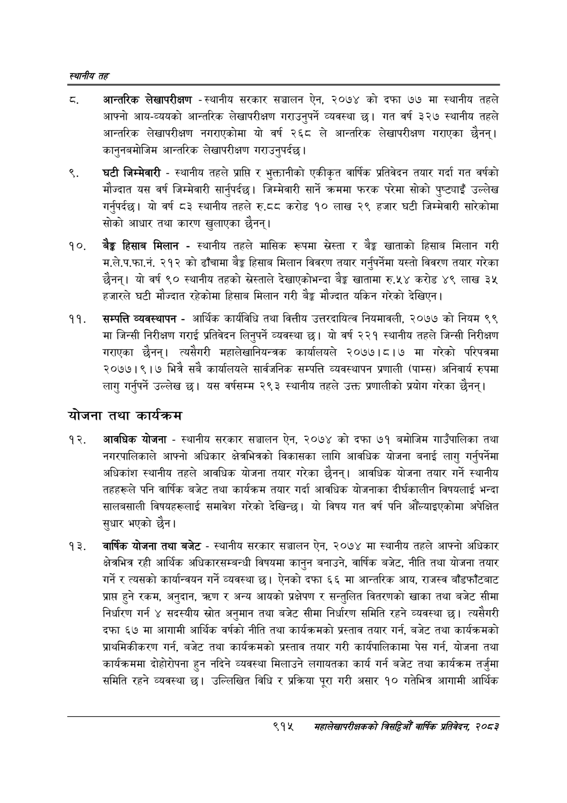

# Page 969 QA

## Rendered page


## Extracted text

```text
स्थानीय तह
ठ. आन्तरिक लेखापरीक्षण -स्थानीय सरकार सञ्चालन ऐन, २०७४ को दफा ७७ मा स्थानीय तहले आफ्नो आय-व्ययको आन्तरिक लेखापरीक्षण गराउनुपर्ने व्यवस्था | गत वर्ष ३२७ स्थानीय तहले आन्तरिक लेखापरीक्षण नगराएकोमा यो वर्ष २६८ ले आन्तरिक लेखापरीक्षण गराएका छैनन्‌। कानुनबमोजिम आन्तरिक लेखापरीक्षण गराउनुपर्दछ।
घटी जिम्मेवारी -स्थानीय तहले प्राप्ति र भुक्तानीको एकीकृत वार्षिक प्रतिवेदन तयार गर्दा गत वर्षको मौज्दात यस वर्ष जिम्मेवारी सार्नुपर्दछ। जिम्मेवारी सार्ने क्रममा फरक परेमा सोको पुष्ट्याइँ उल्लेख गर्नुपर्दछ। यो वर्ष ८३ स्थानीय तहले ©.६५ करोड १० लाख २९ हजार घटी जिम्मेवारी सारेकोमा सोको आधार तथा कारण खुलाएका छैनन्‌।
बेङ्ग हिसाब मिलान -स्थानीय तहले मासिक रूपमा सस्ता र बैङ्क खाताको हिसाब मिलान गरी म.ले.प.फा.नं. २१२ को ढाँचामा बेङ्ग हिसाब मिलान विवरण तयार गर्नुपर्नेमा यस्तो विवरण तयार गरेका छैनन्‌। यो वर्ष ९० स्थानीय तहको सस्ताले देखाएकोभन्दा बेङ्ग खातामा रु.५४ करोड ४९ लाख ३५ हजारले घटी मौज्दात रहेकोमा हिसाब मिलान गरी बेङ्ग मौज्दात यकिन गरेको देखिएन |
सम्पत्ति व्यवस्थापन -आर्थिक कार्यविधि तथा वित्तीय उत्तरदायित्व नियमावली, २०७७ को नियम ९९ मा जिन्सी निरीक्षण गराई प्रतिवेदन लिनुपर्ने व्यवस्था छ। यो वर्ष २२१ स्थानीय तहले जिन्सी निरीक्षण गराएका छैनन्‌। त्यसैगरी महालेखानियन्त्रक कार्यालयले २०७७।८।७ मा गरेको परिपत्रमा २०७७।९।७ भित्रै सबै कार्यालयले सार्वजनिक सम्पत्ति व्यवस्थापन प्रणाली (पाम्स) अनिवार्य रुपमा लागु गर्नुपर्ने उल्लेख | यस वर्षसम्म २९३ स्थानीय तहले उक्त प्रणालीको प्रयोग गरेका छैनन्‌।
योजना तथा कार्यक्रम
आवधिक योजना -स्थानीय सरकार सञ्चालन ऐन, २०७४ को दफा ७१ बमोजिम गाउँपालिका तथा नगरपालिकाले आफ्नो अधिकार क्षेत्रभित्रको विकासका लागि आवधिक योजना बनाई लागु गर्नुपर्नेमा अधिकांश स्थानीय तहले आवधिक योजना तयार गरेका छैनन्‌। आवधिक योजना तयार गर्ने स्थानीय तहहरूले पनि वार्षिक बजेट तथा कार्यक्रम तयार गर्दा आवधिक योजनाका दीर्घकालीन विषयलाई भन्दा सालबसाली विषयहरूलाई समावेश गरेको देखिन्छ। यो विषय गत वर्ष पनि औँल्याइएकोमा अपेक्षित सुधार भएको |
वार्षिक योजना तथा बजेट -स्थानीय सरकार सञ्चालन ऐन, २०७४ मा स्थानीय तहले आफ्नो अधिकार क्षेत्रभित्र रही आर्थिक अधिकारसम्बन्धी विषयमा कानुन बनाउने, वार्षिक बजेट, नीति तथा योजना तयार गर्ने र त्यसको कार्यान्वयन गर्ने व्यवस्था छ। ऐनको दफा ६६ मा आन्तरिक आय, राजस्व बाँडफाँटबाट प्राप्त हुने रकम, अनुदान, र अन्य आयको प्रक्षेपण र सन्तुलित वितरणको खाका तथा बजेट सीमा निर्धारण गर्न ४ सदस्यीय स्रोत अनुमान तथा बजेट सीमा निर्धारण समिति रहने व्यवस्था छ। त्यसैगरी दफा ६७ मा आगामी आर्थिक वर्षको नीति तथा कार्यक्रमको प्रस्ताव तयार गर्न, बजेट तथा कार्यक्रमको प्राथमिकीकरण गर्न, बजेट तथा कार्यक्रमको प्रस्ताव तयार गरी कार्यपालिकामा पेस गर्न, योजना तथा कार्यक्रममा दोहोरोपना हुन नदिने व्यवस्था मिलाउने लगायतका कार्य गर्न बजेट तथा कार्यक्रम तर्जुमा समिति रहने व्यवस्था छ। उल्लिखित विधि र प्रक्रिया पूरा गरी असार १० गतेभित्र आगामी आर्थिक
९१४
समसृहालेखापरीक्षकको वार्षिक प्रतिवेदन, २०८२
```

## Flags
- None
