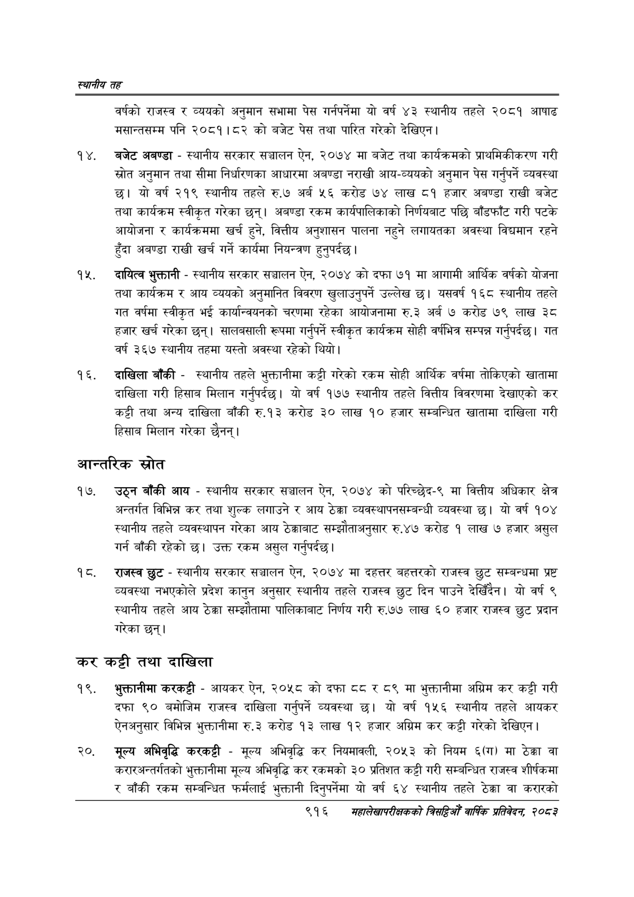

# Page 970 QA

## Rendered page


## Extracted text

```text
स्थानीय तह
वर्षको राजस्व र व्ययको अनुमान सभामा पेस गर्नपर्नेमा यो वर्ष ४३ स्थानीय तहले २०८१ आषाढ मसान्तसम्म पनि २०८१।८२ को बजेट पेस तथा पारित गरेको देखिएन |
बजेट अबण्डा -स्थानीय सरकार सञ्चालन ऐन, २०७४ मा बजेट तथा कार्यक्रमको प्राथमिकीकरण गरी स्रोत अनुमान तथा सीमा निर्धारणका आधारमा अबण्डा नराखी आय-व्ययको अनुमान पेस गर्नुपर्ने व्यवस्था छ। यो वर्ष २१९ स्थानीय तहले रु.७ अर्ब ५६ करोड ७४ लाख ८१ हजार अबण्डा राखी बजेट तथा कार्यक्रम स्वीकृत गरेका छन्‌। अबण्डा रकम कार्यपालिकाको निर्णयबाट पछि बाँडफाँट गरी पटके आयोजना र कार्यक्रममा खर्च हुने, वित्तीय अनुशासन पालना नहुने लगायतका अवस्था विद्यमान रहने हुँदा अबण्डा राखी खर्च गर्ने कार्यमा नियन्त्रण हुनुपर्दछ |
दायित्व भुक्तानी -स्थानीय सरकार सञ्चालन ऐन, २०७४ को दफा ७१ मा आगामी आर्थिक वर्षको योजना तथा कार्यक्रम र आय व्ययको अनुमानित विवरण खुलाउनुपर्ने उल्लेख छ। यसवर्ष १६८ स्थानीय तहले गत वर्षमा स्वीकृत भई कार्यान्वयनको चरणमा रहेका आयोजनामा रु.३ अर्ब ७ करोड ७९ लाख ३८ हजार खर्च गरेका छन्‌। सालबसाली रूपमा गर्नुपर्ने स्वीकृत कार्यक्रम सोही वर्षभित्र सम्पन्न गर्नुपर्दछ। गत वर्ष ३६७ स्थानीय तहमा यस्तो अवस्था रहेको थियो।
दाखिला बाँकी -स्थानीय तहले भुक्तानीमा कट्टी गरेको रकम सोही आर्थिक वर्षमा तोकिएको खातामा दाखिला गरी हिसाब मिलान गर्नुपर्दछ। यो वर्ष १७७ स्थानीय तहले वित्तीय विवरणमा देखाएको कर कट्टी तथा अन्य दाखिला बाँकी रु.१३ करोड ३० लाख १० हजार सम्बन्धित खातामा दाखिला गरी हिसाब मिलान गरेका छैनन्‌।
आन्तरिक स्रोत
उठ्न बाँकी आय -स्थानीय सरकार सञ्चालन ऐन, २०७४ को परिच्छेद-९ मा वित्तीय अधिकार क्षेत्र अन्तर्गत विभिन्न कर तथा शुल्क लगाउने र आय ठेक्का व्यवस्थापनसम्बन्धी व्यवस्था छ। यो वर्ष १०४ स्थानीय तहले व्यवस्थापन गरेका आय ठेक्काबाट सम्झौताअनुसार रु.४७ करोड १ लाख ७ हजार असुल गर्न बाँकी रहेको छ। उक्त रकम असुल गर्नुपर्दछ।
राजस्व छुट -स्थानीय सरकार सञ्चालन ऐन, २०७४ मा दहत्तर बहत्तरको राजस्व छुट सम्बन्धमा प्रष्ट व्यवस्था नभएकोले प्रदेश कानुन अनुसार स्थानीय तहले राजस्व छुट दिन पाउने देखिँदैन। यो वर्ष ९ स्थानीय तहले आय ठेक्का सम्झौतामा पालिकाबाट निर्णय गरी रु.७७ लाख ६० हजार राजस्व छुट प्रदान गरेका छन्‌।
कर कट्टी तथा दाखिला
भुक्तानीमा करकट्टी -आयकर ऐन, २०५८ को दफा दद र ८९ मा भुक्तानीमा अग्रिम कर कट्टी गरी दफा ९० बमोजिम राजस्व दाखिला गर्नुपर्ने व्यवस्था छ। यो वर्ष १५६ स्थानीय तहले आयकर ऐनअनुसार विभिन्न भुक्तानीमा रु.३ करोड १३ लाख १२ हजार अग्रिम कर कट्टी गरेको देखिएन |
मूल्य अभिवृद्धि करकट्टी -मूल्य अभिवृद्धि कर नियमावली, २०५३ को नियम ६(ग) मा ठेक्का वा करारअन्तर्गतको भुक्तानीमा मूल्य अभिवृद्धि कर रकमको ३० प्रतिशत कट्टी गरी सम्बन्धित राजस्व शीर्षकमा र बाँकी रकम सम्बन्धित फर्मलाई भुक्तानी दिनुपर्नेमा यो वर्ष ६४ स्थानीय तहले ठेक्का वा करारको
९१६
मृहालेखापरीक्षकको वार्षिक , २०८२
```

## Flags
- None
