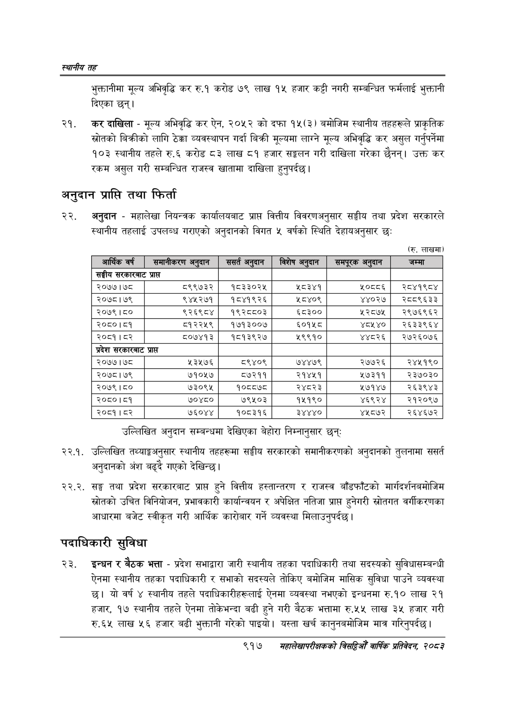

# Page 971 QA

## Rendered page


## Extracted text

```text
स्थानीय तह
भुक्तानीमा मूल्य अभिवृद्धि कर रु.१ करोड ७९ लाख १५ हजार कट्टी नगरी सम्बन्धित फर्मलाई भुक्तानी दिएका छन्‌।
'कर दाखिला -मूल्य अभिवृद्धि कर ऐन, २०५२ को दफा १५(३) बमोजिम स्थानीय तहहरूले प्राकृतिक स्रोतको बिक्रीको लागि ठेक्का व्यवस्थापन गर्दा बिक्री मूल्यमा लाग्ने मूल्य अभिवृद्धि कर असुल गर्नुपर्नेमा १०३ स्थानीय तहले रु.६ करोड ८३ लाख ८१ हजार सङ्गलन गरी दाखिला गरेका छैनन्‌। उक्त कर रकम असुल गरी सम्बन्धित राजस्व खातामा दाखिला हुनुपर्दछ |
अनुदान प्राप्ति तथा फिर्ता
अनुदान -महालेखा नियन्त्रक कार्यालयबाट प्राप्त वित्तीय विवरणअनुसार सङ्घीय तथा प्रदेश सरकारले स्थानीय तहलाई उपलब्ध गराएको अनुदानको विगत ५ वर्षको स्थिति देहायअनुसार छः
(रु. लाखमा)
उल्लिखित अनुदान सम्बन्धमा देखिएका बेहोरा निम्नानुसार छन्‌ः
२२.१. उल्लिखित तथ्याङ्कअनुसार स्थानीय तहहरूमा सङ्घीय सरकारको समानीकरणको अनुदानको तुलनामा ससर्त अनुदानको अंश बढ्दै गएको देखिन्छ।
२२.२. सङ्ग तथा प्रदेश सरकारबाट प्राप्त हुने वित्तीय हस्तान्तरण र राजस्व बाँडफाँटको मार्गदर्शनबमोजिम स्रोतको उचित विनियोजन, प्रभावकारी कार्यान्वयन र अपेक्षित नतिजा प्राप्त हुनेगरी स्रोतगत वर्गीकरणका आधारमा बजेट स्वीकृत गरी आर्थिक कारोबार गर्ने व्यवस्था मिलाउनुपर्दछ।
पदाधिकारी सुविधा
इन्धन र बैठक भत्ता -प्रदेश सभाद्वारा जारी स्थानीय तहका पदाधिकारी तथा सदस्यको सुविधासम्बन्धी ऐनमा स्थानीय तहका पदाधिकारी र सभाको सदस्यले तोकिए बमोजिम मासिक सुविधा पाउने व्यवस्था छ। यो वर्ष ४ स्थानीय तहले पदाधिकारीहरूलाई ऐनमा व्यवस्था नभएको इन्धनमा रु.१० लाख २१ हजार, १७ स्थानीय तहले ऐनमा तोकेभन्दा बढी हुने गरी बैठक भत्तामा रु.५५ लाख ३५ हजार गरी रु.६५ लाख ५६ हजार बढी भुक्तानी गरेको पाइयो। यस्ता खर्च कानुनबमोजिम मात्र गरिन्‌पर्दछ।
९१७
महालेखापरीक्षकको वार्षिक प्रतिवेकन, २०८२

(रु. लाखमा)

| आर्थिक वर्ष             | समानीकरण अनुदान &#124;   |   ससर्त अनुदान |   विशेष अनुदान | &#124; समपूरक अनुदान   | &#124; जम्मा &#124;   |
|-------------------------|--------------------------|----------------|----------------|------------------------|-----------------------|
| सङ्घीय सरकारबाट प्राप्त | सङ्घीय सरकारबाट प्राप्त  |                |                |                        |                       |
| २०७७।७८                 | ८९९७३२ &#124;            |        १८३३०२५ |           ८३४१ | ₹०८०६                  | &#124; २८४१९८४        |
| २०७८।७९                 | ९४५२७१ &#124;            |        १८४१९२६ |          ५८४०९ | ४४०२७                  | &#124; २८८९६३३        |
| २०७९।८०                 | ९२६९८४&#124;             |        १९२८८०३ |          ६८३०० | २८७५                   | &#124; २९७६९६२        |
| २०८०।८१                 | ८१२२५९                   |        १७१३००७ |          ६०१५८ | ४८५४०&#124;            | २६३३९६४               |
| २०८१।८२                 | &#124; ८०७४१३ &#124;     |        १८१३९२७ |           ९९१० | ४४८२६                  | &#124; २७२६०७६        |
| प्रदेश सरकारबाट प्राप्त | प्रदेश सरकारबाट प्राप्त  |                |                |                        |                       |
| २०७७।७८                 | ५३५७६                    |           ९४०९ |          ७४४७९ | २७७२६                  | २४४११९०               |
| २०७८।७९                 | ७१०५७                    |          ८७२११ |         २१४४५१ | ७३११                   | २३७०३०                |
| २०७९।८०                 | ७३०९४५                   |         १०८८७८ |          २४८२३ | ७१४७                   | २६३९४३                |
| २०८०।८१                 | ७०४८०                    |          ७९५०३ |          १५१९० | ४६९२४&#124;            | २१२०९७                |
| २०८१ । ८२               | ७६०४४                    |         १०८३१६ |          ३४४४० | ४५८७२                  | २६४६७२                |
```

## Flags
- table_page
