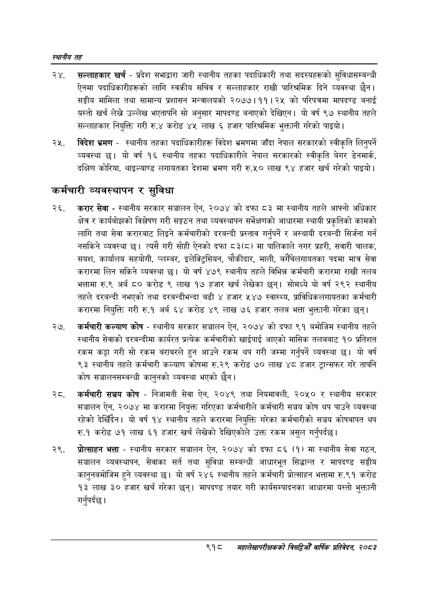

# Page 972 QA

## Rendered page


## Extracted text

```text
स्थानीय तह
सल्लाहकार खर्च -प्रदेश सभाद्वारा जारी स्थानीय तहका पदाधिकारी तथा सदस्यहरूको सुविधासम्बन्धी ऐनमा पदाधिकारीहरूको लागि स्वकीय सचिव र सल्लाहकार राखी पारिश्रमिक दिने व्यवस्था छैन। सङ्घीय मामिला तथा सामान्य प्रशासन मन्त्रालयको २०७७।११। २५ को परिपत्रमा मापदण्ड बनाई यस्तो खर्च लेख्ने उल्लेख भएतापनि सो अनुसार मापदण्ड बनाएको देखिएन। यो वर्ष ९७ स्थानीय तहले सल्लाहकार नियुक्ति गरी रु.४ करोड ४५ लाख ६ हजार पारिश्रमिक भुक्तानी गरेको पाइयो |
विदेश भ्रमण -स्थानीय तहका पदाधिकारीहरू विदेश भ्रमणमा जाँदा नेपाल सरकारको स्वीकृति लिन्‌पर्ने व्यवस्था छ। यो वर्ष १६ स्थानीय तहका पदाधिकारीले नेपाल सरकारको स्वीकृति बेगर डेनमार्क, दक्षिण कोरिया, थाइल्याण्ड लगायतका देशमा भ्रमण गरी रु.५० लाख ९४ हजार खर्च गरेको पाइयो |
कर्मचारी व्यवस्थापन र सुविधा
करार सेवा -स्थानीय सरकार सञ्चालन ऐन, २०७४ को दफा ८३ मा स्थानीय तहले आफ्नो अधिकार क्षेत्र र कार्यबोझको विश्लेषण गरी सङ्गठन तथा व्यवस्थापन सर्भेक्षणको आधारमा स्थायी प्रकृतिको कामको लागि तथा सेवा करारबाट लिइने कर्मचारीको दरबन्दी प्रस्ताव गर्नुपर्ने र अस्थायी दरबन्दी सिर्जना गर्न नसकिने व्यवस्था छ। त्यसै गरी सोही ऐनको दफा ८३(८) मा पालिकाले नगर प्रहरी, सवारी चालक, सयश, कार्यालय सहयोगी, प्लम्बर, इलेक्ट्रिसियन, चौकीदार, माली, बगैँचेलगायतका पदमा मात्र सेवा करारमा लिन सकिने व्यवस्था छ। यो वर्ष ४७९ स्थानीय तहले विभिन्न कर्मचारी करारमा राखी तलब भत्तामा रु.९ अर्ब ८० करोड ९ लाख १७ हजार खर्च लेखेका छन्‌। सोमध्ये यो वर्ष २९२ स्थानीय तहले दरबन्दी नभएको तथा दरबन्दीभन्दा बढी ४ हजार ५४७ स्वास्थ्य, प्राविधिकलगायतका कर्मचारी करारमा नियुक्ति गरी रु.१ अर्ब ६४ करोड ४९ लाख ७६ हजार तलब भत्ता भुक्तानी गरेका छन्‌।
२७, कर्मचारी कल्याण कोष -स्थानीय सरकार सञ्चालन ऐन, २०७४ को दफा ९१ बमोजिम स्थानीय तहले स्थानीय सेवाको दरबन्दीमा कार्यरत प्रत्येक कर्मचारीको खाईपाई आएको मासिक तलबबाट १० प्रतिशत रकम कट्टा गरी सो रकम बराबरले हुन आउने रकम थप गरी जम्मा गर्नुपर्ने व्यवस्था छ। यो वर्ष ९३ स्थानीय तहले कर्मचारी कल्याण कोषमा रु.२९ करोड ७० लाख ४८ हजार ट्रान्सफर गरे तापनि कोष सञ्चालनसम्बन्धी कानुनको व्यवस्था भएको छैन।
कर्मचारी सञ्चय कोष -निजामती सेवा ऐन, २०४९ तथा नियमावली, २०५० र स्थानीय सरकार सञ्चालन ऐन, २०७४ मा करारमा नियुक्त गरिएका कर्मचारीले कर्मचारी सञ्चय कोष थप पाउने व्यवस्था रहेको देखिँदैन। यो वर्ष १४ स्थानीय तहले करारमा नियुक्ति गरेका कर्मचारीको सञ्चय कोषबापत थप रु.१ करोड ७१ लाख ६१ हजार खर्च लेखेको देखिएकोले उक्त रकम असुल गर्नुपर्दछ |
२९, प्रोत्साहन भत्ता -स्थानीय सरकार सञ्चालन ऐन, २०७४ को दफा ८६ (१) मा स्थानीय सेवा गठन, सञ्चालन व्यवस्थापन, सेवाका सर्त तथा सुविधा सम्बन्धी आधारभूत सिद्धान्त र मापदण्ड सङ्घीय कानुनबमोजिम हुने व्यवस्था छ। यो वर्ष २४६ स्थानीय तहले कर्मचारी प्रोत्साहन भत्तामा रु.९१ करोड १३ लाख ३० हजार खर्च गरेका छन्‌। मापदण्ड तयार गरी कार्यसम्पादनका आधारमा यस्तो भुक्तानी गर्नुपर्दछ |
९१८
महालेखापरीक्षकको वार्षिक प्रतिवेकन, २०८२
```

## Flags
- None
