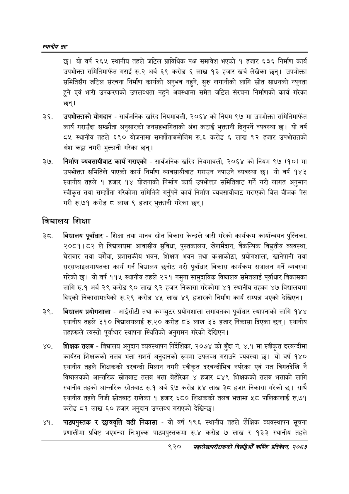

# Page 974 QA

## Rendered page


## Extracted text

```text
स्थानीय तह
छ। यो वर्ष २६५ स्थानीय तहले जटिल प्राविधिक पक्ष समावेश भएको १ हजार ६३६ निर्माण कार्य उपभोक्ता समितिमार्फत गराई रु.२ अर्ब ६९ करोड ६ लाख १३ हजार खर्च लेखेका छन्‌। उपभोक्ता समितिसँग जटिल संरचना निर्माण कार्यको अनुभव नहुने, सुरु लगानीको लागि स्रोत साधनको न्यूनता हुने एवं भारी उपकरणको उपलब्धता नहुने अवस्थामा समेत जटिल संरचना निर्माणको कार्य गरेका छन्‌।
उपभोक्ताको योगदान -सार्वजनिक खरिद नियमावली, २०६४ को नियम ९७ मा उपभोक्ता समितिमार्फत कार्य गराउँदा सम्झौता अनुसारको जनसहभागिताको अंश कटाई भुक्तानी दिनुपर्ने व्यवस्था छ। यो वर्ष ८५ स्थानीय तहले ६९० योजनामा सम्झौताबमोजिम रु.६ करोड ६ लाख ९२ हजार उपभोक्ताको अंश कट्टा नगरी भुक्तानी गरेका छन्‌।
निर्माण व्यवसायीबाट कार्य गराएको -सार्वजनिक खरिद नियमावली, २०६४ को नियम ९७ (१०) मा उपभोक्ता समितिले पाएको कार्य निर्माण व्यवसायीबाट गराउन नपाउने व्यवस्था १ यो वर्ष १४३ स्थानीय तहले १ हजार १४ योजनाको निर्माण कार्य उपभोक्ता समितिबाट गर्ने गरी लागत अनुमान स्वीकृत तथा सम्झौता गरेकोमा समितिले गर्नुपर्ने कार्य निर्माण व्यवसायीबाट गराएको बिल बीजक पेस गरी रु.७१ करोड लाख ९ हजार भुक्तानी गरेका |
विद्यालय
शिक्षा
विद्यालय पूर्वाधार -शिक्षा तथा मानव स्रोत विकास केन्द्रले जारी गरेको कार्यक्रम कार्यान्वयन पुस्तिका, २०८१।८२ ले विद्यालयमा आवासीय सुविधा, पुस्तकालय, खेलमैदान, वैकल्पिक विद्युतीय व्यवस्था, घेराबार तथा बगैँचा, प्रशासकीय भवन, शिक्षण भवन तथा कक्षाकोठा, प्रयोगशाला, खानेपानी तथा सरसफाइलगायतका कार्य गर्न विद्यालय छनोट गरी पूर्वाधार विकास कार्यक्रम सञ्चालन गर्ने व्यवस्था गरेको छ। यो वर्ष ११५ स्थानीय तहले २२१ नमुना सामुदायिक विद्यालय समेतलाई पूर्वाधार विकासका लागि रु.१ अर्ब २९ करोड ९० लाख ९२ हजार निकासा गरेकोमा ४१ स्थानीय तहका ४७ विद्यालयमा दिएको निकासामध्येको रु.२९ करोड ४५ लाख ४९ हजारको निर्माण कार्य सम्पन्न भएको देखिएन |
विद्यालय प्रयोगशाला -आईसीटी तथा कम्प्युटर प्रयोगशाला लगायतका पूर्वाधार स्थापनाको लागि १४४ स्थानीय तहले ३१० विद्यालयलाई रु.२० करोड ८३ लाख ३३ हजार निकासा दिएका छन्‌। स्थानीय तहहरूले त्यस्तो पूर्वाधार स्थापना स्थितिको अनुगमन गरेको देखिएन |
शिक्षक तलब -विद्यालय अनुदान व्यवस्थापन निर्देशिका, २०७४ को बुँदा नं. ४.१ मा स्वीकृत दरबन्दीमा कार्यरत शिक्षकको तलब भत्ता संशर्त अनुदानको रूपमा उपलब्ध गराउने व्यवस्था छु। यो वर्ष १४० स्थानीय तहले शिक्षकको दरबन्दी मिलान नगरी स्वीकृत दरबन्दीभित्र नपरेका एवं गत विगतदेखि नै विद्यालयको आन्तरिक स्रोतबाट तलब भत्ता बेहोरका ४ हजार ८४९ शिक्षकको तलब भत्ताको लागि स्थानीय तहको आन्तरिक स्रोतबाट रु.१ अर्ब ६७ करोड ५४ लाख ३८ हजार निकासा गरेको छ। साथै स्थानीय तहले निजी स्रोतबाट राखेका १ हजार ६८० शिक्षकको तलब भत्तामा ५८ पालिकालाई रु.७१ करोड ८१ लाख ६० हजार अनुदान उपलब्ध गराएको देखिन्छ।
पाठ्यपुस्तक र छात्रवृत्ति बढी निकासा -यो वर्ष १९६ स्थानीय तहले शैक्षिक व्यवस्थापन सूचना प्रणालीमा प्रविष्ट भएभन्दा निःशुल्क पाठ्यपुस्तकमा रु.४ करोड ७ लाख र १३३ स्थानीय तहले
९२०
महालेखापरीक्षकको वार्षिक प्रतिवेकन २०८२
```

## Flags
- None
