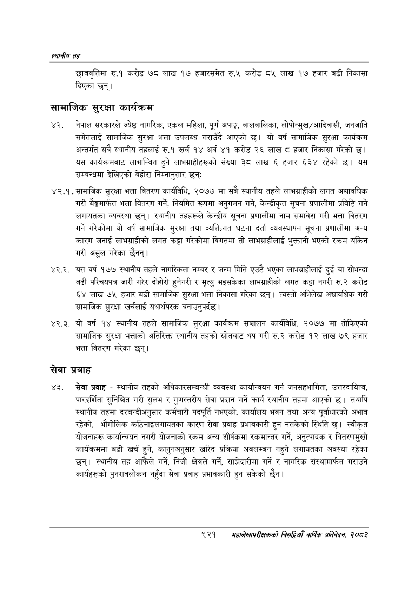

# Page 975 QA

## Rendered page


## Extracted text

```text
स्थानीय तह
छात्रवृत्तिमा रु.१ करोड ७८ लाख १७ हजारसमेत रु.५ करोड ८५ लाख १७ हजार बढी निकासा दिएका छन्‌।
सामाजिक सुरक्षा कार्यक्रम
नेपाल सरकारले ज्येष्ठ नागरिक, एकल महिला, पूर्ण अपाङ्ग, बालबालिका, लोपोन्मुख/ आदिवासी, जनजाति समेतलाई सामाजिक सुरक्षा भत्ता उपलब्ध गराउँदै आएको छ। यो वर्ष सामाजिक सुरक्षा कार्यक्रम अन्तर्गत सबै स्थानीय तहलाई रु.१ खर्ब १४ अर्ब ४१ करोड २६ लाख © हजार निकासा गरेको | यस कार्यक्रमबाट लाभान्वित हुने लाभग्राहीहरूको संख्या ३८ लाख ६ हजार ६३४ रहेको यस सम्बन्धमा देखिएको बेहोरा निम्नानुसार छन्‌ः
४२.१. सामाजिक सुरक्षा भत्ता वितरण कार्यविधि, २०७७ मा सबै स्थानीय तहले लाभग्राहीको लगत अद्यावधिक गरी बैङ्कमार्फत भत्ता वितरण गर्ने, नियमित रूपमा अनुगमन गर्ने, केन्द्रीकृत सूचना प्रणालीमा प्रविष्टि गर्ने लगायतका व्यवस्था छन्‌। स्थानीय तहहरूले केन्द्रीय सूचना प्रणालीमा नाम समावेश गरी भत्ता वितरण गर्ने गरेकोमा यो वर्ष सामाजिक सुरक्षा तथा व्यक्तिगत घटना दर्ता व्यवस्थापन सूचना प्रणालीमा अन्य कारण जनाई लाभग्राहीको लगत कट्टा गरेकोमा विगतमा ती लाभग्राहीलाई भुक्तानी भएको रकम यकिन गरी असुल गरेका छैनन्‌।
४२.२. यस वर्ष १७७ स्थानीय तहले नागरिकता नम्बर र जन्म मिति एउटै भएका लाभग्राहीलाई दुई वा सोभन्दा बढी परिचयपत्र जारी गरेर दोहोरो हुनेगरी र मृत्यु भइसकेका लाभग्राहीको लगत कट्टा नगरी रु.२ करोड ६४ लाख ७५ हजार बढी सामाजिक सुरक्षा भत्ता निकासा गरेका छन्‌। त्यस्तो अभिलेख अद्यावधिक गरी सामाजिक सुरक्षा खर्चलाई यथार्थपरक बनाउनुपर्दछ |
४२.३. यो वर्ष १४ स्थानीय तहले सामाजिक सुरक्षा कार्यक्रम सञ्चालन कार्यविधि, २०७७ मा तोकिएको सामाजिक सुरक्षा भत्ताको अतिरिक्त स्थानीय तहको स्रोतबाट थप गरी रु.२ करोड १२ लाख ७९ हजार भत्ता वितरण गरेका छन्‌।
सेवा
प्रवाह
सेवा प्रवाह -स्थानीय तहको अधिकारसम्बन्धी व्यवस्था कार्यान्वयन गर्न जनसहभागिता, उत्तरदायित्व, पारदर्शिता सुनिश्चित गरी सुलभ र गुणस्तरीय सेवा प्रदान गर्ने कार्य स्थानीय तहमा आएको छ। तथापि स्थानीय तहमा दरबन्दीअनुसार कर्मचारी पदपूर्ति नभएको, कार्यालय भवन तथा अन्य पूर्वाधारको अभाव रहेको, भौगोलिक कठिनाइलगायतका कारण सेवा प्रवाह प्रभावकारी हुन नसकेको स्थिति छ। स्वीकृत योजनाहरू कार्यान्वयन नगरी योजनाको रकम अन्य शीर्षकमा रकमान्तर गर्ने, अनुत्पादक र वितरणमुखी कार्यक्रममा बढी खर्च हुने, कानुनअनुसार खरिद प्रक्रिया अवलम्बन नहुने लगायतका अवस्था रहेका छन्‌। स्थानीय तह आफैंले गर्ने, निजी क्षेत्रले गर्ने, साझेदारीमा गर्ने र नागरिक संस्थामार्फत गराउने कार्यहरूको पुनरावलोकन नहुँदा सेवा प्रवाह प्रभावकारी हुन सकेको छैन।
९२१
महालेखापरीक्षकको वार्षिक प्रतिवेकन; २०८२
```

## Flags
- None
