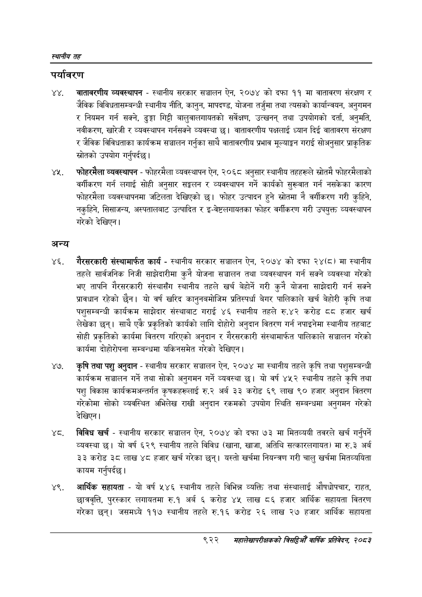

# Page 976 QA

## Rendered page


## Extracted text

```text
स्थानीय तह
पर्यावरण
वातावरणीय व्यवस्थापन -स्थानीय सरकार सञ्चालन ऐन, २०७४ को दफा ११ मा वातावरण संरक्षण र जैविक विविधतासम्बन्धी स्थानीय नीति, कानुन, मापदण्ड, योजना तर्जुमा तथा त्यसको कार्यान्वयन, अनुगमन र नियमन गर्न सक्ने, ढुङ्गा गिट्टी बालुवालगायतको सर्वेक्षण, उत्खनन्‌ तथा उपयोगको दर्ता, अनुमति, नवीकरण, खारेजी र व्यवस्थापन गर्नसक्ने व्यवस्था छ। वातावरणीय पक्षलाई ध्यान दिई वातावरण संरक्षण र जैविक विविधताका कार्यक्रम सञ्चालन गर्नुका साथै वातावरणीय प्रभाव मूल्याङ्कन गराई सोअनुसार प्राकृतिक स्रोतको उपयोग गर्नुपर्दछ |
४ फोहरमैला व्यवस्थापन -फोहरमैला व्यवस्थापन ऐन, २०६८ अनुसार स्थानीय तहहरूले स्रोतमै फोहरमैलाको वर्गीकरण गर्न लगाई सोही अनुसार सङ्कलन र व्यवस्थापन गर्ने कार्यको सुख्वात गर्न नसकेका कारण फोहरमैला व्यवस्थापनमा जटिलता देखिएको छ। फोहर उत्पादन हुने स्रोतमा नै वर्गीकरण गरी कुहिने, नकुहिने, सिसाजन्य, अस्पतालबाट उत्पादित र इ-वेष्टलगायतका फोहर वर्गीकरण गरी उपयुक्त व्यवस्थापन गरेको देखिएन |
अन्य
गैरसरकारी संस्थामार्फत कार्य -स्थानीय सरकार सञ्चालन ऐन, २०७४ को दफा २४(८) मा स्थानीय तहले सार्वजनिक निजी साझेदारीमा कुनै योजना सञ्चालन तथा व्यवस्थापन गर्न सक्ने व्यवस्था गरेको भए तापनि गैरसरकारी संस्थासँग स्थानीय तहले खर्च बेहोर्ने गरी कुनै योजना साझेदारी गर्न सक्ने प्रावधान रहेको छैन। यो वर्ष खरिद कानुनबमोजिम प्रतिस्पर्धा बेगर पालिकाले खर्च बेहोरी कृषि तथा पशुसम्बन्धी कार्यक्रम साझेदार संस्थाबाट गराई ४६ स्थानीय तहले रु.४२ करोड ८८ हजार खर्च लेखेका छन्‌। साथै एकै प्रकृतिको कार्यको लागि दोहोरो अनुदान वितरण गर्न नपाइनेमा स्थानीय तहबाट सोही प्रकृतिको कार्यमा वितरण गरिएको अनुदान र गैरसरकारी संस्थामार्फत पालिकाले सञ्चालन गरेको कार्यमा दोहोरोपना सम्बन्धमा यकिनसमेत गरेको देखिएन |
कृषि तथा पशु अनुदान -स्थानीय सरकार सञ्चालन ऐन, २०७४ मा स्थानीय तहले कृषि तथा पशुसम्बन्धी कार्यक्रम सञ्चालन गर्ने तथा सोको अनुगमन गर्ने व्यवस्था छ। यो वर्ष ४५२ स्थानीय तहले कृषि तथा पशु विकास कार्यक्रमअन्तर्गत कृषकहरूलाई रु.२ अर्ब ३३ करोड ६९ लाख ९० हजार अनुदान वितरण गरेकोमा सोको व्यवस्थित अभिलेख राखी अनुदान रकमको उपयोग स्थिति सम्बन्धमा अनुगमन गरेको देखिएन।
ट. विविध खर्च -स्थानीय सरकार सञ्चालन ऐन, २०७४ को दफा ७३ मा मितव्ययी तवरले खर्च गर्नुपर्ने व्यवस्था | यो वर्ष ६२९ स्थानीय तहले विविध (खाना, खाजा, अतिथि सत्कारलगायत) मा रु.३ अर्ब ३३ करोड ३८ लाख ४८ हजार खर्च गरेका छन्‌। यस्तो खर्चमा नियन्त्रण गरी चालु खर्चमा मितव्ययिता कायम गर्नुपर्दछ |
४९, आर्थिक सहायता -यो वर्ष ५४६ स्थानीय तहले विभिन्न व्यक्ति तथा संस्थालाई औषधोपचार, राहत, छात्रवृत्ति, पुरस्कार लगायतमा रु.१ अर्ब ६ करोड ४५ लाख ८६ हजार आर्थिक सहायता वितरण गरेका छन्‌। जसमध्ये ११७ स्थानीय तहले रु.१६ करोड लाख २७ हजार आर्थिक सहायता
९२२
महालेखापरीक्षकको वार्षिक , २०८२
```

## Flags
- None
