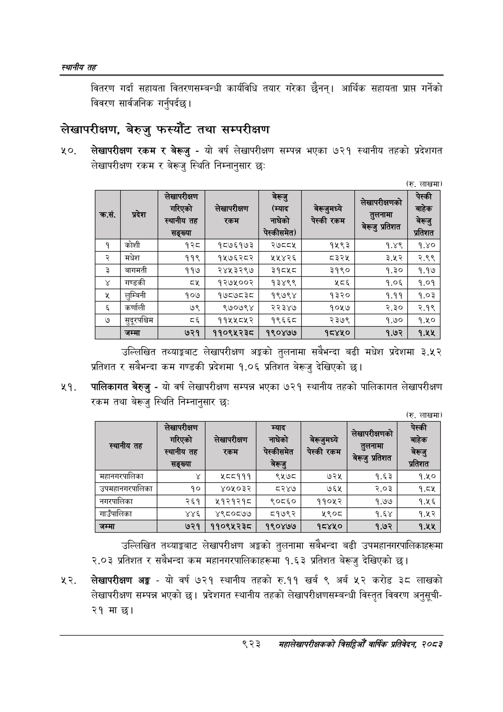

# Page 977 QA

## Rendered page


## Extracted text

```text
स्थानीय तह
वितरण गर्दा सहायता वितरणसम्बन्धी कार्यविधि तयार गरेका छैनन्‌। आर्थिक सहायता प्राप्त गर्नेको विवरण सार्वजनिक गर्नुपर्दछ।
लेखापरीक्षण, बेरुजु फस्यौट तथा सम्परीक्षण
लेखापरीक्षण रकम र बेर्जु -यो वर्ष लेखापरीक्षण सम्पन्न भएका ७२१ स्थानीय तहको प्रदेशगत लेखापरीक्षण रकम र बेरूजु स्थिति निम्नानुसार छः
(रु. लाखमा)
उल्लिखित तथ्याङ्कबाट लेखापरीक्षण अङ्गको तुलनामा सबैभन्दा बढी मधेश प्रदेशमा ३.५२ प्रतिशत र सबैभन्दा कम गण्डकी प्रदेशमा १.०६ प्रतिशत बेरूजु देखिएको |
पालिकागत बेरुजु -यो वर्ष लेखापरीक्षण सम्पन्न भएका ७२१ स्थानीय तहको पालिकागत लेखापरीक्षण रकम तथा बेरूजु स्थिति निम्नानुसार छः
(रु. लाखमा)
उल्लिखित तथ्याङ्कबाट लेखापरीक्षण अङ्गको तुलनामा सबैभन्दा बढी उपमहानगरपालिकाहरूमा २.०३ प्रतिशत र सबैभन्दा कम महानगरपालिकाहरूमा १.६३ प्रतिशत बेरूजु देखिएको छ।
लेखापरीक्षण अङ्ग -यो वर्ष ७२१ स्थानीय तहको रु.११ खर्ब ९ अर्ब ५२ करोड ३८ लाखको लेखापरीक्षण सम्पन्न भएको छ। प्रदेशगत स्थानीय तहको लेखापरीक्षणसम्बन्धी विस्तृत विवरण अनुसूची२१ माछ।
९२३
मंहालेखापरीक्षकको वार्षिक प्रतिवेकन; २०८२

(रु. लाखमा)

| क्रस.   | &#124; प्रदेश   | लेखापरीक्षण गरिएको स्थानीय तह सङ्ख्या   | लेखापरीक्षण रकम   | e (म्याद नाघेको पेस्कीसमेत)   |   बेरूजुमध्ये पेस्की रकम |   लेखापरीक्षणको तुलनामा S प्रतिशत | पेस्की बाहेक बेरूजु प्रतिशत   |
|---------|-----------------|-----------------------------------------|-------------------|-------------------------------|--------------------------|-----------------------------------|-------------------------------|
|         | कोशी            | १२८&#124;                               | १८७६१७३           | &#124; ey                     |                     १५९३ |                              १.४९ | १.४०                          |
|         | मधेश            | ११९                                     | १५७६२८२           | &#124; ५५४२६                  |                     ८३२४ |                              ३.५२ | २.९९                          |
|         | बागमती          | ११७                                     | २४५३२९७&#124;     | ३१८४५८                        |                     ३१९० |                              १.३० | १.१७                          |
|         | गण्डकी          | ८१                                      | १२७५००२           | &#124; १३४९९                  |                      २८६ |                              १.०६ | १.०१                          |
|         | लुम्बिनी        | १०७                                     | १७८७८३८           | &#124; १९७९४                  |                     १३२० |                              १.११ | १.०३                          |
|         | कर्णाली         | ७९                                      | ९७०७९४            | २२३४७                         |                     १०५७ |                              २.३० | २.१९                          |
|         | सुदूरपश्चिम     | &                                       | ११५४१८४५२         | १९६६८                         |                     २३७९ |                              १.७० | q.40                          |
|         | जम्मा           | ७२१                                     | ११०९:५२३८         | १९०४७७                        |                    १८४५० |                              १.७२ | 1.4%                          |

(रु. लाखमा)

| स्थानीय तह   | लेखापरीक्षण गरिएको स्थानीय तह सङ्ख्या   | लेखापरीक्षण &#124; रकम &#124;   |   म्याद नाघेको पेस्कीसमेत बेर्जु |   बेरूजुमध्ये पेस्की रकम |   सेखापरीक्षणको तुलनामा ey रूजु प्रतिशत |   पेस्की बाहेक बेरूजु प्रतिशत |
|--------------|-----------------------------------------|---------------------------------|----------------------------------|--------------------------|-----------------------------------------|-------------------------------|
| महानगरपालिका | ¥                                       | 255999                          |                             ९५७८ |                      ७२५ |                                    १.६३ |                          १.५० |
|              | हा                                      | पा                              |                     
```

## Flags
- table_page
