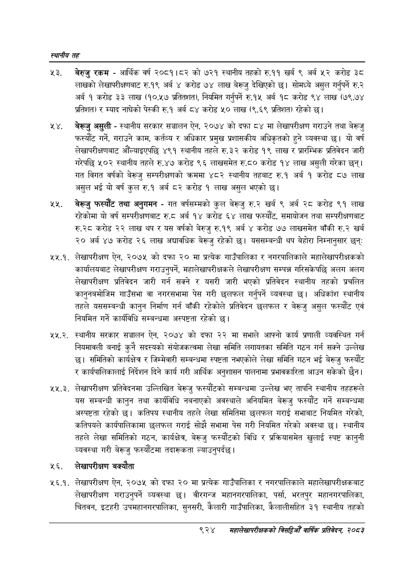

# Page 978 QA

## Rendered page


## Extracted text

```text
स्थानीय तह
नरे. बेरुजु रकम -आर्थिक वर्ष २०८१।८२ को ७२१ स्थानीय तहको रु.११ खर्ब ९ अर्ब ५२ करोड ३८ लाखको लेखापरीक्षणबाट रु.१९ अर्ब करोड ७४ लाख बेरूजु देखिएको छ। सोमध्ये असुल गर्नुपर्ने रु.२ अर्ब १ करोड ३३ लाख (१०.५७ प्रतितशत), नियमित गर्नुपर्ने रु.१४५ अर्ब १८ करोड ९४ लाख (७९,७४ प्रतिशत) र म्याद नाघेको पेस्की रु.१ अर्ब ८४ करोड ५० लाख (९.६९ प्रतिशत) रहेको छ।
. बेरूजु असुली -स्थानीय सरकार सञ्चालन ऐन, २०७४ को दफा ८४ मा लेखापरीक्षण गराउने तथा बेरूजु फस्यौट गर्ने, गराउने काम, कर्तव्य र अधिकार प्रमुख प्रशासकीय अधिकृतको हुने व्यवस्था छ। यो वर्ष लेखापरीक्षणबाट औँल्याइएपछि ४९१ स्थानीय तहले रु.३२ करोड १९ लाख र प्रारम्भिक प्रतिवेदन जारी गरेपछि ५०२ स्थानीय तहले रु.४७ करोड ९६ लाखसमेत रु.८० करोड १४ लाख असुली गरेका छन्‌। गत विगत वर्षको बेरूजु सम्परीक्षणको क्रममा ४८२ स्थानीय तहबाट रु.१ अर्ब १ करोड ८७ लाख असुल भई यो वर्ष कुल रु.१ अर्ब ८२ करोड १ लाख असुल भएको |
४४ बेख्जु फस्यौट तथा अनुगमन -गत वर्षसम्मको कुल बेरूजु रु.२ खर्ब ९ अर्ब २८ करोड ९१ लाख रहेकोमा यो वर्ष सम्परीक्षणबाट रु.८ अर्ब १४ करोड ६४ लाख फस्यौट, समायोजन तथा सम्परीक्षणबाट रु.२८ करोड २२ लाख थप र यस वर्षको बेरुजु रु.१९ अर्ब ४ करोड ७७ लाखसमेत बाँकी रु.२ खर्ब २० अर्ब ४७ करोड २६ लाख अद्यावधिक बेरूजु रहेको छ। यससम्बन्धी थप बेहोरा निम्नानुसार छन्‌
२२.१. लेखापरीक्षण ऐन, २०७५ को दफा २० मा प्रत्येक गाउँपालिका र नगरपालिकाले महालेखापरीक्षकको कार्यालयबाट लेखापरीक्षण गराउनुपर्ने, महालेखापरीक्षकले लेखापरीक्षण सम्पन्न गरिसकेपछि अलग अलग लेखापरीक्षण प्रतिवेदन जारी गर्न सक्ने र यसरी जारी भएको प्रतिवेदन स्थानीय तहको प्रचलित कानुनबमोजिम गाउँसभा वा नगरसभामा पेस गरी छलफल गर्नुपर्ने व्यवस्था छ। अधिकांश स्थानीय तहले यससम्बन्धी कानुन निर्माण गर्न बाँकी रहेकोले प्रतिवेदन छलफल र बेरूजु असुल फस्यौंट एवं नियमित गर्ने कार्यविधि सम्बन्धमा अस्पष्टता रहेको छ।
४४४४ स्थानीय सरकार सञ्चालन ऐन, २०७४ को दफा २२ मा सभाले आफ्नो कार्य प्रणाली व्यवस्थित गर्न नियमावली बनाई कुनै सदस्यको संयोजकत्वमा लेखा समिति लगायतका समिति गठन गर्न सक्ने उल्लेख छ। समितिको कार्यक्षेत्र र जिम्मेवारी सम्बन्धमा स्पष्टता नभएकोले लेखा समिति गठन भई बेरूजु फस्यौट र कार्यपालिकालाई निर्देशन दिने कार्य गरी आर्थिक अनुशासन पालनामा प्रभावकारिता आउन सकेको छैन।
४४१ लेखापरीक्षण प्रतिवेदनमा उल्लिखित बेरूजु फस्यौटको सम्बन्धमा उल्लेख भए तापनि स्थानीय तहहरूले यस सम्बन्धी कानुन तथा कार्यविधि नबनाएको अवस्थाले अनियमित बेरूजु फस्यौंट गर्ने सम्बन्धमा अस्पष्टता रहेको छ। कतिपय स्थानीय तहले लेखा समितिमा छलफल गराई सभाबाट नियमित गरेको, कतिपयले कार्यपालिकामा छलफल गराई सोझै सभामा पेस गरी नियमित गरेको अवस्था छ। स्थानीय तहले लेखा समितिको गठन, कार्यक्षेत्र, बेरूजु फस्यौटको विधि र प्रक्रियासमेत खुलाई स्पष्ट कानुनी व्यवस्था गरी बेरूजु फस्यौटमा तदारूकता ल्याउनुपर्दछ।
२६. लेखापरीक्षण बक्यौता
२६.. लेखापरीक्षण ऐन, २०७५ को दफा २० मा प्रत्येक गाउँपालिका र नगरपालिकाले महालेखापरीक्षकबाट लेखापरीक्षण गराउनुपर्ने व्यवस्था छ। वीरगन्ज महानगरपालिका, पर्सा, भरतपुर महानगरपालिका, चितवन, इटहरी उपमहानगरपालिका, सुनसरी, कैलारी गाउँपालिका, कैलालीसहित ३१ स्थानीय तहको
९२४
महालेखापरीक्षकको वार्षिक प्रतिवेकन; २०८२
```

## Flags
- None
