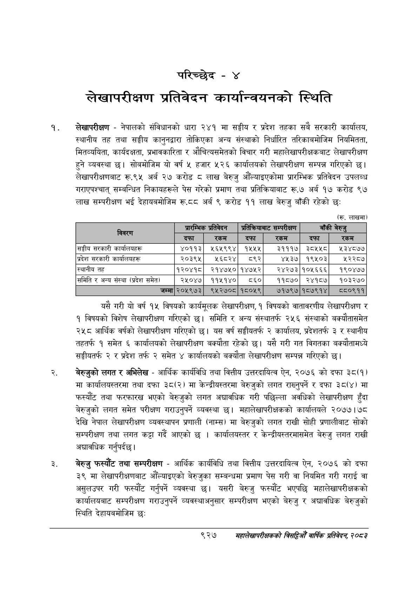

# Page 983 QA

## Rendered page


## Extracted text

```text
परिच्छेद -४
लेखापरीक्षण प्रतिवेदन कार्यान्वयनको स्थिति
लेखापरीक्षण -नेपालको संविधानको धारा २४१ मा सङ्घीय र प्रदेश तहका सबै सरकारी कार्यालय, स्थानीय तह तथा सङ्घीय कानुनद्वारा तोकिएका अन्य संस्थाको निर्धारित तरिकाबमोजिम नियमितता, मितव्ययिता, कार्यदक्षता, प्रभावकारिता र औचित्यसमेतको विचार गरी महालेखापरीक्षकबाट लेखापरीक्षण हुने व्यवस्था छु। सोबमोजिम यो वर्ष ५ हजार ५२६ कार्यालयको लेखापरीक्षण सम्पन्न गरिएको छ। लेखापरीक्षणबाट रू.९५ अर्ब २७ करोड ८ लाख बेरुजु औंल्याइएकोमा प्रारम्भिक प्रतिवेदन उपलब्ध गराएपश्चात्‌ सम्बन्धित निकायहरूले पेस गरेको प्रमाण तथा प्रतिक्रियाबाट रू.७ अर्ब १७ करोड ९७ लाख सम्परीक्षण भई देहायबमोजिम रू.८८ अर्ब ९ करोड ११ लाख बेरुजु बाँकी रहेको छः
(रू. लाखमा)
यसै गरी यो वर्ष १५ विषयको कार्यमूलक लेखापरीक्षण, १ विषयको वातावरणीय लेखापरीक्षण र १ विषयको विशेष लेखापरीक्षण गरिएको छ। समिति र अन्य संस्थातर्फ २५६ संस्थाको बक्यौतासमेत २५८ आर्थिक वर्षको लेखापरीक्षण गरिएको छ। यस वर्ष सङ्घीयतर्फ २ कार्यालय, प्रदेशतर्फ ३ र स्थानीय तहतर्फ १ समेत ६ कार्यालयको लेखापरीक्षण बक्यौता रहेको | यसै गरी गत विगतका बक्यौतामध्ये सङ्घीयतर्फ २ र प्रदेश तर्फ २ समेत ४ कार्यालयको बक्यौता लेखापरीक्षण सम्पन्न गरिएको छ।
बेरुजुको लगत र अभिलेख -आर्थिक कार्यविधि तथा वित्तीय उत्तरदायित्व ऐन, २०७६ को दफा ३८(१) मा कार्यालयस्तरमा तथा दफा ३८(२) मा केन्द्रीयस्तरमा बेरुजुको लगत राख्नुपर्ने र दफा ३८(४) मा फस्यौट तथा फरफारख भएको बेरुजुको लगत अद्यावधिक गरी पछिल्ला अवधिको लेखापरीक्षण हुँदा बेरुजुको लगत समेत परीक्षण गराउनुपर्ने व्यवस्था | महालेखापरीक्षकको कार्यालयले २०७७। ७८ देखि नेपाल लेखापरीक्षण व्यवस्थापन प्रणाली (नाम्स) मा बेरुजुको लगत राखी सोही प्रणालीबाट सोको सम्परीक्षण तथा लगत कट्टा गर्दै आएको छ। कार्यालयस्तर र केन्द्रीयस्तरमासमेत बेरुजु लगत राखी अद्यावधिक गर्नुपर्दछ।
बेरुजु फस्यौट तथा सम्परीक्षण -आर्थिक कार्यविधि तथा वित्तीय उत्तरदायित्व ऐन, २०७६ को दफा ३९ मा लेखापरीक्षणबाट औँल्याइएको बेरुजुका सम्बन्धमा प्रमाण पेस गरी वा नियमित गरी गराई वा असुलउपर गरी फस्यौट गर्नुपर्ने व्यवस्था छ। यसरी बेरुजु फस्यौट भएपछि महालेखापरीक्षकको कार्यालयबाट सम्परीक्षण गराउनुपर्ने व्यवस्थाअनुसार सम्परीक्षण भएको बेरुजु र अद्यावधिक बेरुजुको स्थिति देहायबमोजिम छः
९२७
महालेखापरीक्षकको वार्षिक प्रतिवेदन; २०८३

(रू. लाखमा)

| विवरण                             | प्रारम्भिक प्रतिवेदन &#124;   | प्रारम्भिक प्रतिवेदन &#124;   | प्रतिक्रियाबाट   | प्रतिक्रियाबाट   | सम्परीक्षण] बाँकी बेरुजु   | सम्परीक्षण] बाँकी बेरुजु   |
|-----------------------------------|-------------------------------|-------------------------------|------------------|------------------|----------------------------|----------------------------|
|                                   | दफा &#124;                    | रकम &#124;                    | दफा              | रकम              | दफा                        | रकम                        |
| सङ्घीय सरकारी कार्यालयहरू         | ४०११३&#124;                   | ५६४५९९४]                      | १५५५]            | ३१११]            | ३८११८]                     | ५३४८७७                     |
| प्रदेश सरकारी कार्यालयहरू         | &#124; २०३९५]                 | ५६८२४]                        | ८९२]             | ४५३४]            | १९१०३]                     | २२८७                       |
| स्थानीय तह                        | &#124;[१२०४१८]                | २१४७५०][१४७५२]                |                  |                  | २४२७३&#124;१०१६६६]         | _१९०४७७                    |
| समिति र अन्य संस्था (प्रदेश समेत) | २५०४७&#124;                   | ११५१४०&#124;                  | ८5६०             | ११८७०]           | २४१८७&#124;]               | १०३२७०                     |
| । =                               |                               |                               |                  |                  | ७१७९७&#124;१८७९१४&#124;]   | ८८०९११                     |
```

## Flags
- table_page
