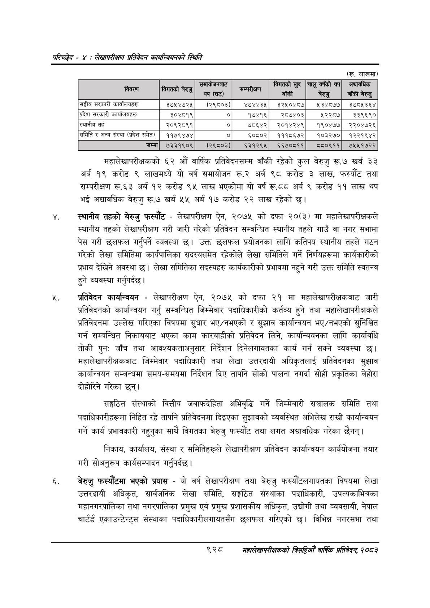

# Page 984 QA

## Rendered page


## Extracted text

```text
परिच्छेद -: लेखापरीक्षण प्रतिवेदन कार्यन्वयनको स्थिति
महालेखापरीक्षकको ६२ औं वार्षिक प्रतिवेदनसम्म बाँकी रहेको कुल बेरुजु रू.७ खर्ब ३३ अर्ब १९ करोड ९ लाखमध्ये यो वर्ष समायोजन रू.२ अर्ब ९८ करोड ३ लाख, फस्यौट तथा सम्परीक्षण रू.६३ अर्ब १२ करोड ९५ लाख भएकोमा यो वर्ष रू.टठ८ अर्ब ९ करोड ११ लाख थप भई अद्यावधिक बेरुजु रू.७ खर्ब ५५ अर्ब १७ करोड २२ लाख रहेको छ।
स्थानीय तहको बेरुजु फस्यौट -लेखापरीक्षण ऐन, २०७५ को दफा २०(३) मा महालेखापरीक्षकले स्थानीय तहको लेखापरीक्षण गरी जारी गरेको प्रतिवेदन सम्बन्धित स्थानीय तहले गाउँ वा नगर सभामा पेस गरी छलफल गर्नुपर्ने व्यवस्था छ। उक्त छलफल प्रयोजनका लागि कतिपय स्थानीय तहले गठन गरेको लेखा समितिमा कार्यपालिका सदस्यसमेत रहेकोले लेखा समितिले गर्ने निर्णयहरूमा कार्यकारीको प्रभाव देखिने अवस्था छ। लेखा समितिका सदस्यहरु कार्यकारीको प्रभावमा नहुने गरी उक्त समिति स्वतन्त्र हुने व्यवस्था गर्नुपर्दछ।
प्रतिवेदन कार्यान्वयन -लेखापरीक्षण ऐन, २०७५ को दफा २१ मा महालेखापरीक्षकबाट जारी प्रतिवेदनको कार्यान्वयन गर्नु सम्बन्धित जिम्मेवार पदाधिकारीको कर्तव्य हुने तथा महालेखापरीक्षकले प्रतिवेदनमा उल्लेख गरिएका विषयमा सुधार भए/नभएको र सुझाव कार्यान्वयन भए/नभएको सुनिश्चित गर्न सम्बन्धित निकायबाट भएका काम कारबाहीको प्रतिवेदन लिने, कार्यान्वयनका लागि कार्यावधि तोकी पुनः जाँच तथा आवश्यकताअनुसार निर्देशन दिनेलगायतका कार्य गर्न सक्ने व्यवस्था छ। महालेखापरीक्षकबाट जिम्मेवार पदाधिकारी तथा लेखा उत्तरदायी अधिकृतलाई प्रतिवेदनका सुझाव कार्यान्वयन सम्बन्धमा समय-समयमा निर्देशन दिए तापनि सोको पालना नगर्दा सोही प्रकृतिका बेहोरा दोहोरिने गरेका छन्‌।
सङ्गठित संस्थाको वित्तीय जवाफदेहिता अभिवृद्धि गर्ने जिम्मेवारी सञ्चालक समिति तथा पदाधिकारीहरूमा निहित रहे तापनि प्रतिवेदनमा दिइएका सुझावको व्यवस्थित अभिलेख राखी कार्यान्वयन गर्ने कार्य प्रभावकारी नहुनुका साथै विगतका बेरुजु फस्यौट तथा लगत अद्यावधिक गरेका छैनन्‌।
निकाय, कार्यालय, संस्था र समितिहरूले लेखापरीक्षण प्रतिवेदन कार्यान्वयन कार्ययोजना तयार गरी सोअनुरूप कार्यसम्पादन गर्नुपर्दछ |
बेरुजु फस्यौटमा भएको प्रयास -यो वर्ष लेखापरीक्षण तथा बेरुजु फस्यौटलगायतका विषयमा लेखा उत्तरदायी अधिकृत, सार्वजनिक लेखा समिति, सङ्गठित संस्थाका पदाधिकारी, उपत्यकाभित्रका महानगरपालिका तथा नगरपालिका प्रमुख एवं प्रमुख प्रशासकीय अधिकृत, उद्योगी तथा व्यवसायी, नेपाल चार्टर्ड एकाउन्टेन्ट्स संस्थाका पदाधिकारीलगायतसँग छलफल गरिएको छ। विभिन्न नगरसभा तथा
९२८
महालेखापरीक्षकको वार्षिक प्रतिवेदन; २०८३

| विवरण                             |                      | 'समायोजनबाट थप (घट)   | सम्परीक्षण   |          |         |          |
|-----------------------------------|----------------------|-----------------------|--------------|----------|---------|----------|
| सङ्घीय सरकारी कार्यालयहरू         | ३७२५४७२५             | (२९८०३)               | ४७४४३२       | ३२४५०४८७ | ५३४८०७७ |  २७८५३६४ |
| प्रदेश सरकारी कार्यालयहरू &#124;  | _३०४८१९] &#124;      | ०]                    | १७४१६]       |   २८७४०३ | ५२२८७   |   ३३९६९० |
| स्थानीय तह &#124;                 | २०९२८९१&#124; &#124; | ०                     | ७८६४२]&#124; |  २०१४२४९ | १९०४७७  |  २२०४७२६ |
| समिति र अन्य संस्था (प्रदेश समेत) | ११७९४७४ &#124;       | ०                     | ६०८०२]&#124; |  १११८६७२ | १०३२७०  |  १२२१९४२ |
| &#124; जम्मा]                     | ७३३१९०९              | (२९८०३)               | ६३१२९५]      |  ६६७०८११ | ८८०९११] | ७२५५१७२२ |
```

## Flags
- table_page
