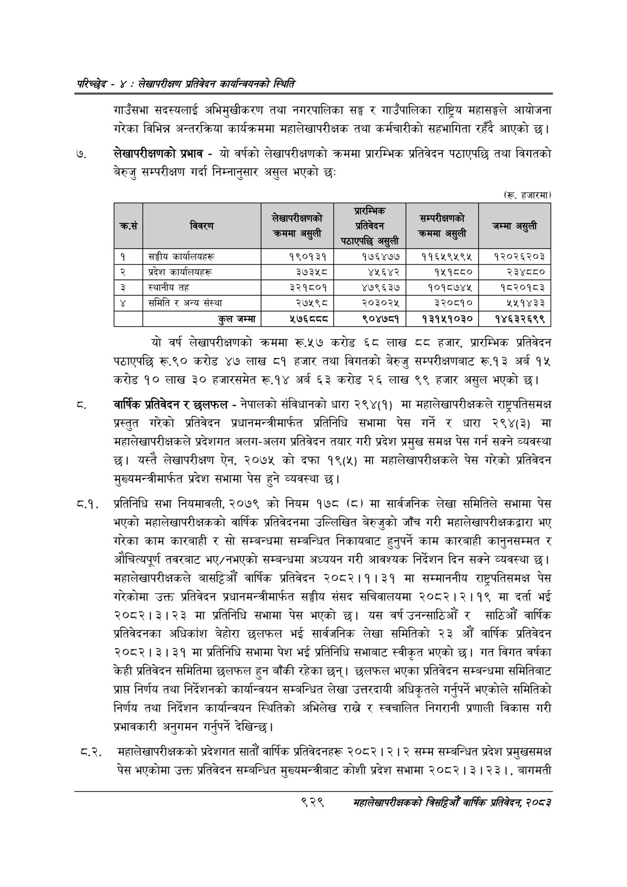

# Page 985 QA

## Rendered page


## Extracted text

```text
परिच्छेद -: लेखापरीक्षण प्रतिवेदन कार्यन्वयनको स्थिति
गाउँसभा सदस्यलाई अभिमुखीकरण तथा नगरपालिका सङ्ग र गाउँपालिका राष्ट्रिय महासङ्घले आयोजना गरेका विभिन्न अन्तरक्रिया कार्यक्रममा महालेखापरीक्षक तथा कर्मचारीको सहभागिता रहँदै आएको |
लेखापरीक्षणको प्रभाव -यो वर्षको लेखापरीक्षणको क्रममा प्रारम्भिक प्रतिवेदन पठाएपछि तथा विगतको बेरुजु सम्परीक्षण गर्दा निम्नानुसार असुल भएको छः
(रू. हजारमा)
यो वर्ष लेखापरीक्षणको क्रममा रू.५७ करोड ६८ लाख ६ हजार, प्रारम्भिक प्रतिवेदन पठाएपछि रू.९० करोड ४७ लाख ८१ हजार तथा विगतको बेरुजु सम्परीक्षणबाट रू.१३ अर्ब १५ करोड १० लाख ३० हजारसमेत रू.१४ अर्ब ६३ करोड २६ लाख ९९ हजार असुल भएको छ।
वार्षिक प्रतिवेदन र छलफल -नेपालको संविधानको धारा २९४(१) मा महालेखापरीक्षकले राष्ट्रपतिसमक्ष प्रस्तुत गरेको प्रतिवेदन प्रधानमन्त्रीमार्फत प्रतिनिधि सभामा पेस गर्ने र धारा २९४(३) मा महालेखापरीक्षकले प्रदेशगत अलग-अलग प्रतिवेदन तयार गरी प्रदेश प्रमुख समक्ष पेस गर्न सक्ने व्यवस्था यस्तै लेखापरीक्षण ऐन, २०७५ को दफा १९(५) मा महालेखापरीक्षकले पेस गरेको प्रतिवेदन मुख्यमन्त्रीमार्फत प्रदेश सभामा पेस हुने व्यवस्था छ।
प्रतिनिधि सभा नियमावली, २०७९ को नियम १७८ (८) मा सार्वजनिक लेखा समितिले सभामा पेस भएको महालेखापरीक्षकको वार्षिक प्रतिवेदनमा उल्लिखित बेरुजुको जाँच गरी महालेखापरीक्षकद्वारा भए गरेका काम कारबाही र सो सम्बन्धमा सम्बन्धित निकायबाट हुनुपर्ने काम कारबाही कानुनसम्मत र औचित्यपूर्ण तवरबाट भए/नभएको सम्बन्धमा अध्ययन गरी आवश्यक निर्देशन दिन सक्ने व्यवस्था छ। महालेखापरीक्षकले बासट्टिऔं वार्षिक प्रतिवेदन २०८२।१।३१ मा सम्माननीय राष्ट्रपतिसमक्ष पेस गरेकोमा उक्त प्रतिवेदन प्रधानमन्त्रीमार्फत सङ्घीय संसद सचिवालयमा २०८२।२।१९ मा दर्ता भई २०८२।३।२३ मा प्रतिनिधि सभामा पेस भएको छ। यस वर्ष उनन्साठिऔं र साठिऔंँ वार्षिक प्रतिवेदनका अधिकांश बेहोरा छलफल भई सार्वजनिक लेखा समितिको २३ औं वार्षिक प्रतिवेदन २०८२।३। ३१ मा प्रतिनिधि सभामा पेश भई प्रतिनिधि सभाबाट स्वीकृत भएको छ। गत विगत वर्षका केही प्रतिवेदन समितिमा छलफल हुन बाँकी रहेका छन्‌। छलफल भएका प्रतिवेदन सम्बन्धमा समितिबाट प्राप्त निर्णय तथा निर्देशनको कार्यान्वयन सम्बन्धित लेखा उत्तरदायी अधिकृतले गर्नुपर्ने भएकोले समितिको निर्णय तथा निर्देशन कार्यान्वयन स्थितिको अभिलेख राख्ने र स्वचालित निगरानी प्रणाली विकास गरी प्रभावकारी अनुगमन गर्नुपर्ने देखिन्छ |
व्.२. महालेखापरीक्षकको प्रदेशगत सातौं वार्षिक प्रतिवेदनहरू २०८२ | | २ सम्म सम्बन्धित प्रदेश प्रमुखसमक्ष पेस भएकोमा उक्त प्रतिवेदन सम्बन्धित मुख्यमन्त्रीबाट कोशी प्रदेश सभामा २०८२। ३। २३ |, बागमती
९२९
महालेखापरीक्षकको वार्षिक प्रतिवेदन; २०८३

(रू. हजारमा)

| छ क्रस   | विवरण               | लेखापरीक्षणको क्रममा असुली   |   प्रारम्भिक ™ प्रतिवेदन पठाएपछि असुली |   सम्परीक्षणको क्रममा असुली |   जम्मा असुली |
|----------|---------------------|------------------------------|----------------------------------------|-----------------------------|---------------|
| १ ।      | सङ्गीय कार्यालयहरू  | १९०१३१                       |                                 १७६४७७ |                    ११६५९५९५ |      १२०२६२०३ |
| २        | प्रदेश कार्यालयहरू  | ३७३५८                        |                                  ४५६४२ |                      १५१८८० |        २३४८८० |
| ३        | ।स्थानीय तह         | ३२१८०१                       |                                 ४७९६३७ |                    १०१८७४४५ |       १८२०१८३ |
| ¥        | समिति र अन्य संस्था | २७५९८                        |                                 २०३०२५ |                      ३२०८१० |        २५१४३३ |
|          | कुल जम्मा           | LT~~~                        |                                 ९०४७८१ |                    १३१५१०३० |      १४६३२६९९ |
```

## Flags
- table_page
