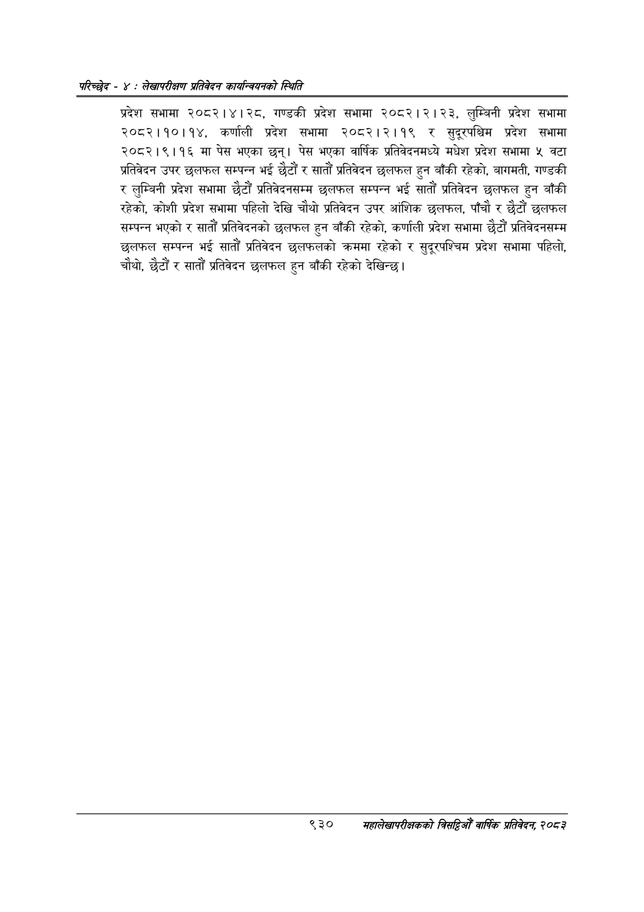

# Page 986 QA

## Rendered page


## Extracted text

```text
परिच्छेद -: लेखापरीक्षण प्रतिवेदन कार्यन्वयनको स्थिति
प्रदेश सभामा २०८२।४। २८, गण्डकी प्रदेश सभामा २०८२।२।२३, लुम्बिनी प्रदेश सभामा २०८२।१०।१४, कर्णाली प्रदेश सभामा २०८२।२।१९ र सुदूरपश्चिम प्रदेश सभामा २०८२।९।१६ मा पेस भएका छन्‌। पेस भएका वार्षिक प्रतिवेदनमध्ये मधेश प्रदेश सभामा ५ वटा प्रतिवेदन उपर छलफल सम्पन्न भई छैटौं र सातौं प्रतिवेदन छलफल हुन बाँकी रहेको, बागमती, गण्डकी लुम्बिनी प्रदेश सभामा छैटौं प्रतिवेदनसम्म छलफल सम्पन्न भई सातौं प्रतिवेदन छलफल हुन बाँकी रहेको, कोशी प्रदेश सभामा पहिलो देखि चौथो प्रतिवेदन उपर आंशिक छलफल, पाँचौ र छैटौं छलफल सम्पन्न भएको र सातौं प्रतिवेदनको छलफल हुन बाँकी रहेको, कर्णाली प्रदेश सभामा छैटौं प्रतिवेदनसम्म छलफल सम्पन्न भई सातौं प्रतिवेदन छलफलको क्रममा रहेको र सुदूरपश्चिम प्रदेश सभामा पहिलो, चौथो, छैटौं र सातौं प्रतिवेदन छलफल हुन बाँकी रहेको देखिन्छ।
९३०
महालेखापरीक्षकको वार्षिक प्रतिवेदन; २०८३
```

## Flags
- None
