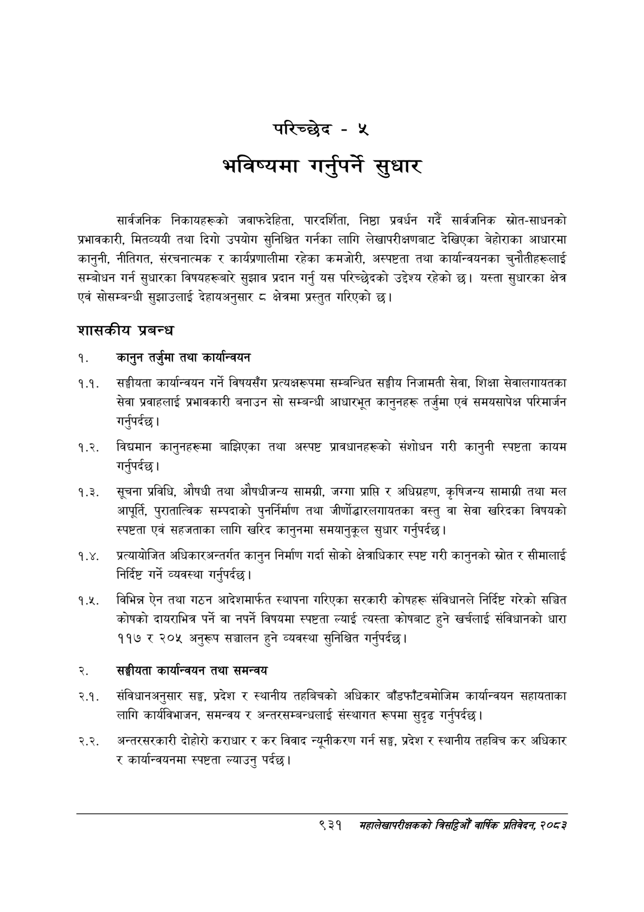

# Page 989 QA

## Rendered page


## Extracted text

```text
परिच्छेद -५
भविष्यमा गर्नुपर्ने सुधार
सार्वजनिक निकायहरूको जवाफदेहिता, पारदर्शिता, निष्ठा प्रवर्धन गर्दै सार्वजनिक स्रोत-साधनको प्रभावकारी, मितव्ययी तथा दिगो उपयोग सुनिश्चित गर्नका लागि लेखापरीक्षणबाट देखिएका बेहोराका आधारमा कानुनी, नीतिगत, संरचनात्मक र कार्यप्रणालीमा रहेका कमजोरी, अस्पष्टता तथा कार्यान्वयनका चुनौतीहरूलाई सम्बोधन गर्न सुधारका विषयहरूबारे सुझाव प्रदान गर्नु यस परिच्छेदको उद्देश्य रहेको छ। यस्ता सुधारका क्षेत्र एवं सोसम्बन्धी सुझाउलाई देहायअनुसार ८ क्षेत्रमा प्रस्तुत गरिएको छ।
शासकीय प्रबन्ध
१. कानुन तर्जुमा तथा कार्यान्वयन
१.१. सङ्घीयता कार्यान्वयन गर्ने विषयसँग प्रत्यक्षरूपमा सम्बन्धित सङ्घीय निजामती सेवा, शिक्षा सेवालगायतका सेवा प्रवाहलाई प्रभावकारी बनाउन सो सम्बन्धी आधारभूत कानुनहरू तर्जुमा एवं समयसापेक्ष परिमार्जन गर्नुपर्दछ |
१.२. विद्यमान कानुनहरूमा बाझिएका तथा अस्पष्ट प्रावधानहरूको संशोधन गरी कानुनी स्पष्टता कायम गर्नुपर्दछ |
१.३. सूचना प्रविधि, औषधी तथा औषधीजन्य सामग्री, जग्गा प्राप्ति र अधिग्रहण, कृषिजन्य सामाग्री तथा मल आपूर्ति, पुरातात्विक सम्पदाको पुनर्निर्माण तथा जीर्णोद्वारलगायतका वस्तु वा सेवा खरिदका विषयको स्पष्टता एवं सहजताका लागि खरिद कानुनमा समयानुकूल सुधार गर्नुपर्दछ |
१.४. प्रत्यायोजित अधिकारअन्तर्गत कानुन निर्माण गर्दा सोको क्षेत्राधिकार स्पष्ट गरी कानुनको स्रोत र सीमालाई निर्दिष्ट गर्ने व्यवस्था गर्नुपर्दछ।
१.५. विभिन्न ऐन तथा गठन आदेशमार्फत स्थापना गरिएका सरकारी कोषहरू संविधानले निर्दिष्ट गरेको सञ्चित कोषको दायराभित्र पर्ने वा नपर्ने विषयमा स्पष्टता ल्याई त्यस्ता कोषबाट हुने खर्चलाई संविधानको धारा ११७ र २०५ अनुरूप सञ्चालन हुने व्यवस्था सुनिश्चित गर्नुपर्दछ |
सङ्घीयता कार्यान्वयन तथा समन्वय
२.१. संविधानअनुसार सङ्ग, प्रदेश र स्थानीय तहविचको अधिकार बाँडफाँटबमोजिम कार्यान्वयन सहायताका लागि कार्यविभाजन, समन्वय र अन्तरसम्बन्धलाई संस्थागत रूपमा सुदृढ गर्नुपर्दछ |
२.२. अन्तरसरकारी दोहोरो कराधार र कर विवाद न्युनीकरण गर्न सङ्घ, प्रदेश र स्थानीय तहबिच कर अधिकार र कार्यान्वयनमा स्पष्टता ल्याउनु पर्दछ।
९३१
मंहालेखापरीक्षकको बितदिमो वार्षिक प्रतिवेदन; २०८२
```

## Flags
- None
