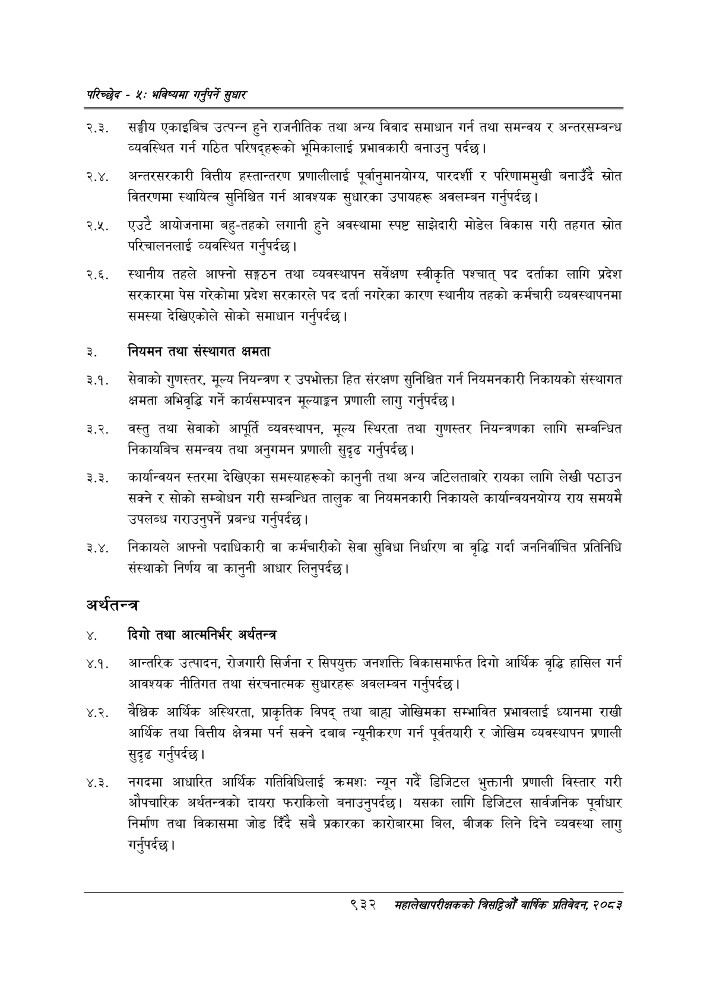

# Page 990 QA

## Rendered page


## Extracted text

```text
परिच्छेष -४: भविष्यमा गर्नुपर्ने सुधार
२.३. सङ्घीय एकाइबिच उत्पन्न हुने राजनीतिक तथा अन्य विवाद समाधान गर्न तथा समन्वय र अन्तरसम्बन्ध व्यवस्थित गर्न गठित परिषद्हरूको भूमिकालाई प्रभावकारी बनाउनु पर्दछ।
२.४. अन्तरसरकारी वित्तीय हस्तान्तरण प्रणालीलाई पूर्वानुमानयोग्य, पारदर्शी र परिणाममुखी बनाउँदै स्रोत वितरणमा स्थायित्व सुनिश्चित गर्न आवश्यक सुधारका उपायहरू अवलम्बन गर्नुपर्दछ |
२.५. एउटै आयोजनामा बहु-तहको लगानी हुने अवस्थामा स्पष्ट साझेदारी मोडेल विकास गरी तहगत स्रोत परिचालनलाई व्यवस्थित गर्नुपर्दछ |
२.६. स्थानीय तहले आफ्नो सङ्गठन तथा व्यवस्थापन सर्वेक्षण स्वीकृति पश्चात्‌ पद दर्ताका लागि प्रदेश सरकारमा पेस गरेकोमा प्रदेश सरकारले पद दर्ता नगरेका कारण स्थानीय तहको कर्मचारी व्यवस्थापनमा समस्या देखिएकोले सोको समाधान गर्नुपर्दछ |
३. नियमन तथा संस्थागत क्षमता
३.१. सेवाको गुणस्तर, मूल्य नियन्त्रण र उपभोक्ता हित संरक्षण सुनिश्चित गर्न नियमनकारी निकायको संस्थागत क्षमता अभिवृद्धि गर्ने कार्यसम्पादन मूल्याङ्कन प्रणाली लागु गर्नुपर्दछ |
३.२. वस्तु तथा सेवाको आपूर्ति व्यवस्थापन, मूल्य स्थिरता तथा गुणस्तर नियन्त्रणका लागि सम्बन्धित निकायबिच समन्वय तथा अनुगमन प्रणाली सुदृढ गर्नुपर्दछ |
३.३. कार्यान्वयन स्तरमा देखिएका समस्याहरूको कानुनी तथा अन्य जटिलताबारे रायका लागि लेखी पठाउन सक्ने र सोको सम्बोधन गरी सम्बन्धित तालुक वा नियमनकारी निकायले कार्यान्वयनयोग्य राय समयमै उपलब्ध गराउनुपर्ने प्रबन्ध गर्नुपर्दछ।
३.४. निकायले आफ्नो पदाधिकारी वा कर्मचारीको सेवा सुविधा निर्धारण वा वृद्धि गर्दा जननिर्वाचित प्रतिनिधि संस्थाको निर्णय वा कानुनी आधार लिनुपर्दछ |
अर्थतन्त्र
४. दिगो तथा आत्मनिर्भर अर्थतन्त्र
४.१. आन्तरिक उत्पादन, रोजगारी सिर्जना र सिपयुक्त जनशक्ति विकासमार्फत दिगो आर्थिक वृद्धि हासिल गर्न आवश्यक नीतिगत तथा संरचनात्मक सुधारहरू अवलम्बन गर्नुपर्दछ |
४.२. वैध्िक आर्थिक अस्थिरता, प्राकृतिक विपद्‌ तथा बाहा जोखिमका सम्भावित प्रभावलाई ध्यानमा राखी आर्थिक तथा वित्तीय क्षेत्रमा पर्न सक्ने दबाब न्यूनीकरण गर्न पूर्वतयारी र जोखिम व्यवस्थापन प्रणाली सुदृढ गर्नुपर्दछ |
४.३. नगदमा आधारित आर्थिक गतिविधिलाई क्रमशः न्यून गर्दै डिजिटल भुक्तानी प्रणाली विस्तार गरी औपचारिक अर्थतन्त्रको दायरा फराकिलो बनाउनुपर्दछ। यसका लागि डिजिटल सार्वजनिक पूर्वाधार निर्माण तथा विकासमा जोड दिँदै सबै प्रकारका कारोबारमा बिल, बीजक लिने दिने व्यवस्था लागु गर्नुपर्दछ |
९३२ मंहालेखापरीक्षकको बित्यो वार्षिक प्रतिवेदन; २०८२
```

## Flags
- None
