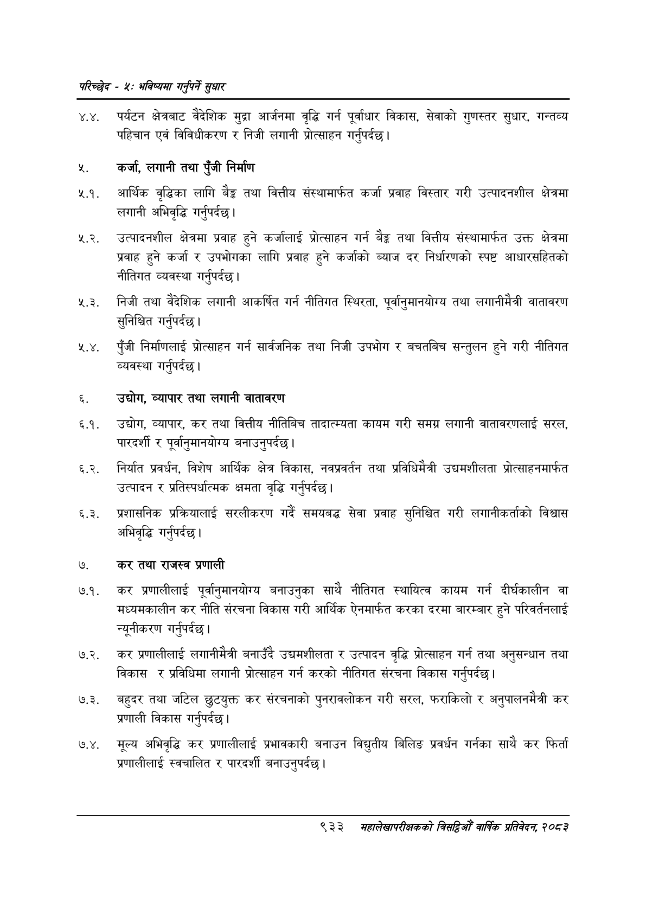

# Page 991 QA

## Rendered page


## Extracted text

```text
परिच्छेद -४: भविष्यसा गनुपर्ने सुधार
४.४. पर्यटन क्षेत्रबाट वैदेशिक मुद्रा आर्जनमा वृद्धि गर्न पूर्वाधार विकास, सेवाको गुणस्तर सुधार, गन्तव्य पहिचान एवं विविधीकरण र निजी लगानी प्रोत्साहन गर्नुपर्दछ |
कर्जा, लगानी तथा पुँजी निर्माण
२.१. आर्थिक वृद्धिका लागि ३ तथा वित्तीय संस्थामार्फत कर्जा प्रवाह विस्तार गरी उत्पादनशील क्षेत्रमा लगानी अभिवृद्धि गर्नुपर्दछ |
२.२. उत्पादनशील क्षेत्रमा प्रवाह हुने कर्जालाई प्रोत्साहन गर्न बैङ्क तथा वित्तीय संस्थामार्फत उक्त क्षेत्रमा प्रवाह हुने कर्जा र उपभोगका लागि प्रवाह हुने कर्जाको ब्याज दर निर्धारणको स्पष्ट आधारसहितको नीतिगत व्यवस्था गर्नुपर्दछ |
रे. निजी तथा वैदेशिक लगानी आकर्षित गर्न नीतिगत स्थिरता, पूर्वानुमानयोग्य तथा लगानीमैत्री वातावरण सुनिश्चित गर्नुपर्दछ।
२.४. पुँजी निर्माणलाई प्रोत्साहन गर्न सार्वजनिक तथा निजी उपभोग र बचतबिच सन्तुलन हुने गरी नीतिगत व्यवस्था गर्नुपर्दछ |
उद्योग, व्यापार तथा लगानी वातावरण
६.१. उद्योग, व्यापार, कर तथा वित्तीय नीतिबिच तादात्म्यता कायम गरी समग्र लगानी वातावरणलाई सरल, पारदर्शी र पूर्वानुमानयोग्य बनाउनुपर्दछ |
६.२. निर्यात प्रवर्धन, विशेष आर्थिक क्षेत्र विकास, नवप्रवर्तन तथा प्रविधिमैत्री उद्यमशीलता प्रोत्साहनमार्फत उत्पादन र प्रतिस्पर्धात्मक क्षमता वृद्धि गर्नपर्दछ।
६.३. प्रशासनिक प्रक्रियालाई सरलीकरण गर्दै समयबद्ध सेवा प्रवाह सुनिश्चित गरी लगानीकर्ताको विश्वास अभिवृद्धि गर्नुपर्दछ |
'कर तथा राजस्व प्रणाली
७.१. कर प्रणालीलाई पूर्वानुमानयोग्य बनाउनुका साथै नीतिगत स्थायित्व कायम गर्न दीर्घकालीन वा मध्यमकालीन कर नीति संरचना विकास गरी आर्थिक ऐनमार्फत करका दरमा बारम्बार हुने परिवर्तनलाई न्यूनीकरण गर्नुपर्दछ |
७.२. कर प्रणालीलाई लगानीमैत्री बनाउँदै उद्यमशीलता र उत्पादन वृद्धि प्रोत्साहन गर्न तथा अनुसन्धान तथा विकास र प्रविधिमा लगानी प्रोत्साहन गर्न करको नीतिगत संरचना विकास गर्नुपर्दछ |
७.३. बहुदर तथा जटिल छुटयुक्त कर संरचनाको पुनरावलोकन गरी सरल, फराकिलो र अनुपालनमैत्री कर प्रणाली विकास गर्नुपर्दछ |
७.४. मूल्य अभिवृद्धि कर प्रणालीलाई प्रभावकारी बनाउन विद्युतीय बिलिङ प्रवर्धन गर्नका साथै कर फिर्ता प्रणालीलाई स्वचालित र पारदर्शी बनाउनुपर्दछ |
९३३
मंहालेखापरीक्षकको बितदिमो वार्षिक प्रतिवेदन; २०८२
```

## Flags
- None
